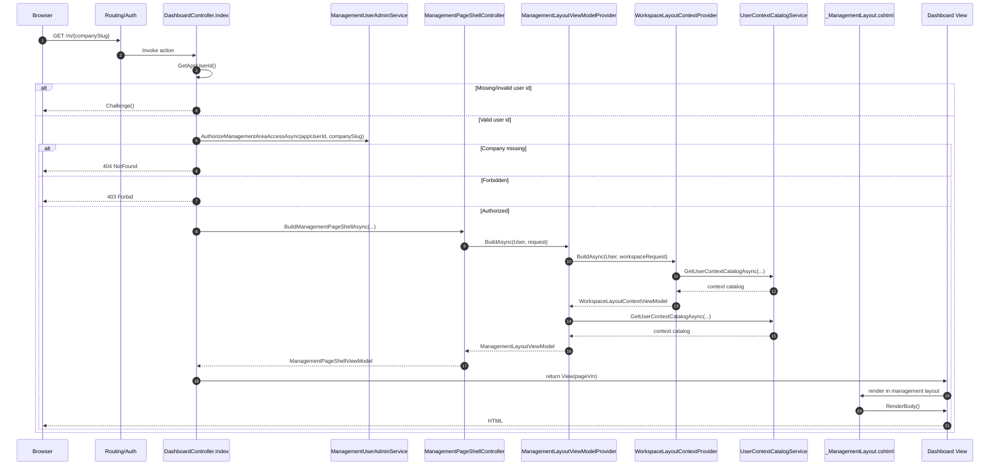
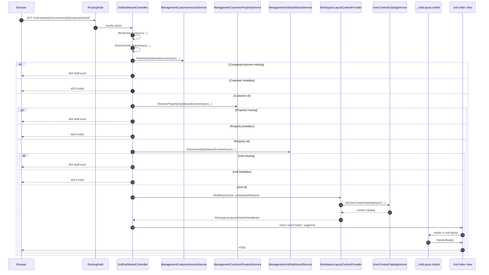
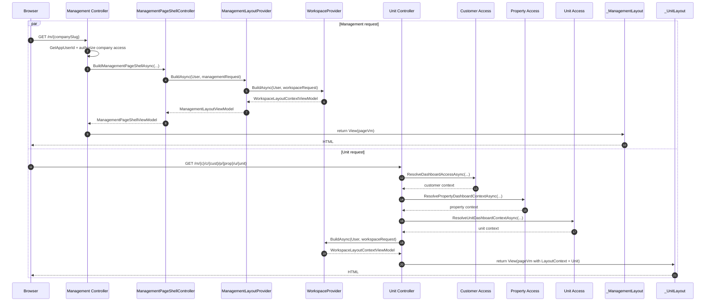

# Management and Unit HTTP Request → Rendering Flow

This document explains the full **ASP.NET Core MVC request-to-render pipeline** for two concrete areas in the repository:

- **Management**
- **Unit**

It focuses on how a request moves through:

1. routing and authorization,
2. controller actions,
3. service calls,
4. layout/viewmodel construction,
5. Razor layout selection,
6. final HTML rendering.

It also includes Mermaid diagrams for:

- management GET flow,
- management POST/edit flow,
- unit GET flow,
- unit POST/edit flow,
- a side-by-side sequence comparing management vs. unit.

---

## 1. High-level architectural difference

### Management
Management uses a **management-specific layout pipeline**:

- controllers inherit `ManagementPageShellController`
- controllers call `BuildManagementPageShellAsync(...)`
- that helper calls `IManagementLayoutViewModelProvider`
- the provider internally calls the shared workspace provider and then adapts the result into a `ManagementLayoutViewModel`
- the layout reads `Model.PageShell.Management`

### Unit
Unit uses the **shared workspace layout pipeline directly**:

- the unit controller resolves nested access (company → customer → property → unit)
- the controller calls `IWorkspaceLayoutContextProvider`
- the controller creates a `UnitLayoutViewModel`
- the controller combines those into `UnitPageShellViewModel`
- the layout reads both `Model.PageShell.LayoutContext` and `Model.PageShell.Unit`

---

## 2. Management GET flow

Representative route:

- `GET /m/{companySlug}`
- `GET /m/{companySlug}/dashboard`

Representative action:

- `WebApp/Areas/Management/Controllers/DashboardController.cs`

### Step-by-step

1. ASP.NET Core endpoint routing matches the request to the **Management** area dashboard controller.
2. The `[Authorize]` filter runs before the action body.
3. `DashboardController.Index` reads the app-user ID from the current `ClaimsPrincipal`.
4. If there is no valid app-user ID, the action returns `Challenge()`.
5. If there is an app-user ID, the controller asks `_managementUserAdminService.AuthorizeManagementAreaAccessAsync(...)` whether the user may access the requested management company.
6. If the company is missing, the action returns `NotFound()`.
7. If the user is not allowed, the action returns `Forbid()`.
8. If authorization succeeds, the controller builds the page model.
9. The controller calls `BuildManagementPageShellAsync(title, currentSectionLabel, companySlug, cancellationToken)`.
10. `BuildManagementPageShellAsync(...)` creates a `ManagementLayoutRequestViewModel` from:
    - current controller name,
    - company slug,
    - current request path/query,
    - current UI culture.
11. The helper calls `_managementLayoutViewModelProvider.BuildAsync(User, request, cancellationToken)`.
12. `ManagementLayoutViewModelProvider` first calls the shared `_workspaceLayoutContextProvider.BuildAsync(...)`.
13. The shared provider reads the user ID from claims, loads the user context catalog, loads supported cultures, and produces a generic `WorkspaceLayoutContextViewModel`.
14. The management provider then loads user context information again and computes management-only state such as `CanManageCompanyUsers`.
15. The management provider maps the generic shared context into `ManagementLayoutViewModel`.
16. `BuildManagementPageShellAsync(...)` wraps that result into a `ManagementPageShellViewModel`.
17. `DashboardController.Index` places that shell into `ManagementDashboardPageViewModel`.
18. The controller sets `ViewData["Title"]` and returns `View(vm)`.
19. Razor view discovery resolves the management area view.
20. `Areas/Management/Views/_ViewStart.cshtml` chooses `~/Areas/Management/Views/Shared/_ManagementLayout.cshtml`.
21. `_ManagementLayout.cshtml` reads `Model.PageShell.Management` and renders the shared management chrome.
22. The layout then calls `@RenderBody()`.
23. The dashboard body view renders its page-specific content inside that layout.
24. ASP.NET Core writes the final HTML response.

### Management GET mermaid sequence



---

## 3. Management POST/edit flow

Representative route:

- `POST /m/{companySlug}/profile/edit`

Representative action:

- `WebApp/Areas/Management/Controllers/ManagementProfileController.cs`

### Step-by-step

1. Endpoint routing matches the request to `ManagementProfileController.Edit`.
2. The action is protected by `[ValidateAntiForgeryToken]`.
3. The controller gets the current app-user ID.
4. If the ID is missing or invalid, it returns `Challenge()`.
5. The controller loads the current management profile with `_managementCompanyProfileService.GetProfileAsync(...)`.
6. If the profile cannot be found, it returns `NotFound()`.
7. If `ModelState` is invalid, the controller sets `Response.StatusCode = 400`.
8. It then rebuilds the page viewmodel using `BuildViewModelAsync(...)`.
9. That rebuild again constructs the management page shell through `BuildManagementPageShellAsync(...)`.
10. The controller returns `View("Index", vm)`.
11. Razor renders the same profile page again inside `_ManagementLayout.cshtml`.
12. The result is a **same-request re-render** with validation errors.
13. If `ModelState` is valid, the controller calls `_managementCompanyProfileService.UpdateProfileAsync(...)`.
14. If the update fails with not found or forbidden, the controller returns `NotFound()` or `Forbid()`.
15. If the update fails with a business error, the controller adds model errors, sets status code `400`, rebuilds the VM, and re-renders `Index`.
16. If the update succeeds, the controller stores a success message in `TempData`.
17. The controller then redirects to `Index` using PRG (Post/Redirect/Get).
18. The browser performs a fresh `GET /m/{companySlug}/profile`.
19. That GET then goes through the normal management render pipeline again.

### Management POST mermaid flowchart

```mermaid
flowchart TD
    A[POST /m/{companySlug}/profile/edit] --> B[ManagementProfileController.Edit]
    B --> C{Valid app user id?}
    C -- No --> C1[Challenge]
    C -- Yes --> D[GetProfileAsync]
    D --> E{Profile found?}
    E -- No --> E1[NotFound]
    E -- Yes --> F{ModelState valid?}
    F -- No --> G[Set HTTP 400]
    G --> H[BuildViewModelAsync]
    H --> I[BuildManagementPageShellAsync]
    I --> J[Return View("Index", vm)]
    J --> K[Render _ManagementLayout + body]

    F -- Yes --> L[UpdateProfileAsync]
    L --> M{Update success?}
    M -- Forbidden --> M1[Forbid]
    M -- Not found --> M2[NotFound]
    M -- Business error --> N[Add model errors + set 400]
    N --> H
    M -- Success --> O[TempData success message]
    O --> P[RedirectToAction Index]
    P --> Q[Browser issues GET]
    Q --> R[Normal management GET render pipeline]
```

---

## 4. Unit GET flow

Representative route:

- `GET /m/{companySlug}/c/{customerSlug}/p/{propertySlug}/u/{unitSlug}`
- `GET /m/{companySlug}/c/{customerSlug}/p/{propertySlug}/u/{unitSlug}/details`
- `GET /m/{companySlug}/c/{customerSlug}/p/{propertySlug}/u/{unitSlug}/tickets`

Representative action:

- `WebApp/Areas/Unit/Controllers/UnitDashboardController.cs`

### Step-by-step

1. Endpoint routing matches the request to `UnitDashboardController` in the **Unit** area.
2. The action methods `Index`, `Details`, and `Tickets` all delegate to the same internal method: `RenderSectionAsync(...)`.
3. `RenderSectionAsync(...)` calls `ResolveUnitContextAsync(...)`.
4. `ResolveUnitContextAsync(...)` gets the app-user ID from the claims principal.
5. If no valid user ID exists, it returns `Challenge()`.
6. It calls `_managementCustomerAccessService.ResolveDashboardAccessAsync(...)` to resolve customer-level access.
7. If the company/customer context is missing, it returns `NotFound()`.
8. If customer-level access is forbidden, it returns `Forbid()`.
9. It calls `_managementCustomerPropertyService.ResolvePropertyDashboardContextAsync(...)` to resolve the property context.
10. If the property does not exist, it returns `NotFound()`.
11. If property access is forbidden, it returns `Forbid()`.
12. It calls `_managementUnitDashboardService.ResolveUnitDashboardContextAsync(...)` to resolve unit-level context.
13. If the unit does not exist, it returns `NotFound()`.
14. If unit access is forbidden, it returns `Forbid()`.
15. Once all three levels succeed, the controller knows the full nested context:
    - management company,
    - customer,
    - property,
    - unit.
16. The controller creates `UnitLayoutViewModel` with names/slugs for company, customer, property, unit, and the current section.
17. The controller calls `BuildPageShellAsync(...)`.
18. `BuildPageShellAsync(...)` calls `_workspaceLayoutContextProvider.BuildAsync(User, request, cancellationToken)`.
19. The shared provider loads the generic workspace context (claims → user context catalog → supported cultures).
20. The controller combines that generic `WorkspaceLayoutContextViewModel` with the unit-specific `UnitLayoutViewModel`.
21. The result is a `UnitPageShellViewModel`.
22. `RenderSectionAsync(...)` creates `UnitDashboardPageViewModel` and assigns the page shell plus entity data.
23. The controller sets `ViewData["Title"]` and `ViewData["CurrentSectionLabel"]`.
24. The controller returns `View("Index", vm)`.
25. Razor view discovery resolves the unit dashboard body view.
26. `Areas/Unit/Views/_ViewStart.cshtml` chooses `~/Areas/Unit/Views/Shared/_UnitLayout.cshtml`.
27. `_UnitLayout.cshtml` reads both `Model.PageShell.LayoutContext` and `Model.PageShell.Unit`.
28. The layout renders shared workspace chrome and unit-specific nested navigation/context.
29. The layout calls `@RenderBody()`.
30. The unit dashboard body view renders inside the layout.
31. ASP.NET Core writes the final HTML response.

### Unit GET mermaid sequence



---

## 5. Unit POST/edit flow

Representative route:

- `POST /m/{companySlug}/c/{customerSlug}/p/{propertySlug}/u/{unitSlug}/profile/edit`

Representative action:

- `WebApp/Areas/Unit/Controllers/UnitProfileController.cs`

### Step-by-step

1. Endpoint routing matches the request to `UnitProfileController.Edit`.
2. `[ValidateAntiForgeryToken]` runs.
3. The controller calls `ResolveAccessAsync(...)`.
4. That method repeats the same nested company/customer → property → unit resolution chain used for unit GET rendering.
5. If any layer fails, the controller returns `Challenge()`, `NotFound()`, or `Forbid()`.
6. If access succeeds, the controller loads the current unit profile via `_managementUnitProfileService.GetProfileAsync(...)`.
7. If the profile is missing, it returns `NotFound()`.
8. If `ModelState` is invalid, the controller sets `Response.StatusCode = 400`.
9. It rebuilds the page model through `BuildViewModelAsync(...)`.
10. That rebuild constructs:
    - the unit-specific layout VM,
    - the shared workspace layout context,
    - the `UnitPageShellViewModel`,
    - the full page VM.
11. The controller returns `View("Index", vm)`.
12. Razor renders the same page again inside `_UnitLayout.cshtml`.
13. So validation failures are handled as a **same-request re-render**.
14. If `ModelState` is valid, the controller calls `_managementUnitProfileService.UpdateProfileAsync(...)`.
15. If the update fails with not found/forbidden, it returns `NotFound()`/`Forbid()`.
16. If the update fails with a business error, it adds model errors, sets HTTP 400, rebuilds the VM, and re-renders the view.
17. If the update succeeds, it stores a success message in `TempData`.
18. It redirects to `Index` for that same unit.
19. The browser performs a fresh GET.
20. That GET reruns the standard unit render pipeline.

### Unit POST mermaid flowchart

```mermaid
flowchart TD
    A[POST /m/{company}/c/{customer}/p/{property}/u/{unit}/profile/edit] --> B[UnitProfileController.Edit]
    B --> C[ResolveAccessAsync]
    C --> D{Nested access ok?}
    D -- No --> D1[Challenge / NotFound / Forbid]
    D -- Yes --> E[GetProfileAsync]
    E --> F{Profile found?}
    F -- No --> F1[NotFound]
    F -- Yes --> G{ModelState valid?}
    G -- No --> H[Set HTTP 400]
    H --> I[BuildViewModelAsync]
    I --> J[Build shared workspace context]
    J --> K[Build UnitPageShellViewModel]
    K --> L[Return View("Index", vm)]
    L --> M[Render _UnitLayout + body]

    G -- Yes --> N[UpdateProfileAsync]
    N --> O{Update success?}
    O -- Forbidden --> O1[Forbid]
    O -- Not found --> O2[NotFound]
    O -- Business error --> P[Add model errors + set 400]
    P --> I
    O -- Success --> Q[TempData success message]
    Q --> R[RedirectToAction Index]
    R --> S[Browser issues GET]
    S --> T[Normal unit GET render pipeline]
```

---

## 6. Side-by-side sequence: management vs. unit

This diagram emphasizes the core difference:

- **management** goes through a specialized management layout provider,
- **unit** goes through nested entity-resolution and then directly uses the shared workspace provider.



---

## 7. Summary

### Management
Management rendering is centered around a **specialized management shell pipeline**:

- controller authorization,
- management shell helper,
- management layout provider,
- shared workspace provider,
- management-specific layout VM,
- `_ManagementLayout.cshtml`.

### Unit
Unit rendering is centered around a **nested access-resolution pipeline**:

- customer-level resolution,
- property-level resolution,
- unit-level resolution,
- shared workspace provider,
- unit-specific shell,
- `_UnitLayout.cshtml`.

### Most important distinction

- **Management** = specialized provider + specialized layout payload (`PageShell.Management`)
- **Unit** = shared workspace context + unit-specific payload (`PageShell.LayoutContext` + `PageShell.Unit`)

---

## 8. Repository files referenced

- `WebApp/Areas/Management/Controllers/DashboardController.cs`
- `WebApp/Areas/Management/Controllers/ManagementPageShellController.cs`
- `WebApp/Areas/Management/Controllers/ManagementProfileController.cs`
- `WebApp/Areas/Management/Views/_ViewStart.cshtml`
- `WebApp/Areas/Management/Views/Shared/_ManagementLayout.cshtml`
- `WebApp/Areas/Unit/Controllers/UnitDashboardController.cs`
- `WebApp/Areas/Unit/Controllers/UnitProfileController.cs`
- `WebApp/Areas/Unit/Views/_ViewStart.cshtml`
- `WebApp/Areas/Unit/Views/Shared/_UnitLayout.cshtml`
- `WebApp/Services/SharedLayout/IWorkspaceLayoutContextProvider.cs`
- `WebApp/Services/SharedLayout/WorkspaceLayoutContextProvider.cs`
- `WebApp/Services/ManagementLayout/IManagementLayoutViewModelProvider.cs`
- `WebApp/Services/ManagementLayout/ManagementLayoutViewModelProvider.cs`
- `WebApp/ViewModels/Shared/Layout/LayoutPageShellViewModels.cs`
- `WebApp/ViewModels/Shared/Layout/WorkspaceLayoutContextViewModel.cs`

