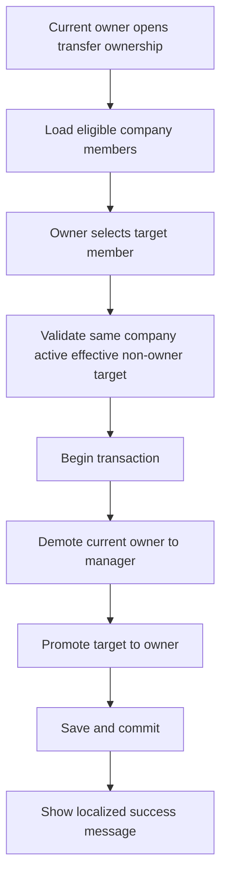

# Management company user management business-rules fix plan

## Scope

This plan covers missing or incomplete company-user-management rules currently implemented around [`ManagementUserAdminService`](../../App.BLL/ManagementUsers/ManagementUserAdminService.cs), [`UsersController`](../../WebApp/Areas/Management/Controllers/UsersController.cs), [`DashboardController`](../../WebApp/Areas/Management/Controllers/DashboardController.cs), and the management users UI in [`Index.cshtml`](../../WebApp/Areas/Management/Views/Users/Index.cshtml) and [`Edit.cshtml`](../../WebApp/Areas/Management/Views/Users/Edit.cshtml).

Assumption confirmed for this plan:
- each management company must always have exactly one active `OWNER`
- ownership transfer must move `OWNER` from the current owner to another company member atomically

## What is currently missing or unsafe

### 1. Dashboard access is incorrectly coupled to user-administration permission

[`DashboardController.Index()`](../../WebApp/Areas/Management/Controllers/DashboardController.cs:23) currently calls [`IManagementUserAdminService.AuthorizeAsync()`](../../App.BLL/ManagementUsers/IManagementUserAdminService.cs:10), which only authorizes `OWNER` and `MANAGER` via [`AdminRoleCodes`](../../App.BLL/ManagementUsers/ManagementUserAdminService.cs:21). That means `FINANCE` and `SUPPORT` company employees cannot open the management dashboard at all, even though they are valid company members.

### 2. Self-demotion and self-deactivation are not blocked

[`ManagementUserAdminService.UpdateMembershipAsync()`](../../App.BLL/ManagementUsers/ManagementUserAdminService.cs:317) contains a TODO for self-demotion or role-removal guardrails. A current owner or manager can change their own role or deactivate themselves in ways that break administration continuity.

### 3. Company can be left without an owner

[`ManagementUserAdminService.UpdateMembershipAsync()`](../../App.BLL/ManagementUsers/ManagementUserAdminService.cs:317) and [`ManagementUserAdminService.DeleteMembershipAsync()`](../../App.BLL/ManagementUsers/ManagementUserAdminService.cs:400) do not enforce the confirmed invariant that exactly one active `OWNER` must always exist.

### 4. Manager can change or delete the owner

Current authorization only distinguishes admin vs non-admin. It does not enforce stricter ownership rules such as:
- manager cannot edit the owner role
- manager cannot remove the owner
- manager cannot assign `OWNER` to another user
- only the current owner can initiate ownership transfer

### 5. No dedicated ownership-transfer workflow exists

The current UI only supports generic edit and delete actions in [`Index.cshtml`](../../WebApp/Areas/Management/Views/Users/Index.cshtml) and generic role editing in [`Edit.cshtml`](../../WebApp/Areas/Management/Views/Users/Edit.cshtml). That is incompatible with the rule that ownership transfer must be explicit and atomic.

### 6. Role selection is over-exposed in add and edit flows

[`UsersController.BuildRoleSelectListAsync()`](../../WebApp/Areas/Management/Controllers/UsersController.cs:310) returns all roles from [`GetAvailableRolesAsync()`](../../App.BLL/ManagementUsers/ManagementUserAdminService.cs:514) with no actor-sensitive filtering. This allows managers to see and attempt actions involving `OWNER`, even if the service later blocks them.

### 7. Membership validity is not treated as part of effective access rules

[`AuthorizeAsync()`](../../App.BLL/ManagementUsers/ManagementUserAdminService.cs:38) checks only `IsActive`, but not whether `ValidFrom` and `ValidTo` make the membership currently effective. This can create mismatches where future-dated or expired memberships still authorize access.

### 8. Business rules are fragmented across dashboard and management-user concerns

Dashboard access and company-membership access should not depend on a user-administration service whose semantics are narrower. The current reuse hides missing business concepts:
- company member access to management area
- company user administration rights
- ownership-only actions

### 9. UI does not communicate immutable or restricted actions clearly

The member list and edit form currently always show generic edit and delete affordances. There is no explanation for:
- why the owner role cannot be changed in standard edit
- why self-removal is disabled
- why ownership requires transfer rather than inline role change
- why some roles can access dashboard but not user administration

### 10. No focused tests protect these invariants

The current code shows TODOs but no visible test coverage for ownership continuity, self-protection rules, or dashboard access by non-admin company roles.

## Target business rules

## Membership and access rules

1. Any active, currently effective management-company member with an allowed operational role can open the management dashboard.
2. User-administration actions remain restricted to `OWNER` and `MANAGER`.
3. Ownership actions are stricter than general user administration and are limited to the current active owner.

## Owner invariants

1. Each company must have exactly one active, currently effective `OWNER` membership.
2. Standard add flow must never create a second owner.
3. Standard edit flow must never change a membership into or out of `OWNER`.
4. Standard delete flow must never delete the current owner.
5. Ownership can only change through a dedicated transfer operation.
6. Ownership transfer must atomically demote the old owner and promote the new owner in one transaction.

## Self-protection rules

1. A user cannot delete their own company membership through the admin UI.
2. A user cannot deactivate their own membership.
3. A user cannot change their own role through the generic edit flow.
4. If self-service leave-company behavior is added later, it must still preserve the single-owner invariant.

## Manager limitations

1. Manager cannot edit, demote, deactivate, or delete the owner.
2. Manager cannot assign `OWNER` in add or edit flows.
3. Manager can manage non-owner company users within the same tenant.

## Ownership transfer rules

1. Only the current owner can open transfer ownership.
2. Transfer target must be an existing membership in the same company.
3. Transfer target must be active and currently effective.
4. Transfer target cannot be the same membership as the current owner.
5. Transfer must be rejected if the target membership is expired, inactive, or outside the tenant.
6. Transfer should be auditable via structured logging now, and extendable to persistent audit history later.

## Proposed implementation plan

### Phase 1. Separate authorization concepts

Create or refactor service-level authorization so that the system distinguishes:
- company membership access for management area navigation
- company user administration permission
- ownership-only permission

Planned changes:
- introduce a management-area access method separate from [`AuthorizeAsync()`](../../App.BLL/ManagementUsers/ManagementUserAdminService.cs:38), or introduce a dedicated management access service in the BLL
- update [`DashboardController.Index()`](../../WebApp/Areas/Management/Controllers/DashboardController.cs:23) to use member-access authorization instead of admin-only authorization
- keep tenant filtering by `ManagementCompanyId`
- evaluate effective membership using `IsActive`, `ValidFrom`, and `ValidTo`

Outcome:
- `FINANCE` and `SUPPORT` can access dashboard when they are valid members
- company-user administration remains restricted to authorized roles only

### Phase 2. Centralize role-code policy and membership-effectiveness checks

Add one reusable policy/helper in the BLL for role-code decisions and effective membership evaluation.

Planned rules to centralize:
- `OWNER`, `MANAGER` are company-user admins
- `OWNER` is the only role allowed to transfer ownership
- member is effective only when active and within validity window
- one place resolves whether target membership is owner, actor, editable, removable, transferable

Outcome:
- controllers and views consume one consistent rule source
- dashboard and admin screens stop drifting in behavior

### Phase 3. Lock down add-user behavior

Update add flow in [`AddUserByEmailAsync()`](../../App.BLL/ManagementUsers/ManagementUserAdminService.cs:244) and corresponding role-option population.

Planned changes:
- managers must not see or assign `OWNER`
- owners also must not create owners through generic add flow
- generic add flow supports only non-owner roles such as `MANAGER`, `FINANCE`, `SUPPORT`
- validate selected role against actor permissions, not just role existence
- optionally block creation of inactive memberships with past or invalid date ranges if that conflicts with onboarding rules

Outcome:
- owner assignment is removed from generic company user creation
- single-owner invariant is protected earlier in the flow

### Phase 4. Lock down edit-user behavior

Update [`GetMembershipForEditAsync()`](../../App.BLL/ManagementUsers/ManagementUserAdminService.cs:173), [`UpdateMembershipAsync()`](../../App.BLL/ManagementUsers/ManagementUserAdminService.cs:317), [`UsersController.Edit()`](../../WebApp/Areas/Management/Controllers/UsersController.cs:80), and [`Edit.cshtml`](../../WebApp/Areas/Management/Views/Users/Edit.cshtml).

Planned changes:
- generic edit must reject any attempt to change a membership into or out of `OWNER`
- manager must be forbidden from editing owner membership
- actor must be forbidden from changing their own role
- actor must be forbidden from deactivating their own membership
- if editing non-owner membership, enforce role transition whitelist by actor role
- expose edit metadata to the UI so restricted fields and actions can be disabled or replaced with explanatory text

Recommended UX rule:
- when editing the current owner, standard edit should not expose role change at all; instead show owner badge and transfer-ownership action if actor is owner

Outcome:
- owner role becomes immutable in standard edit
- self-demotion and self-deactivation are prevented

### Phase 5. Lock down delete behavior

Update [`DeleteMembershipAsync()`](../../App.BLL/ManagementUsers/ManagementUserAdminService.cs:400) and member-list action rendering in [`Index.cshtml`](../../WebApp/Areas/Management/Views/Users/Index.cshtml).

Planned changes:
- keep current self-delete block
- add explicit block for deleting current owner
- add explicit block for manager deleting owner
- add guard that delete cannot violate single-owner invariant
- surface per-row capability flags so delete button is hidden or disabled for protected memberships

Outcome:
- company cannot lose its owner through standard deletion
- invalid actions are prevented in both BLL and UI

### Phase 6. Add dedicated transfer ownership workflow

Implement a dedicated owner-only flow instead of using generic role edit.

Recommended shape:
- BLL request model such as `TransferOwnershipRequest`
- BLL operation such as `TransferOwnershipAsync()` on [`IManagementUserAdminService`](../../App.BLL/ManagementUsers/IManagementUserAdminService.cs:1)
- dedicated controller endpoints under [`UsersController`](../../WebApp/Areas/Management/Controllers/UsersController.cs)
- dedicated view or modal from [`Index.cshtml`](../../WebApp/Areas/Management/Views/Users/Index.cshtml)

Transfer workflow:
1. Current owner opens transfer screen.
2. System lists eligible non-owner memberships in same company.
3. Owner confirms transfer.
4. Service loads current owner and target membership under one tenant-scoped transaction.
5. Service swaps roles atomically: current owner -> manager or configured fallback operational role, target -> owner.
6. Service saves once and logs the operation.

Open implementation decision to capture during coding:
- after transfer, should former owner become `MANAGER` automatically or retain a separately chosen non-owner role?

Recommended default:
- former owner becomes `MANAGER` automatically, because it preserves administrative continuity without introducing another prompt.

Outcome:
- owner changes become explicit, auditable, and safe

### Phase 7. Enrich BLL models for capability-driven UI

Extend list and edit DTO models in [`ManagementUserAdminModels.cs`](../../App.BLL/ManagementUsers/ManagementUserAdminModels.cs) so the UI can render allowed actions safely.

Suggested additions:
- `IsOwner`
- `CanEdit`
- `CanDelete`
- `CanTransferOwnership`
- `CanChangeRole`
- `CanDeactivate`
- `ProtectedReason` or localized message key

Also add result flags for common business-rule failures, for example:
- `CannotEditOwner`
- `CannotAssignOwner`
- `CannotChangeOwnRole`
- `CannotDeactivateSelf`
- `OwnershipTransferRequired`
- `TargetNotEligibleForOwnership`

Outcome:
- controllers stop inferring business rules from raw role codes
- views become simpler and safer

### Phase 8. Update management users UI to reflect business rules

Update [`ManagementUsersPageViewModel`](../../WebApp/ViewModels/ManagementUsers/ManagementUsersPageViewModel.cs), [`Index.cshtml`](../../WebApp/Areas/Management/Views/Users/Index.cshtml), and [`Edit.cshtml`](../../WebApp/Areas/Management/Views/Users/Edit.cshtml).

Planned UX changes:
- show owner badge distinctly in members table
- hide delete action for protected memberships
- hide or disable edit action where actor lacks permission
- add transfer ownership action only on current owner row and only for current owner actor
- remove `OWNER` from generic role dropdowns
- show localized inline explanation when a role or action is protected
- continue using resource-backed success and error text from [`UiText`](../../App.Resources/Views/UiText.resx)

Outcome:
- UI matches server rules
- users are guided toward transfer flow instead of trial-and-error failures

### Phase 9. Localize new business-rule messages

Add resource entries in [`UiText.resx`](../../App.Resources/Views/UiText.resx) and [`UiText.et.resx`](../../App.Resources/Views/UiText.et.resx) for new rule outcomes.

Needed message categories:
- owner cannot be edited here
- ownership transfer required
- you cannot change your own role
- you cannot deactivate your own membership
- manager cannot modify owner
- ownership transferred successfully
- selected transfer target is invalid

Outcome:
- new guardrails remain consistent with project localization rules

### Phase 10. Add verification and regression tests

Add tests proportional to the scope in the BLL and web layer.

Minimum scenarios:
- finance and support member can access dashboard
- finance and support member cannot access user administration
- manager can manage non-owner memberships
- manager cannot edit or delete owner
- actor cannot demote self
- actor cannot deactivate self
- standard edit cannot assign owner
- standard delete cannot remove owner
- company always retains exactly one active effective owner
- ownership transfer is owner-only
- ownership transfer rejects inactive, expired, or same-member target
- ownership transfer atomically changes owner from one member to another within same company
- all queries remain tenant-scoped and do not allow cross-company target selection

Outcome:
- business rules stop being TODOs and become enforced regression-protected behavior

## Additional issues discovered during review

### A. Current admin authorization result is too coarse

[`ManagementUserAdminAuthorizationResult`](../../App.BLL/ManagementUsers/ManagementUserAdminModels.cs:9) only tells callers authorized vs forbidden. It does not express membership-valid-but-not-admin, owner-only restrictions, or membership-expired cases. The plan should include richer authorization outcomes or separate context models.

### B. Generic role list API is not actor-aware

[`GetAvailableRolesAsync()`](../../App.BLL/ManagementUsers/ManagementUserAdminService.cs:514) should not be used directly by the UI without actor context. Replace it with actor-aware role option methods for add and edit flows.

### C. Validity dates are not validated as a coherent range

The plan should include request validation for `ValidTo >= ValidFrom` and clear behavior for whether inactive or expired memberships should remain editable.

### D. Logging should be improved for ownership-sensitive operations

Current service logging focuses on job-title localization compatibility. Ownership transfer, denied owner edits, and blocked self-demotion should also emit structured logs for audit and troubleshooting.

## Recommended implementation order

1. Separate management-area membership authorization from admin authorization.
2. Add reusable role-policy and effective-membership helpers in BLL.
3. Add owner and self-protection checks to update and delete operations.
4. Make add and edit role option APIs actor-aware and remove `OWNER` from generic flows.
5. Add capability flags to BLL and view models.
6. Implement dedicated transfer ownership workflow.
7. Update management users UI and localized messages.
8. Add regression tests for dashboard access, owner invariants, and transfer flow.

## Definition of done for this fix set

This work is complete when:
- `FINANCE` and `SUPPORT` can reach the management dashboard as valid company members
- company-user admin remains limited to authorized roles
- exactly one active effective `OWNER` exists per company at all times
- self-demotion and self-deactivation are blocked
- manager cannot modify owner or assign owner
- owner changes happen only through explicit transfer workflow
- generic add/edit/delete UI no longer exposes invalid actions
- all new user-visible messages are localized
- tests cover tenant scope, ownership invariants, and transfer behavior

## Review note

This plan intentionally treats ownership as a first-class business concept rather than just another role option. That is the cleanest way to fix the currently missing rules without continuing to layer exceptions onto generic edit and delete flows.
