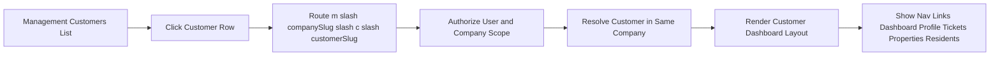

# Customer Dashboard Navigation Bootstrap Plan

## Goal

Add a customer-scoped dashboard entry and sidebar navigation shell that mirrors how the management dashboard is currently structured, while intentionally leaving feature pages unimplemented.

## Confirmed Route Contract

- Customer dashboard entry route from Management Customers list: `m/{companySlug}/c/{customerSlug}`
- Customer area nav links to show in sidebar:
  - Dashboard
  - Profile
  - Tickets
  - Properties
  - Residents

## Current State Summary

- Management area layout and shell already exist and are active in [`WebApp/Areas/Management/Views/Shared/_ManagementLayout.cshtml`](WebApp/Areas/Management/Views/Shared/_ManagementLayout.cshtml).
- Management dashboard route and access checks are implemented in [`WebApp/Areas/Management/Controllers/DashboardController.cs`](WebApp/Areas/Management/Controllers/DashboardController.cs).
- Management customers list exists in [`WebApp/Areas/Management/Views/Customers/Index.cshtml`](WebApp/Areas/Management/Views/Customers/Index.cshtml), but customer rows currently do not link to a customer dashboard.
- Customer records already have slug support in business flow via [`App.BLL/ManagementCustomers/ManagementCustomersService.cs`](App.BLL/ManagementCustomers/ManagementCustomersService.cs).

## Scope

### In scope

1. Create customer dashboard route endpoint for `m/{companySlug}/c/{customerSlug}`.
2. Add customer-context layout shell with sidebar links:
   - Dashboard
   - Profile
   - Tickets
   - Properties
   - Residents
3. Update Management Customers list to link each customer row to the customer dashboard entry route.
4. Enforce tenant and authorization checks for route access to prevent IDOR.
5. Keep localization-ready labels for nav items and page title.

### Out of scope

- Implementing Profile, Tickets, Properties, Residents feature pages.
- Implementing customer analytics widgets or business data cards.
- Any database schema or migration work.

## Planned Implementation Steps

1. **Add customer dashboard controller and index action**
   - Add new controller in management area with route prefix `m/{companySlug}/c/{customerSlug}`.
   - Add `Index` action for base route.
   - Validate current user identity.
   - Validate management membership and tenant scope.
   - Validate customer belongs to management company and slug matches company scope.
   - Return `NotFound` or `Forbid` without cross-tenant data leakage.

2. **Create customer layout shell matching management UI style**
   - Add customer layout Razor with same structural style as management layout.
   - Add sidebar links for Dashboard, Profile, Tickets, Properties, Residents.
   - Keep only Dashboard active initially, others visible as placeholder links or disabled placeholders.
   - Ensure company and customer context is visible in header/sidebar.

3. **Create dashboard placeholder view model and view**
   - Add minimal page view model with company slug, customer slug, customer name.
   - Add dashboard view with empty-state card indicating future feature modules.

4. **Wire entry links from Management Customers list**
   - In customer list table, render customer name as link to `m/{companySlug}/c/{customerSlug}`.
   - Preserve existing table behavior and avoid introducing edit side effects.

5. **Localization pass for new static UI text**
   - Add resource keys for customer dashboard title and nav labels if missing.
   - Add entries in both English and Estonian resource files.

6. **Verification and regression checks**
   - Route works for valid user-company-customer combination.
   - Access denied for users outside company role scope.
   - Not found behavior for unknown company slug or customer slug.
   - Sidebar displays all required links.
   - Management customers page entry links navigate correctly.

## File-Level Change Plan

### Expected updates

- Update [`WebApp/Areas/Management/Views/Customers/Index.cshtml`](WebApp/Areas/Management/Views/Customers/Index.cshtml) to add row-level customer dashboard links.
- Update resources in [`App.Resources/Views/UiText.resx`](App.Resources/Views/UiText.resx) and [`App.Resources/Views/UiText.et.resx`](App.Resources/Views/UiText.et.resx) for any missing customer dashboard labels.

### Expected additions

- New controller for customer dashboard under `WebApp/Areas/Management/Controllers`.
- New customer dashboard layout under `WebApp/Areas/Management/Views/Shared`.
- New customer dashboard view and optional placeholder views under `WebApp/Areas/Management/Views`.
- New customer dashboard view model under `WebApp/ViewModels/Management`.
- Optional BLL authorization/query helper in `App.BLL/ManagementCustomers` if existing service does not already expose required customer-by-slug authorization methods.

## Authorization and IDOR Controls Checklist

- Resolve actor from claims principal.
- Resolve management company by `companySlug`.
- Verify actor has valid role in company scope.
- Resolve customer by `customerSlug` **and** `ManagementCompanyId`.
- Never resolve customer by slug alone.
- Return `NotFound` for unknown scoped resource.
- Return `Forbid` for unauthorized actor.

## Navigation Behavior Contract

- Entry from Management Customers page must land on customer dashboard base route.
- Sidebar links are visible immediately for:
  - Dashboard
  - Profile
  - Tickets
  - Properties
  - Residents
- Non-dashboard links are placeholders for later implementation and should not break routing.

## High-Level Flow

## Acceptance Criteria

1. Clicking a customer from management customers list opens `m/{companySlug}/c/{customerSlug}`.
2. Customer dashboard renders with sidebar links:
   - Dashboard
   - Profile
   - Tickets
   - Properties
   - Residents
3. Dashboard page is accessible only when actor is authorized in target management company.
4. Cross-tenant customer access attempts do not expose existence details.
5. No feature pages are required beyond dashboard shell and placeholder navigation.

## Handoff Notes for Implementation Mode

- Reuse existing management dashboard authorization and layout patterns for consistency.
- Keep controllers thin and place any new business authorization checks in BLL service methods.
- Keep resource-backed text for all user-visible labels.
- Avoid introducing migrations or unrelated domain changes.
