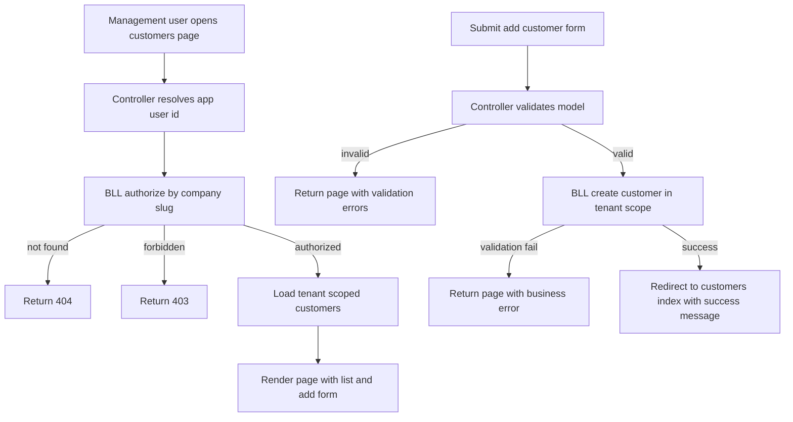

# Management Area Customers Page Implementation Plan

## Objective

Implement a new Management area Customers page under `m/{companySlug}` that provides:
- A tenant-scoped customer list
- Important customer details in the list
- An inline or dedicated workflow to add new customers

## Confirmed v1 data fields

The page must support these customer fields:
- Name
- RegistryCode
- BillingEmail
- BillingAddress
- Phone

Notes:
- Request text used `BillingAadress`; implementation will align to domain property `BillingAddress` while preserving UI wording decisions in localization resources.
- `Slug` should be generated in BLL and not entered by user.

## Existing context and constraints

### Routing and area conventions

- Management area routes follow slug-based pattern such as `m/{companySlug}` and subroutes like `m/{companySlug}/users`.
- New Customers page should follow the same convention, e.g. `m/{companySlug}/customers`.

### Security and tenant isolation

- Tenant boundary is management company.
- All reads/writes must be filtered by current tenant context from authenticated actor authorization.
- Never trust client-provided tenant identifiers.
- Details/edit/delete endpoints must prevent IDOR by combining id + tenant filter + role checks.

### Domain model readiness

`Customer` already includes required fields:
- `Name`
- `RegistryCode`
- `BillingEmail`
- `BillingAddress`
- `Phone`
- `Slug`
- `ManagementCompanyId`
- `IsActive`, `CreatedAt`

Unique constraints already enforce tenant-safe customer uniqueness:
- unique by `ManagementCompanyId + RegistryCode`
- unique by `ManagementCompanyId + Slug`

## Implementation approach

### 1. BLL service layer for Management Customers

Create a dedicated BLL service for management customer operations. Controllers must stay orchestration-only.

Planned service capabilities:
- `AuthorizeAsync(appUserId, companySlug)` returning authorized context or forbidden/not found
- `ListCustomersAsync(context, filters)` tenant-scoped list projection
- `CreateCustomerAsync(context, request)` with business validation and slug generation

Planned validations in BLL:
- actor has management context access
- actor has permission to view and create customers
- `Name` and `RegistryCode` required and normalized
- `BillingEmail` format validation if provided
- uniqueness within current tenant for `RegistryCode`
- safe slug generation and uniqueness within tenant

### 2. Management MVC controller

Add Management controller for Customers, mirroring established Management patterns:
- Route base: `m/{companySlug}/customers`
- GET `Index`
- POST `Add`

Controller behavior:
- Resolve actor id from claims
- Call BLL authorization
- Return `NotFound` for unknown company slug
- Return `Forbid` for unauthorized actor
- Map BLL models to Management page view models
- Use anti-forgery on POST
- Use TempData for success and error feedback

### 3. View models

Create dedicated strongly typed view models for page and add form.

Recommended models:
- `ManagementCustomersPageViewModel`
  - `CompanySlug`, `CompanyName`
  - `IReadOnlyList<ManagementCustomerListItemViewModel> Customers`
  - `AddCustomerViewModel AddCustomer`
- `ManagementCustomerListItemViewModel`
  - `CustomerId`
  - `Name`
  - `RegistryCode`
  - `BillingEmail`
  - `BillingAddress`
  - `Phone`
- `AddCustomerViewModel`
  - `Name`
  - `RegistryCode`
  - `BillingEmail`
  - `BillingAddress`
  - `Phone`

Validation annotations must be resource-backed for labels and messages.

### 4. Razor view

Create Customers index page in Management area with:
- Header card consistent with existing Management UI
- Add Customer form card
- Customers table card

Customers table columns in v1:
- Name
- Registry code
- Billing email
- Billing address
- Phone
- Actions placeholder column for future details/edit

Form behavior:
- field-level validation messages
- validation summary
- success alert after create
- error alert on business or validation failure

### 5. Management layout navigation integration

Enable active navigation link for Customers in Management sidebar layout:
- Replace disabled Customers placeholder with clickable link to Customers Index route
- Preserve current controller highlighting pattern

### 6. Localization updates

Add required UI text keys in both resource files:
- `UiText.resx`
- `UiText.et.resx`

Required keys include:
- Customers page title and intro
- Add customer form labels
- table headers
- button labels
- success and error messages
- empty state text

### 7. Testing plan

Add tests proportional to scope:

Service-level tests:
- tenant isolation on list and create
- authorization outcomes for forbidden and company-not-found
- duplicate registry code blocked inside same tenant
- same registry code allowed across different tenants
- slug generation and uniqueness behavior

Controller tests:
- returns `Challenge` without user id claim
- returns `NotFound` when company slug invalid
- returns `Forbid` when unauthorized
- successful create redirects to index and sets TempData success
- invalid model returns index with validation errors

### 8. Non-goals in this v1 plan

Not included in this scope:
- customer details page
- edit or delete customer in management area
- customer representatives management in management area
- advanced filtering or pagination
- API endpoint additions

## Execution sequence

1. Add BLL contracts and models for management customer list and create.
2. Implement BLL service with tenant-scoped authorization, list, create, validation, and slug generation.
3. Register service in DI.
4. Add Management Customers controller.
5. Add Management Customers view models.
6. Create Customers index view with add form and list table.
7. Update management layout navigation to enable Customers link.
8. Add localization keys in English and Estonian resources.
9. Add tests for BLL and controller guardrails.
10. Run verification and finalize.

## Flow diagram

## Risks and mitigations

- Risk: accidental cross-tenant query leakage  
  Mitigation: all BLL queries require authorized context and tenant filter before materialization.

- Risk: duplicate customer records by registry code in same tenant  
  Mitigation: enforce service validation plus existing DB unique constraint.

- Risk: localization regressions for new UI strings  
  Mitigation: add keys in both cultures and use resource-backed view model annotations.

- Risk: future divergence from management route conventions  
  Mitigation: use established route pattern and layout integration approach already used by existing management pages.
