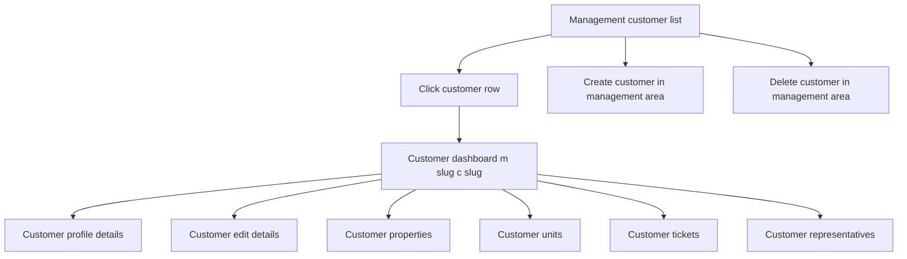

# Customer workflow implementation plan

## Purpose

Define implementation plan for customer workflow in management context based on [`plans/management/workflows.md`](plans/management/workflows.md), with corrected navigation and ownership boundaries.

Key correction:

- Clicking customer in management customer list opens customer dashboard at `m/{managementCompanySlug}/c/{customerSlug}`
- Customer details and edit flows are in customer area, not management list area
- Management area supports create and delete only for customer records
- Customer operational pages live under customer area routes such as `m/{managementCompanySlug}/c/{customerSlug}/properties`

## Source alignment summary

Derived from customer section in [`plans/management/workflows.md`](plans/management/workflows.md), while replacing prior assumption that management area owns customer details and edit pages.

Updated ownership model:

- Management area: list, create, delete, redirect to customer area
- Customer area: dashboard, details, edit, properties, units, tickets, representatives

## Boundary and ownership model

### Management area responsibilities

- Customer list and filtering
- Create customer
- Delete customer by role and business restrictions
- Route to customer dashboard when customer row is clicked

### Customer area responsibilities

- Customer dashboard landing page
- Customer profile details and edit
- Customer representatives overview and actions
- Customer properties, units, tickets portfolio pages
- Customer scoped navigation for related operational context

## Route contract and URL mapping

### Management area customer routes

- `GET /m/{managementCompanySlug}/customers`
- `GET /m/{managementCompanySlug}/customers/new`
- `POST /m/{managementCompanySlug}/customers/new`
- `GET /m/{managementCompanySlug}/customers/{customerSlug}/delete`
- `POST /m/{managementCompanySlug}/customers/{customerSlug}/delete`

### Customer area routes

- `GET /m/{managementCompanySlug}/c/{customerSlug}`
- `GET /m/{managementCompanySlug}/c/{customerSlug}/edit`
- `POST /m/{managementCompanySlug}/c/{customerSlug}/edit`
- `GET /m/{managementCompanySlug}/c/{customerSlug}/properties`
- `GET /m/{managementCompanySlug}/c/{customerSlug}/p/{propertySlug}`
- `GET /m/{managementCompanySlug}/c/{customerSlug}/p/{propertySlug}/u/{unitSlug}`
- `GET /m/{managementCompanySlug}/c/{customerSlug}/tickets`
- `GET /m/{managementCompanySlug}/c/{customerSlug}/representatives`

### Navigation rules

- Management customer list row click navigates to customer dashboard route
- Management area does not expose customer details route
- Management area does not expose customer edit route
- Links from tickets and properties to customer point to customer area dashboard route
- Unit links under customer context must be nested under property route segment

## Detailed implementation checklist

## 1. Routing and endpoint design

- Add or validate route templates for management list create delete actions
- Add or validate customer area route templates for dashboard details edit and portfolio pages
- Enforce slug pair route shape using managementCompanySlug and customerSlug
- Add shared route builder helper for customer area URLs to reduce hardcoded links in views
- Define legacy route handling strategy for prior management customer details or edit URLs

## 2. Controller split and web orchestration

- Keep management customer controller scope limited to list create delete and redirects
- Remove or deprecate management customer details and edit actions
- Add customer area controller or controller set for dashboard details edit and child pages
- Keep controllers thin and delegate business policy and query logic to BLL
- Standardize unauthorized responses as not found or forbidden without cross tenant leakage

## 3. BLL service design

- Add customer area query service methods for dashboard and customer portfolio pages
- Add customer area command service methods for customer edit operations
- Keep management area customer command methods for create and delete only
- Resolve actor tenant context server side in every BLL method
- Apply role policy checks in BLL for list create delete view edit actions
- Keep business rules centralized in BLL layer as required by repository architecture rules

## 4. Tenant isolation and IDOR safeguards

- Query customer by customerSlug plus managementCompanySlug plus actor tenant scope
- Never query customer by identifier alone for route actions
- Validate customer belongs to management company before read or write
- Validate linked pages properties units tickets representatives use same tenant and customer scope
- Return not found or forbidden without revealing cross tenant existence
- Apply same checks for delete flow including POST confirmation path

## 5. UI and view model updates

- Update management customer list view model to include customer dashboard target link
- Add customer dashboard view model with portfolio summary cards
- Add customer profile details and edit view models under customer area
- Add customer properties units tickets representatives page view models scoped to customer
- Add resource backed labels and messages for any new user visible texts
- Keep success and error feedback explicit for create delete and edit flows

## 6. Data query and projection strategy

- Use page specific projections to avoid overfetching
- Ensure all projections include management company and customer scope filters
- Evaluate index needs for frequent slug pair lookups
- Keep MVC transport models explicit and avoid leaking domain entities through API contracts
- Confirm joins to tickets properties units remain tenant constrained end to end

## 7. Cross area navigation updates

- Update ticket pages customer links to `/m/{managementCompanySlug}/c/{customerSlug}`
- Update property and unit pages customer links to customer area route
- Update breadcrumbs for management list to customer dashboard flow
- Add navigation affordance from customer area back to management customer list

## 8. Test coverage plan

### BLL tests

- Tenant scoped customer retrieval by management company slug and customer slug
- Role based allow deny behavior for create delete view edit actions
- Delete guard behavior for business restriction scenarios
- Customer portfolio queries include only scoped properties units tickets representatives

### Integration tests

- Route mapping for management list create delete endpoints
- Route mapping for customer dashboard details edit and child pages
- Authorization behavior for cross tenant access attempts
- IDOR scenarios for guessed slugs return safe not found or forbidden outcomes

### UI behavior tests

- Clicking customer in management list opens customer dashboard URL
- Customer details and edit unavailable via management area routes
- Customer properties page opens at `/m/{managementCompanySlug}/c/{customerSlug}/properties`
- Customer property details page opens at `/m/{managementCompanySlug}/c/{customerSlug}/p/{propertySlug}`
- Customer unit details page opens at `/m/{managementCompanySlug}/c/{customerSlug}/p/{propertySlug}/u/{unitSlug}`
- Localized success and error feedback renders correctly

## 9. Compatibility and migration tasks

- Inventory old management customer details or edit URLs and define redirects to customer area
- Update shared partials and navigation menus to new ownership model
- Validate legacy bookmarks produce redirect or safe not found according to policy
- Update workflow documentation references to corrected customer area ownership

## Mermaid navigation and ownership flow

## Definition of done

- Management area customer workflow contains list create delete only
- Customer row click in management list opens `/m/{managementCompanySlug}/c/{customerSlug}`
- Customer details and edit are only available in customer area
- Customer properties tickets and representatives pages are under customer area route family
- Customer unit route is nested under customer property route
- Tenant isolation RBAC and IDOR safeguards verified for all impacted endpoints
- Tests cover route mapping authorization tenant scope and navigation behavior
- Documentation reflects corrected customer workflow boundaries
