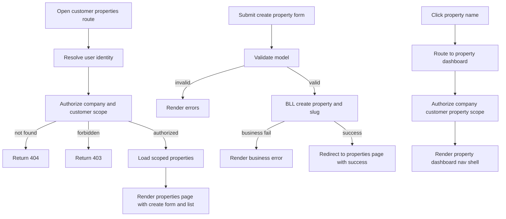

# Customer Area Properties and Property Dashboard Implementation Plan

## Objective

Implement customer-scoped property management under the existing customer context so users can:
- open a properties page at `m/{companySlug}/c/{customerSlug}/properties`
- create new properties in tenant-safe scope
- list customer properties with names as clickable links
- open each property dashboard at `m/{companySlug}/c/{customerSlug}/p/{propertySlug}`
- use a consistent customer-context layout with language switcher, new context action, and logout action
- see top-left context links to current management company dashboard and customer dashboard

Also prepare follow-up management-area property list behavior:
- after customer properties and property dashboard are implemented, management properties page can render a simple list of properties
- property names in management properties list must route to property dashboard

## Confirmed Route Contract

- Customer properties list create page: `m/{companySlug}/c/{customerSlug}/properties`
- Property dashboard entry page: `m/{companySlug}/c/{customerSlug}/p/{propertySlug}`

## Existing Context and Constraints

### Routing and context conventions

- Existing customer entry pattern already uses `m/{companySlug}/c/{customerSlug}`.
- New property routes must stay nested under company plus customer scope.
- Property slug must be unique in safe scope and never trusted from user input for ownership checks.

### Security and tenant isolation

For every read and write:
- resolve actor from authenticated principal
- resolve management company by `companySlug`
- verify actor has company-scope permissions
- resolve customer by `customerSlug` plus `ManagementCompanyId`
- resolve property by `propertySlug` plus `CustomerId` plus company scope checks
- return `NotFound` for missing scoped records and `Forbid` for unauthorized access without leaking cross-tenant existence

### Architecture and layering

- Controllers remain orchestration-only.
- Business authorization and workflow checks belong in BLL services.
- Use strongly typed view models for MVC pages.
- Use resource-backed UI text and validation messages in both English and Estonian.

### Domain readiness assumptions

- `Property` already exists with slug support in domain and migration history.
- Property creation flow should generate slug in BLL.
- Uniqueness and tenant-safe constraints must be validated both in service logic and DB constraints.

## Functional Scope

### In scope

1. Customer properties page under `m/{companySlug}/c/{customerSlug}/properties` with:
   - property list table
   - create property form
   - resource-backed validation and feedback
2. Property dashboard route under `m/{companySlug}/c/{customerSlug}/p/{propertySlug}`.
3. Property dashboard navigation shell with links:
   - Dashboard
   - Profile
   - Units
   - Residents
   - Tickets
4. Customer-context layout parity including:
   - language switching
   - new context action
   - logout action
   - top-left context labels and links:
     - management company link to company dashboard
     - customer link to customer dashboard
5. Customer properties list with property names linking to property dashboard.
6. Management area properties page follow-up contract:
   - list scoped properties only
   - property names link to same property dashboard route

### Out of scope for this phase

- Full implementation of property profile business features
- Full implementation of units and residents modules
- New public REST API endpoints
- Unrelated schema redesign

## Planned Implementation Approach

### 1. BLL service expansion for customer properties and property dashboard authorization

Add or extend dedicated BLL capability for:
- authorizing actor in company plus customer scope
- listing properties for customer scope
- creating property with validation and slug generation
- resolving property dashboard context by `propertySlug` within customer and tenant scope

Planned BLL operations:
- `AuthorizeCustomerContextAsync appUserId companySlug customerSlug`
- `ListPropertiesAsync context`
- `CreatePropertyAsync context request`
- `GetPropertyDashboardContextAsync context propertySlug`

Planned BLL validations:
- actor is authenticated and tenant-authorized
- customer belongs to target company
- required property fields are valid and normalized
- property uniqueness and slug safety in correct scope
- no cross-customer or cross-company property access

### 2. Customer properties MVC controller

Add customer-scoped properties controller with route base:
- `m/{companySlug}/c/{customerSlug}/properties`

Planned actions:
- GET `Index` for list and create form model
- POST `Add` for property creation

Controller behavior:
- resolve app user id from claims
- call BLL for authorization and data
- return `Challenge`, `NotFound`, or `Forbid` per guardrail rules
- use anti-forgery validation on POST
- use TempData for success or business error feedback

### 3. Property dashboard MVC controller

Add property dashboard controller with route base:
- `m/{companySlug}/c/{customerSlug}/p/{propertySlug}`

Planned actions:
- GET `Index`

Controller behavior:
- authorize company and customer scope via BLL
- resolve property in scoped context
- return secure `NotFound` or `Forbid` outcomes
- render dashboard shell and starter widgets in same spirit as customer dashboard bootstrap

### 4. View model plan

Create strongly typed models for:

- `CustomerPropertiesPageViewModel`
  - `CompanySlug`
  - `CompanyName`
  - `CustomerSlug`
  - `CustomerName`
  - `IReadOnlyList<CustomerPropertyListItemViewModel> Properties`
  - `AddPropertyViewModel AddProperty`

- `CustomerPropertyListItemViewModel`
  - `PropertyId`
  - `Name`
  - `Slug`
  - optional summary fields for v1 list

- `AddPropertyViewModel`
  - property create inputs required by current domain
  - resource-backed display and validation attributes

- `PropertyDashboardPageViewModel`
  - `CompanySlug`
  - `CompanyName`
  - `CustomerSlug`
  - `CustomerName`
  - `PropertySlug`
  - `PropertyName`
  - starter dashboard cards or counters

### 5. Razor pages and layout behavior

Create and wire views for:
- customer properties index page with create form card plus list card
- property dashboard index page with shell cards and placeholders in same spirit as customer dashboard plan

Layout requirements for property context:
- keep language switching control
- keep new context control
- keep logout control
- show top-left scope links:
  - management company display links to company dashboard
  - customer display links to customer dashboard
- keep active nav highlighting for Dashboard, Profile, Units, Residents, Tickets

### 6. Navigation integration

Update customer-side navigation behavior:
- from customer context sidebar, Properties should route to customer properties page
- from properties list, property name links to property dashboard
- from property dashboard, nav links render stable placeholders or routed pages per phased implementation

### 7. Management properties page dependency phase

After customer properties and property dashboard are in place:
- implement management area properties page as list-focused page
- scope list by company and optionally customer filters as needed by current design
- render property names as links to `m/{companySlug}/c/{customerSlug}/p/{propertySlug}`

This keeps management properties page thin and aligned with established property dashboard route.

### 8. Localization updates

Add missing keys in both:
- `App.Resources/Views/UiText.resx`
- `App.Resources/Views/UiText.et.resx`

Required key categories:
- customer properties page title and intro
- create property form labels and validation text
- properties table headers and empty state text
- property dashboard title and nav labels
- top-left context captions for company and customer links
- success and error messages

### 9. Verification and tests

Service tests:
- tenant isolation for list, create, and property resolve
- forbidden and not found outcomes for invalid scope access
- slug generation and uniqueness behavior in scoped context

Controller tests:
- `Challenge` when user id claim missing
- secure `NotFound` for unknown company, customer, or property slug in scope
- `Forbid` for unauthorized actor
- successful create redirects to index with success feedback
- invalid model returns page with validation errors

UI checks:
- properties page renders create form plus list
- property names navigate to property dashboard
- property dashboard renders required nav links
- language switching, new context action, and logout are visible and functional in context layout
- top-left company and customer links navigate correctly

## Execution Sequence

1. Add or extend BLL contracts and models for customer-scoped property list, create, and property dashboard context.
2. Implement BLL authorization and tenant-safe property operations.
3. Register BLL services in DI.
4. Add customer properties controller and actions.
5. Add property dashboard controller and action.
6. Add customer properties and property dashboard view models.
7. Build customer properties index view with create form and list.
8. Build property dashboard view and context-aware layout elements.
9. Integrate navigation and top-left context links.
10. Add localization keys in both cultures.
11. Add service and controller tests for IDOR and authorization guardrails.
12. Implement management properties list page that links property names to property dashboard route.
13. Run verification and finalize.

## Flow Diagram

## Acceptance Criteria

1. Customer properties page exists at `m/{companySlug}/c/{customerSlug}/properties`.
2. User can create property and see it in customer-scoped list.
3. Property names are clickable and open `m/{companySlug}/c/{customerSlug}/p/{propertySlug}`.
4. Property dashboard renders nav links: Dashboard, Profile, Units, Residents, Tickets.
5. Property context layout includes language switcher, new context action, and logout action.
6. Top-left context displays both management company and customer as clickable links to their dashboards.
7. Unauthorized and cross-tenant access attempts return secure `NotFound` or `Forbid` behavior without leakage.
8. Management properties page can be implemented as list-only view with property-name links to property dashboard once dependency phase is complete.

## Risks and Mitigations

- Risk: cross-tenant or cross-customer property exposure
  - Mitigation: enforce company plus customer plus property filters before materialization in BLL.

- Risk: route inconsistency between customer and management entry points
  - Mitigation: standardize property dashboard links on confirmed route contract.

- Risk: UI context confusion in nested company customer property scope
  - Mitigation: always show top-left company and customer links and consistent sidebar active state.

- Risk: localization regressions for new nav and form text
  - Mitigation: add keys in both cultures and use resource-backed labels plus messages.

## Handoff Notes for Implementation Mode

- Reuse customer dashboard shell style and management page form-list card patterns for consistency.
- Keep controllers thin and place business checks in BLL service methods.
- Keep all user-facing text resource-backed and bilingual.
- Implement management properties list page only after customer properties and property dashboard foundation is in place.
