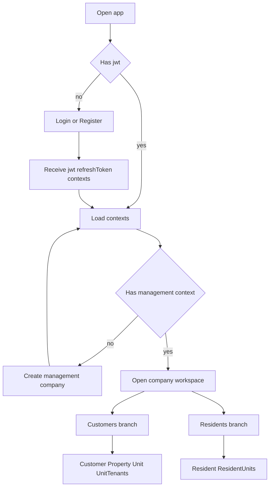

# AGENTS.md - Frontend Vue SPA Implementation Guide

## 1. Mission
Build a standalone Vue SPA for the existing backend API defined in [`plans/front/swagger.json`](plans/front/swagger.json).

This document is self-contained for the frontend agent. Do not assume access to any other planning file. All required flows, hierarchy, and UI directives are defined here.

This frontend must be API-only. Do not depend on MVC pages, Razor, server-rendered layouts, TempData, cookie context switching, or MVC view models.

## 2. Mandatory tech stack
Use only:
- Vue 3
- TypeScript
- Vite
- Vue Router
- Pinia
- ESLint
- Prettier

Do not add other libraries unless explicitly approved.

## 3. Core product rules
- Authentication is JWT + refresh token.
- Client supports register, login, token refresh, logout.
- Client supports create management company onboarding.
- Navigation must match supported API only.
- UI should look and behave like current MVC experience style, but implemented as SPA pages.
- Keep same hierarchical workspace model:
  - Management -> Customer -> Property -> Unit -> UnitTenants
  - Management -> Resident -> ResidentUnits
- Do not include navigation links for features that have no API support.

## 4. API-first route model
Use hierarchical SPA routes that map to API route context.

### 4.1 Workspace model and area-style shells
UI should mirror MVC-style area workspaces as SPA shells:

- Management company workspace
  - Customers
  - Residents
  - Profile
- Customer workspace
  - Properties
  - Profile
- Property workspace
  - Units
  - Profile
- Unit workspace
  - Profile
  - Tenants
- Resident workspace
  - Details
  - Units

Important:
- Do not render dead links.
- If a workspace subpage has no API endpoint yet, keep the item hidden or disabled with clear unavailable state.
- Based on current API map in [`plans/front/swagger.json`](plans/front/swagger.json), Management workspace profile endpoint is not present, so do not expose it as an active navigation link.

Recommended frontend route tree:
- `/auth/login`
- `/auth/register`
- `/onboarding/contexts`
- `/onboarding/create-management-company`
- `/co/:companySlug`
  - `/co/:companySlug/customers`
  - `/co/:companySlug/customers/:customerSlug/dashboard`
  - `/co/:companySlug/customers/:customerSlug/profile`
  - `/co/:companySlug/customers/:customerSlug/properties`
  - `/co/:companySlug/customers/:customerSlug/properties/:propertySlug/dashboard`
  - `/co/:companySlug/customers/:customerSlug/properties/:propertySlug/profile`
  - `/co/:companySlug/customers/:customerSlug/properties/:propertySlug/units`
  - `/co/:companySlug/customers/:customerSlug/properties/:propertySlug/units/:unitSlug/dashboard`
  - `/co/:companySlug/customers/:customerSlug/properties/:propertySlug/units/:unitSlug/profile`
  - `/co/:companySlug/customers/:customerSlug/properties/:propertySlug/units/:unitSlug/tenants`
  - `/co/:companySlug/residents`
  - `/co/:companySlug/residents/:residentIdCode/dashboard`
  - `/co/:companySlug/residents/:residentIdCode/profile`
  - `/co/:companySlug/residents/:residentIdCode/units`

Frontend route names may differ, but the URL state must preserve `companySlug`, `customerSlug`, `propertySlug`, `unitSlug`, `residentIdCode` as applicable.

### 4.2 Supported capability map from current API
Use this map to decide what is actually navigable today:

- Management workspace
  - Customers list and create: supported
  - Residents list and create: supported
  - Profile: not supported by current API
- Customer workspace
  - Dashboard: supported
  - Properties list and create: supported
  - Profile get update delete: supported
- Property workspace
  - Dashboard: supported
  - Units list and create: supported
  - Profile get update delete: supported
- Unit workspace
  - Dashboard: supported
  - Profile get update delete: supported
  - Tenants bootstrap and lease CRUD: supported
- Resident workspace
  - Dashboard: supported
  - Details via profile get update delete: supported
  - Units bootstrap and lease CRUD: supported

## 5. Authentication contract
Use these endpoints:
- `POST /api/v1/identity/Account/Register`
- `POST /api/v1/identity/Account/Login`
- `POST /api/v1/identity/Account/RefreshTokenData`
- `POST /api/v1/identity/Account/Logout`

### Token handling requirements
- Store auth state in Pinia.
- Keep access token available for Authorization header injection.
- Keep refresh token for refresh flow.
- Implement Axios interceptor:
  - attach `Bearer <jwt>` to protected calls
  - on 401, attempt single refresh retry
  - prevent parallel refresh storms by queueing pending requests
  - if refresh fails, clear auth state and redirect to login
- Logout must call logout endpoint with refresh token, then clear local auth state even if logout API fails.

## 6. Onboarding and initial app entry
Primary startup flow:
1. User registers or logs in.
2. Parse response payload `jwt`, `refreshToken`, onboarding contexts.
3. If no usable management context, route to create management company.
4. Create company via `POST /api/v1/onboarding/management-companies`.
5. Load contexts via `GET /api/v1/onboarding/contexts`.
6. Route user into selected company workspace.

## 7. Required page flows

### 7.1 Management -> Customer chain
- Customers list and create
  - `GET /api/v1/co/{companySlug}/cu`
  - `POST /api/v1/co/{companySlug}/cu`
- Customer dashboard
  - `GET /api/v1/co/{companySlug}/cu/{customerSlug}/dashboard`
- Customer profile CRUD
  - `GET /api/v1/co/{companySlug}/cu/{customerSlug}/profile`
  - `PUT /api/v1/co/{companySlug}/cu/{customerSlug}/profile`
  - `DELETE /api/v1/co/{companySlug}/cu/{customerSlug}/profile`
- Customer properties list and create
  - `GET /api/v1/co/{companySlug}/cu/{customerSlug}/pr`
  - `POST /api/v1/co/{companySlug}/cu/{customerSlug}/pr`

### 7.2 Customer -> Property chain
- Property dashboard
  - `GET /api/v1/co/{companySlug}/cu/{customerSlug}/pr/{propertySlug}/dashboard`
- Property profile CRUD
  - `GET /api/v1/co/{companySlug}/cu/{customerSlug}/pr/{propertySlug}/profile`
  - `PUT /api/v1/co/{companySlug}/cu/{customerSlug}/pr/{propertySlug}/profile`
  - `DELETE /api/v1/co/{companySlug}/cu/{customerSlug}/pr/{propertySlug}/profile`
- Property units list and create
  - `GET /api/v1/co/{companySlug}/cu/{customerSlug}/pr/{propertySlug}/un`
  - `POST /api/v1/co/{companySlug}/cu/{customerSlug}/pr/{propertySlug}/un`

### 7.3 Property -> Unit chain
- Unit dashboard
  - `GET /api/v1/co/{companySlug}/cu/{customerSlug}/pr/{propertySlug}/un/{unitSlug}/dashboard`
- Unit profile CRUD
  - `GET /api/v1/co/{companySlug}/cu/{customerSlug}/pr/{propertySlug}/un/{unitSlug}/profile`
  - `PUT /api/v1/co/{companySlug}/cu/{customerSlug}/pr/{propertySlug}/un/{unitSlug}/profile`
  - `DELETE /api/v1/co/{companySlug}/cu/{customerSlug}/pr/{propertySlug}/un/{unitSlug}/profile`
- Unit tenants workflows
  - Bootstrap: `GET /api/v1/co/{companySlug}/cu/{customerSlug}/pr/{propertySlug}/un/{unitSlug}/tenants`
  - Resident search: `GET /api/v1/co/{companySlug}/cu/{customerSlug}/pr/{propertySlug}/un/{unitSlug}/resident-search`
  - Lease create: `POST /api/v1/co/{companySlug}/cu/{customerSlug}/pr/{propertySlug}/un/{unitSlug}/leases`
  - Lease update: `PUT /api/v1/co/{companySlug}/cu/{customerSlug}/pr/{propertySlug}/un/{unitSlug}/leases/{leaseId}`
  - Lease delete: `DELETE /api/v1/co/{companySlug}/cu/{customerSlug}/pr/{propertySlug}/un/{unitSlug}/leases/{leaseId}`

### 7.4 Management -> Resident chain
- Residents list and create
  - `GET /api/v1/co/{companySlug}/re`
  - `POST /api/v1/co/{companySlug}/re`
- Resident dashboard
  - `GET /api/v1/co/{companySlug}/re/{residentIdCode}/dashboard`
- Resident profile CRUD
  - `GET /api/v1/co/{companySlug}/re/{residentIdCode}/profile`
  - `PUT /api/v1/co/{companySlug}/re/{residentIdCode}/profile`
  - `DELETE /api/v1/co/{companySlug}/re/{residentIdCode}/profile`
- Resident units workflows
  - Bootstrap: `GET /api/v1/co/{companySlug}/re/{residentIdCode}/units`
  - Property search: `GET /api/v1/co/{companySlug}/re/{residentIdCode}/property-search`
  - Property units list: `GET /api/v1/co/{companySlug}/re/{residentIdCode}/properties/{propertyId}/units`
  - Lease create: `POST /api/v1/co/{companySlug}/re/{residentIdCode}/leases`
  - Lease update: `PUT /api/v1/co/{companySlug}/re/{residentIdCode}/leases/{leaseId}`
  - Lease delete: `DELETE /api/v1/co/{companySlug}/re/{residentIdCode}/leases/{leaseId}`

## 8. UI directive
Build a responsive, card-based professional UI consistent with MVC visual behavior, but API-native.

### Mandatory UI behavior
- Left navigation with context-aware links only.
- Breadcrumb from API route context.
- No dead links.
- Every form has inline field validation and summary errors.
- Disable submit during pending request.
- Show clear success and failure notifications.
- On destructive actions, use explicit confirmation input matching backend contract.

### Navigation policy
Render only links that map to implemented API endpoints in this guide.

Navigation expectations by workspace:
- Management workspace nav should include Customers and Residents.
- Customer workspace nav should include Properties and Profile.
- Property workspace nav should include Units and Profile.
- Unit workspace nav should include Profile and Tenants.
- Resident workspace nav should include Details and Units.
- Dashboard links may be included where endpoint exists.

### Layout sections
- Global auth shell for login and register.
- Workspace shell for authenticated pages.
- Context header showing selected management company and current chain location.

## 9. State architecture
Create Pinia stores:
- `authStore`
  - jwt, refreshToken, user email, roles, auth status
- `contextStore`
  - onboarding contexts, selected context, route context helpers
- feature stores or composables for:
  - customers
  - customer properties
  - property units
  - unit tenants leases
  - residents
  - resident units leases

Prefer typed API clients grouped by bounded context.

## 10. API error handling
All API failures must map from [`App.DTO.v1.RestApiErrorResponse`](../front/swagger.json) shape:
- `status`
- `error`
- `errorCode`
- `errors` field dictionary
- `traceId`

Display:
- field errors near controls
- page-level errors in alert area
- unauthorized and forbidden in dedicated access states

## 11. Mermaid workflow

## 12. Definition of done for frontend agent
- Vue app scaffolded with required stack only.
- JWT and refresh token flow fully operational.
- Login, register, logout, create management company implemented.
- All listed hierarchical routes implemented.
- Both lease workflows implemented:
  - UnitTenants path
  - ResidentUnits path
- UI includes only API-backed navigation items.
- Error handling and loading states implemented across all forms and page loads.
- Route guards protect authenticated pages.
- Code formatted and linted with ESLint and Prettier.

## 13. Non-goals for this phase
- Any feature without listed API endpoint support.
- MVC-specific constructs.
- Additional dependency additions beyond approved stack.
