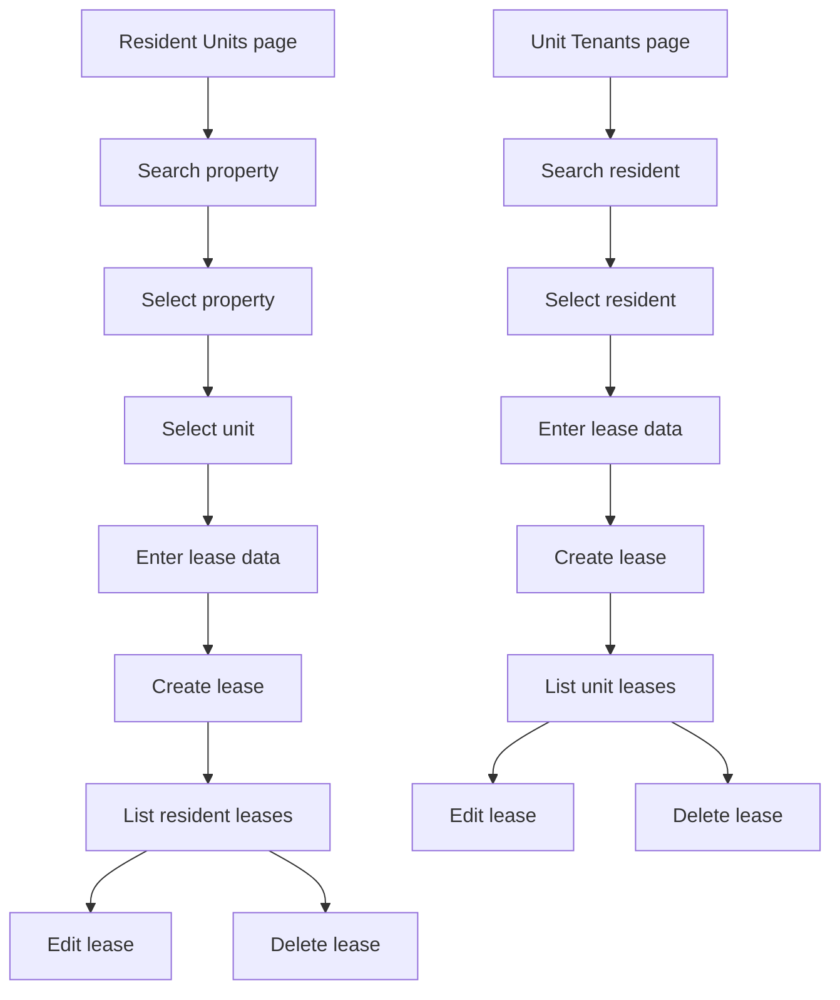

# Lease linking plan for resident units page and unit tenants page

## Goal
Implement lease based linking between [`Resident`](App.Domain/Resident/Resident.cs) and [`Unit`](App.Domain/Property/Unit.cs) using the existing [`Lease`](App.Domain/Lease/Lease.cs) domain entity, with lease management available from both:
- resident workspace Units page
- unit workspace Tenants page

The same lease record must be manageable from either entry point while preserving tenant isolation by management company and preventing cross tenant or cross customer linking.

## Confirmed scope
- Lease management uses separate controllers and separate views for each workspace entry point.
- Resident side uses a dedicated [`ResidentUnitsController`](WebApp/Areas/Resident/Controllers/ResidentUnitsController.cs) and resident specific views.
- Unit side uses a dedicated [`UnitTenantsController`](WebApp/Areas/Unit/Controllers/UnitTenantsController.cs) and unit specific views.
- Resident side add flow starts by searching a property, then selecting a unit number from a dropdown, then filling lease fields.
- Unit side add flow starts by searching for a resident by name or id code, then selecting a resident, then filling lease fields.
- Both pages must list existing leases and support edit and delete actions.
- The linking entity remains [`Lease`](App.Domain/Lease/Lease.cs) with current fields:
  - `StartDate`
  - `EndDate`
  - `IsActive`
  - `Notes`
  - `LeaseRoleId`
  - `UnitId`
  - `ResidentId`

## Existing architecture context
- Resident workspace routing and page shell already exist in [`ResidentDashboardController`](WebApp/Areas/Resident/Controllers/ResidentDashboardController.cs) and [`_ResidentLayout.cshtml`](WebApp/Areas/Resident/Views/Shared/_ResidentLayout.cshtml).
- Unit workspace routing and page shell already exist in [`UnitDashboardController`](WebApp/Areas/Unit/Controllers/UnitDashboardController.cs:13) and [`_UnitLayout.cshtml`](WebApp/Areas/Unit/Views/Shared/_UnitLayout.cshtml).
- Tenant scoped management access patterns already exist in [`ManagementCustomerAccessService`](App.BLL/Management/Customers/ManagementCustomerAccessService.cs), [`ManagementCustomerPropertyService`](App.BLL/Management/Properties/ManagementCustomerPropertyService.cs), and resident access services under [`App.BLL/Management/Residents`](App.BLL/Management/Residents).
- Unit collection and workspace patterns already exist in [`PropertyUnitsController`](WebApp/Areas/Property/Controllers/PropertyUnitsController.cs:14) and [`ManagementPropertyUnitService`](App.BLL/Management/Units/ManagementPropertyUnitService.cs).
- The database model already includes [`Lease`](App.Domain/Lease/Lease.cs), so this increment is mainly about management workflows, validation rules, search UX, and page integration.

## Core design decision
Use one dedicated lease management service set in the BLL layer and surface it through separate resident and unit workspace controllers with separate views.

Reasoning:
- lease rules are still shared between both entry points
- resident and unit page orchestration stays separated by workspace responsibility
- transport and UI concerns stay cleaner than adding more actions into dashboard controllers
- tenant and ownership validation stays centralized in the BLL layer
- the same create, update, delete, and lookup rules are enforced no matter which page initiated the action

## Implementation plan

### 1. Add dedicated lease management BLL contracts and models
Create focused lease services in the dedicated BLL layer and keep controller specific orchestration in separate resident and unit controllers.

Planned contracts:
- `App.BLL/Management/Leases/IManagementLeaseService.cs`
- `App.BLL/Management/Leases/IManagementLeaseSearchService.cs`

Suggested responsibilities for [`IManagementLeaseService`](App.BLL/Management/Leases/IManagementLeaseService.cs):
- list leases for an authorized resident workspace context
- list leases for an authorized unit workspace context
- create lease from resident workspace context
- create lease from unit workspace context
- update lease from resident workspace context
- update lease from unit workspace context
- delete lease from resident workspace context
- delete lease from unit workspace context
- load a single editable lease with tenant scoped checks

Suggested responsibilities for [`IManagementLeaseSearchService`](App.BLL/Management/Leases/IManagementLeaseSearchService.cs):
- property search inside authorized resident company scope
- unit options lookup for a selected property inside resident company scope
- resident search inside authorized unit company scope
- lease role option lookup

Planned models file:
- `App.BLL/Management/Leases/ManagementLeaseModels.cs`

Suggested model groups:
- authorized resident or unit lease context models
- resident workspace lease list item models
- unit workspace lease list item models
- create request and result models
- edit request and result models
- delete result models
- property search result models
- unit option models
- resident search result models
- lease role option models

### 2. Centralize tenant and ownership validation rules
All lease writes must validate both endpoints of the link before saving.

Mandatory create and update rules:
- never create or update a lease by trusting client supplied tenant identifiers
- resolve current actor from the existing authorized resident or unit workspace context
- if entry point is resident workspace, the selected property and selected unit must belong to the same authorized management company as the resident
- if entry point is unit workspace, the selected resident must belong to the same authorized management company as the unit
- do not fetch unit or resident by id only without company scoped filtering
- if a referenced unit or resident falls outside the authorized company boundary, return forbidden or not found without leaking existence
- validate the selected unit belongs to the selected property in the resident flow
- validate the lease being edited or deleted belongs to the current resident or current unit, depending on entry point

Recommended duplicate and consistency rules:
- block duplicate active leases for the same `ResidentId + UnitId` overlap unless business rules explicitly allow multiple concurrent leases
- require `StartDate`
- validate `EndDate >= StartDate` when `EndDate` exists
- require `LeaseRoleId`
- decide `IsActive` centrally from explicit input plus date logic, or document that UI controls it directly
- keep `Notes` localized through [`LangStr`](Base.Domain/LangStr.cs) and update with `SetTranslation(...)` on edit to preserve other languages

### 3. Define route and controller integration points
Use separate controllers and separate views for resident units and unit tenants lease management.

Resident workspace integration:
- add [`ResidentUnitsController`](WebApp/Areas/Resident/Controllers/ResidentUnitsController.cs) instead of extending [`ResidentDashboardController`](WebApp/Areas/Resident/Controllers/ResidentDashboardController.cs)
- keep resident workspace navigation pointing to the resident Units section route, but let the dedicated controller own the page and form actions
- planned actions:
  - `GET units`
  - `POST units/leases/add`
  - `POST units/leases/{leaseId}/edit`
  - `POST units/leases/{leaseId}/delete`
  - optional lightweight endpoints for property search and unit option loading if the UX uses async partials or json
- planned view:
  - `WebApp/Areas/Resident/Views/ResidentUnits/Index.cshtml`

Unit workspace integration:
- add [`UnitTenantsController`](WebApp/Areas/Unit/Controllers/UnitTenantsController.cs) instead of extending [`UnitDashboardController`](WebApp/Areas/Unit/Controllers/UnitDashboardController.cs:13)
- keep unit workspace navigation pointing to the unit Tenants section route, but let the dedicated controller own the page and form actions
- planned actions:
  - `GET tenants`
  - `POST tenants/leases/add`
  - `POST tenants/leases/{leaseId}/edit`
  - `POST tenants/leases/{leaseId}/delete`
  - optional lightweight resident search endpoint if the UX uses async partials or json
- planned view:
  - `WebApp/Areas/Unit/Views/UnitTenants/Index.cshtml`

Controller behavior:
- resolve resident or unit context first using existing access services
- delegate list, search, create, update, and delete operations to lease BLL services
- populate layout context so the existing resident and unit shells still highlight the current section correctly
- on failure rebuild the page model with preserved input and validation messages
- on success redirect back to the same dedicated controller index with `TempData` confirmation

### 4. Add resident Units page models and UX behavior
Create dedicated resident Units page models under the resident view model folder.

Planned view models:
- `WebApp/ViewModels/Resident/ResidentUnitsPageViewModel.cs`
- `WebApp/ViewModels/Resident/ResidentLeaseListItemViewModel.cs`
- `WebApp/ViewModels/Resident/AddResidentLeaseViewModel.cs`
- `WebApp/ViewModels/Resident/EditResidentLeaseViewModel.cs`
- `WebApp/ViewModels/Resident/ResidentLeasePropertySearchResultViewModel.cs`
- `WebApp/ViewModels/Resident/ResidentLeaseUnitOptionViewModel.cs`

Resident page composition:
- leases list card showing current linked units for the resident
- add lease card with property search, unit dropdown, and lease fields
- edit lease UI for existing rows, either inline or modal backed by the same page model
- delete action per lease row with anti forgery protection

Resident add flow details:
1. search property by name or other supported identifier inside current management company scope
2. select a property result
3. load units for that property into a dropdown using unit number as the primary label
4. fill lease data:
   - `StartDate`
   - `EndDate`
   - `LeaseRoleId`
   - `IsActive`
   - `Notes`
5. submit create request for the current resident plus selected unit

Resident list data should include:
- property name
- unit number
- lease role display label
- start date
- end date
- active state
- notes preview if useful
- edit and delete actions

### 5. Add unit Tenants page models and UX behavior
Create dedicated unit Tenants page models under the unit view model folder.

Planned view models:
- `WebApp/ViewModels/Unit/UnitTenantsPageViewModel.cs`
- `WebApp/ViewModels/Unit/UnitTenantLeaseListItemViewModel.cs`
- `WebApp/ViewModels/Unit/AddUnitLeaseViewModel.cs`
- `WebApp/ViewModels/Unit/EditUnitLeaseViewModel.cs`
- `WebApp/ViewModels/Unit/UnitLeaseResidentSearchResultViewModel.cs`

Unit page composition:
- tenants list card showing residents linked to the current unit through leases
- add lease card with resident search, resident select, and lease fields
- edit lease UI for current rows
- delete action per lease row with anti forgery protection

Unit add flow details:
1. search resident by full name fragments or id code within the authorized management company scope
2. select one resident result
3. fill lease data:
   - `StartDate`
   - `EndDate`
   - `LeaseRoleId`
   - `IsActive`
   - `Notes`
4. submit create request for the current unit plus selected resident

Unit list data should include:
- resident full name
- resident id code
- lease role display label
- start date
- end date
- active state
- edit and delete actions

### 6. Decide search interaction style before implementation
The plan supports either server roundtrip forms or lightweight async search helpers, but implementation mode should choose one consistent interaction style.

Recommended approach:
- use lightweight JSON or partial result endpoints for property search, unit option loading, and resident search
- keep final create, edit, and delete as normal MVC form posts

Why this is preferred:
- resident property search and unit loading become smoother
- unit resident search becomes practical for larger resident sets
- final writes remain simple and anti forgery protected

If implementation mode avoids async endpoints, the fallback can be:
- submit search term to the same page
- render matching properties or residents server side
- persist selected ids in the view model for the final create action

### 7. Add persistence and EF verification for lease behavior
Even though [`Lease`](App.Domain/Lease/Lease.cs) already exists, implementation mode should verify that the EF model and schema support the planned workflows.

Checks to perform:
- confirm [`AppDbContext`](App.DAL.EF/AppDbContext.cs) has `DbSet` and relationship mappings for lease, resident, unit, and lease role
- confirm indexes exist or add them if needed for common filters such as:
  - `ResidentId`
  - `UnitId`
  - `LeaseRoleId`
- consider adding a uniqueness or filtered uniqueness rule if business rules disallow overlapping active leases for the same resident and unit pair
- confirm `Notes` persists as `jsonb` and round trips correctly as [`LangStr`](Base.Domain/LangStr.cs)
- add migration only if EF configuration or constraints need adjustment

### 8. Add localization coverage
All new user visible labels, headings, placeholders, buttons, and feedback messages must be resource backed.

Expected resource updates in both languages:
- resident Units page labels for lease list and add form
- unit Tenants page labels for lease list and add form
- property search labels and empty state text
- resident search labels and empty state text
- lease role, start date, end date, active, notes labels where static UI text is needed
- success and failure messages for create, update, delete
- validation fallback messages added by controllers

Planned files:
- `App.Resources/Views/UiText.resx`
- `App.Resources/Views/UiText.et.resx`

### 9. Verification checklist for implementation mode
Required checks after coding:
- resident workspace Units page renders lease list and add lease flow without runtime errors
- unit workspace Tenants page renders lease list and add lease flow without runtime errors
- resident side property search only returns properties within the authorized management company
- resident side unit dropdown only shows units for the selected authorized property
- unit side resident search only returns residents within the authorized management company
- valid lease creation from resident page creates a lease linking the selected resident and unit
- valid lease creation from unit page creates the same kind of lease linking the selected unit and resident
- editing from either page updates the same lease record correctly
- deleting from either page removes the same lease record correctly
- cross tenant resident to unit linking is rejected without leaking foreign tenant existence
- editing or deleting a lease outside the current resident or unit scope is rejected
- `EndDate` before `StartDate` is rejected with clear validation
- localized `Notes` updates preserve other language translations on edit
- new static UI labels and messages render correctly in English and Estonian

## Proposed file touch map for implementation mode

### BLL
- `App.BLL/Management/Leases/IManagementLeaseService.cs`
- `App.BLL/Management/Leases/IManagementLeaseSearchService.cs`
- `App.BLL/Management/Leases/ManagementLeaseModels.cs`
- `App.BLL/Management/Leases/ManagementLeaseService.cs`
- `App.BLL/Management/Leases/ManagementLeaseSearchService.cs`
- `WebApp/Program.cs`

### Domain and persistence
- `App.DAL.EF/AppDbContext.cs`
- `App.DAL.EF/Migrations/<lease_related_migration_if_needed>.cs`
- `App.DAL.EF/Migrations/<lease_related_migration_if_needed>.Designer.cs`
- `App.DAL.EF/Migrations/AppDbContextModelSnapshot.cs`

### Resident workspace web layer
- `WebApp/Areas/Resident/Controllers/ResidentDashboardController.cs`
- `WebApp/Areas/Resident/Controllers/ResidentUnitsController.cs`
- `WebApp/ViewModels/Resident/ResidentDashboardPageViewModel.cs`
- `WebApp/ViewModels/Resident/ResidentUnitsPageViewModel.cs`
- `WebApp/Areas/Resident/Views/ResidentUnits/Index.cshtml`

### Unit workspace web layer
- `WebApp/Areas/Unit/Controllers/UnitDashboardController.cs`
- `WebApp/Areas/Unit/Controllers/UnitTenantsController.cs`
- `WebApp/ViewModels/Unit/UnitDashboardPageViewModel.cs`
- `WebApp/ViewModels/Unit/UnitTenantsPageViewModel.cs`
- `WebApp/Areas/Unit/Views/UnitTenants/Index.cshtml`

### Localization
- `App.Resources/Views/UiText.resx`
- `App.Resources/Views/UiText.et.resx`

## Interaction flow diagram

## Recommended implementation notes
- Keep lease business logic centralized in dedicated BLL services, not duplicated across [`ResidentUnitsController`](WebApp/Areas/Resident/Controllers/ResidentUnitsController.cs) and [`UnitTenantsController`](WebApp/Areas/Unit/Controllers/UnitTenantsController.cs).
- Scope every resident, property, unit, and lease lookup by authorized management company context before materialization.
- Preserve localized lease notes by updating existing [`LangStr`](Base.Domain/LangStr.cs) values instead of replacing them wholesale.
- Use separate resident and unit controllers plus separate views for clearer page ownership, while still using one shared lease domain workflow underneath.
- Keep controllers thin and let service results drive page level validation and feedback.