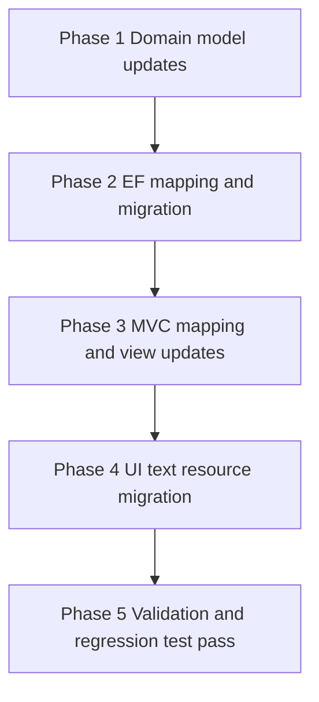

# Localization Backlog Implementation Plan

Source scope: `plans/localization/localization-domain-changes.md`

## Goal

Implement full EN + ET localization for:

1. Required domain `LangStr` migrations for all approved Group A + Group B fields.
2. UI message localization across shared layouts, onboarding, management area, and admin scaffolds.
3. Validation and controller messages currently hardcoded in web layer.

## Delivery strategy

- Use incremental vertical slices with schema-safe migration ordering.
- Keep controllers thin and mapping deterministic.
- Reuse the `ContactType` localization pattern end-to-end.
- Validate `LangStr` translation preservation via `SetTranslation(...)` in edit flows.

---

## Phase 0 - Preconditions and guardrails

### 0.1 Baseline checks

- Confirm `LangStr` converter pattern in `App.DAL.EF/AppDbContext.cs` is reusable for new fields.
- Confirm fallback behavior in `Base.Domain/LangStr.cs` remains authoritative.
- Confirm default culture is `en` and ET culture key target is `et-ee` per `AGENTS.md`.

### 0.2 Branching and migration policy

- Implement schema-impacting changes in focused commits.
- Generate migration immediately after each coherent domain batch.
- Do not mix unrelated refactors with migration commits.

---

## Phase 1 - Domain `LangStr` conversions

### 1.1 Group A required conversions

Update these properties in `App.Domain`:

- `App.Domain/Property/Property.cs`
  - `Label: string -> LangStr`
- `App.Domain/Ticket/Ticket.cs`
  - `Title: string -> LangStr`
  - `Description: string -> LangStr`
- `App.Domain/Vendor/VendorContact.cs`
  - `RoleTitle: string? -> LangStr?`
- `App.Domain/ManagementCompany/ManagementCompanyUser.cs`
  - `JobTitle: string -> LangStr`

### 1.2 Group B required conversions

Update these properties in `App.Domain`:

- `App.Domain/Contact/Contact.cs`
  - `Notes: string? -> LangStr?`
- `App.Domain/Customer/Customer.cs`
  - `Notes: string? -> LangStr?`
- `App.Domain/Customer/CustomerRepresentative.cs`
  - `Notes: string? -> LangStr?`
- `App.Domain/Lease/Lease.cs`
  - `Notes: string? -> LangStr?`
- `App.Domain/Property/Property.cs`
  - `Notes: string? -> LangStr?`
- `App.Domain/Property/Unit.cs`
  - `Notes: string? -> LangStr?`
- `App.Domain/Vendor/Vendor.cs`
  - `Notes: string -> LangStr`
- `App.Domain/Vendor/VendorTicketCategory.cs`
  - `Notes: string? -> LangStr?`
- `App.Domain/Work/ScheduledWork.cs`
  - `Notes: string? -> LangStr?`
- `App.Domain/Work/WorkLog.cs`
  - `Description: string? -> LangStr?`
- `App.Domain/ManagementCompany/ManagementCompanyJoinRequest.cs`
  - `Message: string? -> LangStr?`

### 1.3 Explicit invariant fields non-goals

Do not change invariant fields listed in `plans/localization/localization-domain-changes.md`.

---

## Phase 2 - EF Core mapping and database migration

### 2.1 Model configuration updates

In `App.DAL.EF/AppDbContext.cs`:

- Ensure every converted field uses:
  - value conversion `LangStr <-> json`
  - column type `jsonb`
- Keep nullability consistent with property type.

### 2.2 Data migration design

Create migration that transforms legacy text columns into JSON documents:

- For non-nullable converted fields:
  - text value becomes `{ "en": oldValue }`.
- For nullable fields:
  - null stays null.
  - non-null text becomes `{ "en": oldValue }`.

### 2.3 Migration safety tasks

- Validate up and down migration paths.
- Ensure no data loss for existing notes/title/description values.
- Verify snapshot in `App.DAL.EF/Migrations/AppDbContextModelSnapshot.cs` reflects `jsonb` columns.

---

## Phase 3 - MVC CRUD flow updates for converted fields

### 3.1 Pattern to apply

Apply `ContactType` pattern from:

- `WebApp/Areas/Admin/Controllers/ContactTypeController.cs`

Rules:

- Create: assign incoming string to `LangStr` field.
- Edit: use `entity.Field.SetTranslation(vm.Field)`.
- Display: use `ToString()` for localized rendering.

### 3.2 Admin controllers and views impacted by converted fields

Update CRUD surfaces in `WebApp/Areas/Admin/Controllers/**` and corresponding `WebApp/Areas/Admin/Views/**` for entities:

- `Property`
- `Ticket`
- `VendorContact`
- `ManagementCompanyUser`
- `Contact`
- `Customer`
- `CustomerRepresentative`
- `Lease`
- `Unit`
- `Vendor`
- `VendorTicketCategory`
- `ScheduledWork`
- `WorkLog`
- `ManagementCompanyJoinRequest` if applicable UI exists

### 3.3 View model adjustments

Where strong view models exist, keep form field type as `string` while domain is `LangStr`.

### 3.4 Display template consistency

- Replace raw `DisplayFor` on converted `LangStr` fields with explicit localized output path if needed.
- Ensure list/detail/delete views show resolved translation, not serialized JSON.

---

## Phase 4 - Resource localization for UI messages

### 4.1 Resource structure plan

Create/extend resource files in `App.Resources` with EN and ET variants by feature area:

- `App.Resources/Views/Shared/*.resx`
- `App.Resources/Views/Onboarding/*.resx`
- `App.Resources/Views/Home/*.resx`
- `App.Resources/Views/Management/*.resx`
- optional admin shared resources for scaffold actions and common labels

### 4.2 Shared and onboarding literal extraction backlog

Replace hardcoded text in:

- `WebApp/Views/Shared/_Layout.cshtml`
- `WebApp/Views/Shared/_OnboardingLayout.cshtml`
- `WebApp/Views/Shared/_LoginPartial.cshtml`
- `WebApp/Views/Shared/_LanguageSelection.cshtml`
- `WebApp/Views/Shared/Error.cshtml`
- `WebApp/Views/Home/AccessDenied.cshtml`
- `WebApp/Views/Home/Index.cshtml`
- `WebApp/Views/Home/Privacy.cshtml`
- `WebApp/Views/Onboarding/Index.cshtml`
- `WebApp/Views/Onboarding/Login.cshtml`
- `WebApp/Views/Onboarding/Register.cshtml`
- `WebApp/Views/Onboarding/NewManagementCompany.cshtml`
- `WebApp/Views/Onboarding/JoinManagementCompany.cshtml`
- `WebApp/Views/Onboarding/ResidentAccess.cshtml`

### 4.3 Management area literal extraction backlog

Replace hardcoded text in:

- `WebApp/Areas/Management/Views/Shared/_ManagementLayout.cshtml`
- `WebApp/Areas/Management/Views/Dashboard/Index.cshtml`
- `WebApp/Areas/Management/Views/Users/Index.cshtml`
- `WebApp/Areas/Management/Views/Users/Edit.cshtml`

### 4.4 Admin scaffold localization backlog

Systematically replace common literals in `WebApp/Areas/Admin/Views/**`:

- `Create`
- `Edit`
- `Delete`
- `Details`
- `Back to List`
- `Index`

Use a shared admin resource key set to avoid duplication.

---

## Phase 5 - Controller and view model message localization

### 5.1 Controller message replacement

Move hardcoded messages to resources in:

- `WebApp/Controllers/OnboardingController.cs`
  - `TempData` success text
  - `ModelState` errors
  - informational text assignments
- `WebApp/Areas/Management/Controllers/UsersController.cs`
  - `TempData` success and error text
  - `ModelState` errors
  - `ViewData["Title"]`
- `WebApp/Areas/Management/Controllers/DashboardController.cs`
  - `ViewData["Title"]`

### 5.2 View model metadata and default text replacement

Localize display/default strings in:

- `WebApp/ViewModels/Onboarding/ResidentAccessViewModel.cs`
- `WebApp/ViewModels/Onboarding/JoinManagementCompanyViewModel.cs`
- `WebApp/ViewModels/Management/Layout/ManagementLayoutViewModel.cs`
- `WebApp/ViewModels/ManagementUsers/ManagementUsersPageViewModel.cs`

Use resource-based `Display` metadata approach compatible with ASP.NET MVC model binding and validation pipeline.

---

## Phase 6 - Testing and validation

### 6.1 Automated tests

Add or update tests to verify:

- Converted fields persist as `jsonb` with expected shape.
- Edit in ET preserves EN translation for converted fields.
- Resource keys resolve in EN and ET for controller and view messages.

### 6.2 Manual verification checklist

- Switch UI culture EN -> ET and verify key pages.
- Create and edit records with converted fields in both cultures.
- Confirm admin scaffold action labels render localized text.
- Confirm onboarding and management alerts and validation messages are localized.

### 6.3 Regression checkpoints

- Ensure no cross-tenant rule regressions.
- Ensure no IDOR behavior changes.
- Ensure no API DTO contract breakage from UI/domain localization changes.

---

## Execution backlog as actionable checklist

- [ ] Phase 0 baseline checks completed
- [ ] Group A domain fields converted to `LangStr`
- [ ] Group B domain fields converted to `LangStr`
- [ ] EF mappings updated for all converted fields
- [ ] Migration created and verified for text -> `jsonb`
- [ ] Admin MVC flows updated for converted entities
- [ ] Shared + onboarding views localized via resources
- [ ] Management area views localized via resources
- [ ] Admin scaffold common literals localized via shared keys
- [ ] Controller messages localized in onboarding and management flows
- [ ] View model default/display strings localized
- [ ] EN/ET smoke tests completed
- [ ] `LangStr` translation preservation tests completed
- [ ] Final review against `plans/localization/localization-domain-changes.md`

---

## Definition of done for this backlog

Backlog is complete when:

- Every Group A and Group B field is fully migrated and rendered localized.
- UI literals identified in scope are resource-backed in EN and ET.
- Migration is safe and preserves existing data.
- Tests and manual checks confirm localization behavior and no security regression.
