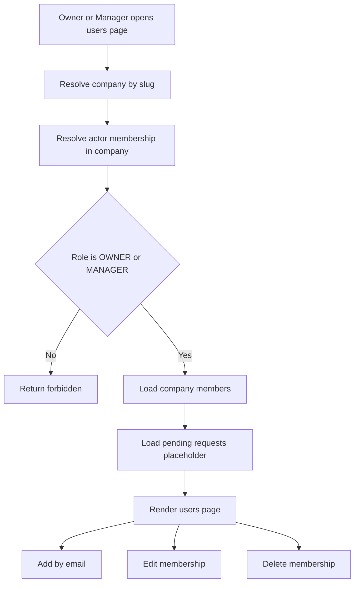

# Management users page implementation plan

## Goal
Implement a management-area users page under the company route that allows authorized company staff to:
- list all users belonging to the current management company
- edit an existing company user membership
- add a new company user by email
- delete a user from the current company
- show a separate pending requests subsection that is ready for a future access-request workflow described in [`plans/onboarding/onboarding.md`](plans/onboarding/onboarding.md)

## Scope and assumptions
- The page lives in the Management area, alongside the existing company-slug based routes already used by [`DashboardController`](WebApp/Areas/Management/Controllers/DashboardController.cs:9).
- Access must be restricted by company membership role, not only by authenticated status. Only company users with role code `OWNER` or `MANAGER` should be able to open the page or perform actions.
- The page manages company membership records, not global application users. Deleting a user from the page removes the [`ManagementCompanyUser`](App.Domain/ManagementCompany/ManagementCompanyUser.cs:7) link for the current company and must not delete the global [`AppUser`](App.Domain/Identity/AppUser.cs:8).
- Adding a user by email should support the onboarding note that owner or manager can add a company user directly after the app user exists, as stated in [`plans/onboarding/onboarding.md`](plans/onboarding/onboarding.md:24) and [`plans/onboarding/onboarding.md`](plans/onboarding/onboarding.md:34).
- Pending requests UI should be designed now as a dedicated subsection and backed by an abstraction that can later consume approval-request data when the onboarding request workflow is implemented.
- This is a school project, so the plan should stay pragmatic and avoid overengineering while still respecting tenant isolation and role checks from [`AGENTS.md`](AGENTS.md).

## Functional outcome
The target user journey is:
1. Authorized owner or manager opens `m/{companySlug}/users`.
2. The page resolves the current company from slug and verifies the signed-in user has an active company membership with role `OWNER` or `MANAGER`.
3. The page shows:
   - active company members list
   - member role and job title data
   - actions for edit and delete
   - add-user form by email
   - pending requests subsection, empty-state ready if workflow is not yet implemented
4. Add by email creates a new [`ManagementCompanyUser`](App.Domain/ManagementCompany/ManagementCompanyUser.cs:7) for an existing [`AppUser`](App.Domain/Identity/AppUser.cs:8), scoped to the current company.
5. Edit updates only the current company membership fields such as role, job title, active state, and validity dates.
6. Delete removes or deactivates only the current company membership, depending on final implementation choice.

## Recommended architecture
Keep controllers thin and place business rules in a dedicated BLL service, following the repository rule from [`AGENTS.md`](AGENTS.md).

### BLL responsibilities
Create a management-company user administration service in [`App.BLL`](App.BLL/) that is responsible for:
- resolving current actor company access from app user id plus company slug
- checking role authorization for `OWNER` and `MANAGER`
- loading the current company member list with tenant filtering applied before materialization
- validating email lookup for add flow
- preventing duplicate membership entries for the same user and company
- applying edit and delete operations only inside the current company scope
- exposing a placeholder method or result section for pending requests so the UI contract does not need redesign later

### Web responsibilities
The Management MVC controller should:
- accept the `companySlug` route parameter
- call the BLL service for all reads and writes
- return view models only
- surface validation messages and success feedback
- avoid direct EF authorization logic in controller actions

### Data access constraints
All queries must filter by company and actor authorization together. Avoid the admin-style pattern in [`ManagementCompanyUserController`](WebApp/Areas/Admin/Controllers/ManagementCompanyUserController.cs:26) because that controller reads by id without tenant constraints and is not suitable for management-area usage.

## Suggested implementation pieces

### 1. Authorization and tenant resolution
Add a reusable BLL-level method to:
- resolve the management company by slug
- resolve the signed-in app user id
- load the actor's active [`ManagementCompanyUser`](App.Domain/ManagementCompany/ManagementCompanyUser.cs:7) for that company
- verify role code is `OWNER` or `MANAGER`
- return not found or forbidden style result without leaking unrelated company data

This authorization check should be used consistently for:
- page load
- add user
- edit user
- delete user
- future pending-request approval actions

### 2. Management users controller
Introduce a controller such as [`UsersController`](WebApp/Areas/Management/Controllers/UsersController.cs) in the Management area with route pattern under the company slug:
- `GET m/{companySlug}/users`
- `GET m/{companySlug}/users/{id}/edit`
- `POST m/{companySlug}/users/{id}/edit`
- `POST m/{companySlug}/users/add`
- `POST m/{companySlug}/users/{id}/delete`

Use PRG flow for writes so validation and success messaging are predictable.

### 3. View models
Create focused management-area view models, for example:
- page view model containing company header context, members collection, add form model, and pending requests collection
- member list item view model with display name, email, role label or code, job title, active state, validity dates, and action links
- add form model with email, selected role id, optional job title, valid from, valid to, and active state default
- edit form model for existing membership fields
- pending request list item view model designed to be populated later

Keep models specific to MVC and do not bind domain entities directly.

### 4. Add-by-email workflow
Planned add workflow:
1. Normalize email input.
2. Find existing [`AppUser`](App.Domain/Identity/AppUser.cs:8) by email.
3. If app user does not exist, return validation error explaining that the person must register first.
4. Check if membership for the same company already exists and is active.
5. If duplicate exists, show validation error.
6. Create a new [`ManagementCompanyUser`](App.Domain/ManagementCompany/ManagementCompanyUser.cs:7) with selected role and default metadata.
7. Save and redirect back to the list with success message.

Important note: because onboarding specifies direct add after app-user registration, this page should not create a global identity account or invitation token at this stage.

### 5. Edit workflow
Edit should update only membership-level data inside the current company scope:
- [`ManagementCompanyUser.ManagementCompanyRoleId`](App.Domain/ManagementCompany/ManagementCompanyUser.cs:23)
- [`ManagementCompanyUser.JobTitle`](App.Domain/ManagementCompany/ManagementCompanyUser.cs:13)
- [`ManagementCompanyUser.IsActive`](App.Domain/ManagementCompany/ManagementCompanyUser.cs:14)
- [`ManagementCompanyUser.ValidFrom`](App.Domain/ManagementCompany/ManagementCompanyUser.cs:9)
- [`ManagementCompanyUser.ValidTo`](App.Domain/ManagementCompany/ManagementCompanyUser.cs:10)

Recommended guardrails:
- do not allow editing memberships outside the resolved company
- consider blocking self-demotion or self-removal if it would leave the company without any authorized manager-level user
- consider blocking deletion or deactivation of the last `OWNER` if such role exists in lookup data

If these guardrails are not implemented immediately, explicitly note them as follow-up items in code comments or backlog.

### 6. Delete workflow
Preferred behavior for first implementation:
- delete the company membership record only
- never delete the linked [`AppUser`](App.Domain/Identity/AppUser.cs:8)
- verify target membership belongs to current company before delete

Alternative option is soft removal by setting [`ManagementCompanyUser.IsActive`](App.Domain/ManagementCompany/ManagementCompanyUser.cs:14) false and closing validity dates. Implementation mode can decide based on current project conventions, but the page contract should describe the action as removing access from the company.

### 7. Pending requests subsection readiness
Because the onboarding request workflow is not implemented yet, prepare the page with a stable subsection contract:
- section heading such as Pending access requests
- collection in page view model even if currently empty
- empty state text explaining no pending requests
- BLL method returning an empty list for now
- code structure that can later swap in real request entities without changing the whole page layout

When the onboarding workflow is implemented, this subsection should support data similar to:
- requester name
- requester email
- requested role
- request created timestamp
- approve or reject action endpoints

This is a good candidate for a future dedicated entity and BLL flow, consistent with the notification note in [`plans/onboarding/onboarding.md`](plans/onboarding/onboarding.md:67).

## UI structure
Follow the management dashboard style direction from [`AGENTS.md`](AGENTS.md): professional, card-based, responsive, with clear action feedback.

Suggested page sections:
- header card with page title and short description
- add user card with inline form
- current users table or cards
- pending requests card below or beside current users
- success and validation summary area

Suggested visible columns for current users:
- full name
- email
- company role
- job title
- active state
- valid from
- valid to
- actions

Suggested edit interaction:
- either a dedicated edit page or inline modal-style section
- dedicated edit page is simpler for MVC and fits current routing conventions better

## Dependencies and likely files to add or modify
Implementation will likely touch:
- new BLL service files in [`App.BLL`](App.BLL/)
- management area controller in [`WebApp/Areas/Management/Controllers`](WebApp/Areas/Management/Controllers)
- management area views in [`WebApp/Areas/Management/Views`](WebApp/Areas/Management/Views)
- management-area view models in [`WebApp/ViewModels`](WebApp/ViewModels) or a management-specific subfolder
- possibly DI registration in [`WebApp/Program.cs`](WebApp/Program.cs:60)
- possibly localization resources if page strings are localized

## Validation and error cases
Plan for these explicit behaviors:
- unknown `companySlug` returns not found
- authenticated user without company access returns forbidden or redirected denial flow
- authenticated user with company membership but wrong role returns forbidden
- add by email fails when app user does not exist
- add by email fails when membership already exists for current company
- edit or delete fails when target membership is not inside current company
- pending requests section renders safely when feature backend is absent

## Testing checklist for implementation
Tests should cover at minimum:
- only `OWNER` and `MANAGER` can access page and actions
- users from another company are never listed or editable
- add by email creates membership only for existing app user
- duplicate membership add is rejected
- edit updates only selected company membership
- delete removes only current company membership and not the global app user
- pending requests subsection renders empty-state without backend workflow

## Implementation order
1. Add BLL service contract and result models for management user administration.
2. Implement company resolution plus owner-manager authorization checks.
3. Implement list query and page view model mapping.
4. Implement add-by-email flow with duplicate protection.
5. Implement edit flow for membership fields.
6. Implement delete or remove-access flow.
7. Add pending requests placeholder result and UI subsection.
8. Add MVC views and success or validation feedback.
9. Add tests for tenant isolation, role checks, and membership operations.

## Mermaid overview

## Notes for implementation mode
- Reuse existing company slug route style from [`DashboardController`](WebApp/Areas/Management/Controllers/DashboardController.cs:9).
- Keep all business rules out of MVC actions and inside BLL services, per [`AGENTS.md`](AGENTS.md).
- Treat role checks as company-role checks via [`ManagementCompanyRole`](App.Domain/ManagementCompany/ManagementCompanyRole.cs:7), not ASP.NET Identity global roles.
- Keep the pending requests section intentionally thin but structurally real, so the future onboarding request workflow can plug in with minimal UI rewrite.
