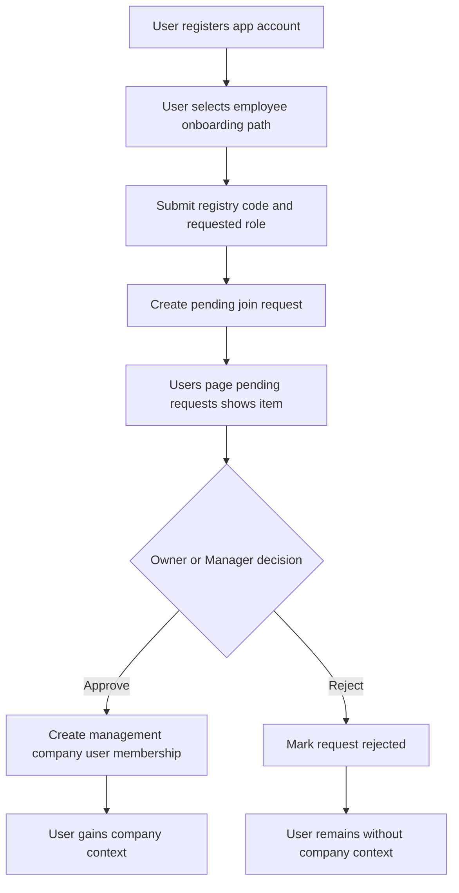

# Management company employee onboarding implementation plan

## Goal
Implement the full end-to-end onboarding flow for a new employee joining an existing management company, based on [`plans/onboarding/onboarding.md`](plans/onboarding/onboarding.md:26), where:
- user registers an app account
- user requests to join an existing management company by registry code and requested role
- request appears in Management Users page pending requests subsection
- management company owner or manager approves or rejects
- on approval, a [`ManagementCompanyUser`](App.Domain/ManagementCompany/ManagementCompanyUser.cs:7) membership is created

This plan extends the existing management users page concept in [`plans/management/users-page.md`](plans/management/users-page.md:1).

## Source workflow to implement
From [`plans/onboarding/onboarding.md`](plans/onboarding/onboarding.md:26):
1. Register app user
2. Choose employee of existing management company flow
3. Enter management company registry code and role to request
4. Management company accepts request
5. System creates management company membership

Also keep Option 2 from [`plans/onboarding/onboarding.md`](plans/onboarding/onboarding.md:32) intact as a parallel path where owner or manager directly adds by email via the users page.

## Scope boundaries

### In scope
- New request-based employee onboarding flow in onboarding UI and BLL
- Persistent request entity for pending approval records
- Management users page pending requests subsection wired to real data
- Approve and reject actions from management users page
- Membership creation on approval
- Duplicate and cross-tenant protections
- Tests for positive and negative flows

### Out of scope
- Email delivery or external notification channels
- Complex audit subsystem beyond basic request status and timestamps
- Global invitation tokens
- Admin area scaffolding

## Roles and permissions
- Request submitter: authenticated app user without required management context yet
- Approver: management company user with role code `OWNER` or `MANAGER`
- Enforce tenant scope by management company across all request reads and writes

No request approval action should succeed unless approver belongs to the same company and has owner or manager role.

## Domain and persistence design

### New entity
Add a dedicated entity in domain and EF mapping for onboarding employee access requests. Suggested name:
- [`ManagementCompanyJoinRequest`](App.Domain/ManagementCompany/ManagementCompanyUser.cs:7)

Suggested fields:
- `Id`
- `AppUserId` requester
- `ManagementCompanyId` target company
- `RequestedManagementCompanyRoleId` requested role
- `Status` pending or approved or rejected
- `Message` optional free text note from requester
- `CreatedAt`
- `ResolvedAt`
- `ResolvedByAppUserId` approver user id

Suggested uniqueness and integrity rules:
- at most one pending request per requester plus company
- foreign keys to app user, company, role lookups
- tenant-safe querying always by company id + actor authorization

### Migration updates
- Add table and indexes in EF migration
- Keep schema aligned with lookup role model used by [`ManagementCompanyUser`](App.Domain/ManagementCompany/ManagementCompanyUser.cs:7)

## BLL design

### New onboarding request service
Create a dedicated BLL service for request lifecycle. Suggested interface:
- `CreateJoinRequestAsync`
- `ListPendingForCompanyAsync`
- `ApproveRequestAsync`
- `RejectRequestAsync`

Service responsibilities:
- resolve target company by registry code
- validate requester exists and is authenticated
- validate requested role exists and is allowed for onboarding request
- block duplicates when active membership already exists
- block duplicate pending requests
- enforce tenant and role checks for approver actions
- create membership on approval
- update request status atomically

### Integration with existing management users BLL
Reuse or extend [`IManagementUserAdminService`](App.BLL/ManagementUsers/IManagementUserAdminService.cs:1) and [`ManagementUserAdminService`](App.BLL/ManagementUsers/ManagementUserAdminService.cs:1) to:
- load pending requests for the same company context as users list
- execute approve or reject action endpoints
- refresh page model with success or validation messages

Keep controller thin and place business rules in BLL as required by [`AGENTS.md`](AGENTS.md:1).

## Web flow design

### Onboarding request submission flow
In onboarding controller and views around [`OnboardingController`](WebApp/Controllers/OnboardingController.cs:1):
1. Authenticated user selects existing management company employee path
2. User submits:
   - management company registry code
   - requested role
   - optional message
3. System validates and creates pending request
4. UI confirms request submitted and informs user waiting for company approval

Suggested view model file area:
- [`WebApp/ViewModels/Onboarding`](WebApp/ViewModels/Onboarding)

### Management approval flow on users page
In [`UsersController`](WebApp/Areas/Management/Controllers/UsersController.cs:1) and [`Index.cshtml`](WebApp/Areas/Management/Views/Users/Index.cshtml:1):
1. Pending requests subsection loads real pending records
2. Each row shows requester name or email, requested role, created timestamp, optional message
3. Owner or manager can click approve or reject
4. Approve creates [`ManagementCompanyUser`](App.Domain/ManagementCompany/ManagementCompanyUser.cs:7)
5. Reject stores rejected status only
6. PRG redirect returns to users page with feedback message

## Validation and rules

### Request creation
- reject if registry code is unknown
- reject if requester already has membership in same company
- reject if pending request already exists for requester and company
- reject if requested role id is invalid for management-company role lookup

### Approval
- reject if request is not pending anymore
- reject if approver is not owner or manager in same company
- reject if requester already gained membership by other flow before approval
- on success create membership and mark request approved

### Rejection
- reject if request is not pending anymore
- reject if approver authorization fails
- on success mark request rejected without creating membership

## Data isolation and IDOR checklist
For each endpoint, apply:
1. resolve actor user id
2. resolve actor company context
3. filter query by target company before materialization
4. verify owner or manager permissions for decision actions
5. return safe not-found or forbidden response without leaking external tenant data

Align this with constraints from [`AGENTS.md`](AGENTS.md:46).

## UX details

### Onboarding side
- clear status message after submission
- if user has no contexts yet, keep existing home page no-context behavior from [`plans/onboarding/onboarding.md`](plans/onboarding/onboarding.md:4)

### Management users page pending section
- pending card should transition from placeholder to live list
- include empty-state text when none pending
- include action feedback after approve or reject
- keep responsive card/table style consistent with management area

## API and DTO note
If API endpoints are added for this flow, use versioned DTOs under [`App.DTO/v1`](App.DTO/v1) and structured errors via [`RestApiErrorResponse`](App.DTO/v1/RestApiErrorResponse.cs:1). For current MVC implementation, keep transport models as MVC view models.

## Testing checklist
Add or extend tests in [`Tests/Onboarding.Tests`](Tests/Onboarding.Tests):
- requester can create pending join request with valid company registry code and role
- duplicate pending request is blocked
- request blocked when requester already has company membership
- pending requests list returns only current company requests
- owner or manager can approve and membership is created
- owner or manager can reject and membership is not created
- non-authorized management user cannot approve or reject
- request cannot be resolved twice
- cross-tenant request id cannot be approved by another company actor

## Implementation sequence
1. Add domain entity and EF mapping for join requests
2. Add migration with indexes and foreign keys
3. Implement onboarding request BLL service and models
4. Add onboarding MVC view model and submit action + view
5. Wire pending requests read into management users page models
6. Add approve and reject actions to management users controller and BLL
7. Add success and validation feedback in users and onboarding views
8. Add tests for request creation, approval, rejection, authorization, and tenant isolation
9. Run verification and fix regressions

## Mermaid flow

## File touch map for implementation mode
Likely touched files or areas:
- domain and EF
  - [`App.Domain/ManagementCompany`](App.Domain/ManagementCompany)
  - [`App.DAL.EF/AppDbContext.cs`](App.DAL.EF/AppDbContext.cs:1)
  - [`App.DAL.EF/Migrations`](App.DAL.EF/Migrations)
- BLL
  - [`App.BLL/Onboarding`](App.BLL/Onboarding)
  - [`App.BLL/ManagementUsers`](App.BLL/ManagementUsers)
- Web MVC
  - [`WebApp/Controllers/OnboardingController.cs`](WebApp/Controllers/OnboardingController.cs:1)
  - [`WebApp/ViewModels/Onboarding`](WebApp/ViewModels/Onboarding)
  - [`WebApp/Views/Onboarding`](WebApp/Views/Onboarding)
  - [`WebApp/Areas/Management/Controllers/UsersController.cs`](WebApp/Areas/Management/Controllers/UsersController.cs:1)
  - [`WebApp/ViewModels/ManagementUsers`](WebApp/ViewModels/ManagementUsers)
  - [`WebApp/Areas/Management/Views/Users/Index.cshtml`](WebApp/Areas/Management/Views/Users/Index.cshtml:1)
- registration and DI
  - [`WebApp/Program.cs`](WebApp/Program.cs:1)
- tests
  - [`Tests/Onboarding.Tests/ContinuedOnboardingServiceTests.cs`](Tests/Onboarding.Tests/ContinuedOnboardingServiceTests.cs:1)
  - [`Tests/Onboarding.Tests/ManagementUserAdminServiceTests.cs`](Tests/Onboarding.Tests/ManagementUserAdminServiceTests.cs:1)

## Done criteria
- employee request can be submitted from onboarding flow
- pending request appears in management users pending subsection
- owner or manager can approve or reject from users page
- approval creates membership and context becomes available for requester
- tenant isolation and role checks validated by tests
- direct add by email path remains functional as alternative onboarding path
