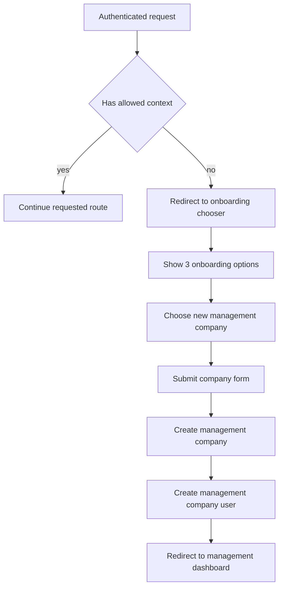

# Management Company Onboarding Plan

## Objective
Implement a focused onboarding slice where authenticated users without usable context are redirected to onboarding, can choose from three onboarding options, and can complete only the new management company flow.

Scope for this plan:
- Redirect user to onboarding chooser if user has no [`ManagementCompanyUser`](App.Domain/ManagementCompany/ManagementCompanyUser.cs) context, no resident context, and is not system admin.
- Show three options on onboarding chooser page:
  - New management company
  - Management company employee
  - Resident
- Implement only the new management company option end to end.
- After creating management company and linking [`ManagementCompanyUser`](App.Domain/ManagementCompany/ManagementCompanyUser.cs), redirect to management home at Area Management, [`DashboardController.Index`](WebApp/Areas/Management/Controllers/DashboardController.cs).
- Management home page should use mock UI style layout pattern, but content and most navigation can remain minimal or empty.

Confirmed routing decisions:
- Post-create target is Area Management, [`DashboardController.Index`](WebApp/Areas/Management/Controllers/DashboardController.cs).
- Context guard applies globally for authenticated routes, excluding onboarding and admin routes.

## Baseline Context
- Existing onboarding auth controller exists in [`OnboardingController`](WebApp/Controllers/OnboardingController.cs).
- Current documented onboarding baseline is in [`onboarding.md`](plans/onboarding/onboarding.md).
- Existing previous planning style reference is in [`plan.md`](plans/onboarding/plan.md).

## Functional Requirements

### 1. Context guard behavior
For authenticated requests:
- If user is system admin, allow route.
- Else if user has at least one management company user context, allow route.
- Else if user has resident user context, allow route.
- Else redirect to onboarding chooser page.

Guard application:
- Apply globally to authenticated routes.
- Exclude onboarding endpoints in [`OnboardingController`](WebApp/Controllers/OnboardingController.cs).
- Exclude admin area routes under [`WebApp/Areas/Admin`](WebApp/Areas/Admin).
- Keep anonymous and static asset behavior unaffected.

### 2. Onboarding chooser page
Add or extend onboarding chooser page to show three visible options:
- New management company
- Management company employee
- Resident

For this slice:
- New management company option is active and navigates to form flow.
- Employee and resident options are present but non-functional placeholders with clear not-in-scope state.

### 3. New management company flow
Implement end-to-end creation flow:
1. User opens new management company form.
2. User submits required company data.
3. System creates [`ManagementCompany`](App.Domain/ManagementCompany/ManagementCompany.cs).
4. System creates matching [`ManagementCompanyUser`](App.Domain/ManagementCompany/ManagementCompanyUser.cs) for current app user.
5. Role assignment should attach owner or equivalent initial management role using lookup seeded role data from [`InitialData`](App.DAL.EF/Seeding/InitialData.cs).
6. User is redirected to Area Management, [`DashboardController.Index`](WebApp/Areas/Management/Controllers/DashboardController.cs).

### 4. Management home placeholder with mock UI layout
Create or adapt management home to use the same layout concept as mock UI management layout from [`_ManagementLayout.cshtml`](Mockui/Areas/MockManagement/Views/Shared/_ManagementLayout.cshtml).

For this slice:
- Keep layout shell and visual structure aligned.
- Navigation can include only essential minimal links.
- Main content can be empty placeholder state.

## Architecture and Layering

### BLL placement
Business logic for context resolution and onboarding company creation should remain in BLL-facing services and not in controllers, aligned with repository rule from [`AGENTS.md`](AGENTS.md).

Controller responsibilities:
- Validate HTTP input.
- Call service methods.
- Map service results to view responses and redirects.

Service responsibilities:
- Determine user context availability.
- Execute management company creation transactionally.
- Enforce role assignment consistency.

### Data and tenant safety
When creating management company context:
- Ensure created [`ManagementCompanyUser`](App.Domain/ManagementCompany/ManagementCompanyUser.cs) references the newly created [`ManagementCompany`](App.Domain/ManagementCompany/ManagementCompany.cs).
- Avoid cross-tenant references.
- Ensure future tenant filtering can rely on this created context.

## Planned Implementation Steps
1. Add context-resolution helper/service contract in BLL for current user context checks.
2. Add global guard middleware or equivalent pipeline hook to enforce redirect behavior for authenticated users without context.
3. Exclude onboarding and admin route groups from guard logic.
4. Add onboarding chooser endpoint and view model updates to render three options.
5. Implement new management company create view model and form page.
6. Implement service method to create [`ManagementCompany`](App.Domain/ManagementCompany/ManagementCompany.cs) plus [`ManagementCompanyUser`](App.Domain/ManagementCompany/ManagementCompanyUser.cs) with initial role.
7. Wire POST success redirect to Area Management [`DashboardController.Index`](WebApp/Areas/Management/Controllers/DashboardController.cs).
8. Create or update management area layout and dashboard view to mirror mock UI structure from [`_ManagementLayout.cshtml`](Mockui/Areas/MockManagement/Views/Shared/_ManagementLayout.cshtml) with minimal content.
9. Add tests for guard, onboarding flow, and redirect behavior.

## Acceptance Criteria
- Authenticated non-admin user with no management or resident context is redirected to onboarding chooser.
- Authenticated system admin is not redirected by context guard.
- Onboarding chooser shows all three options.
- Only new management company option is functional.
- Submitting new management company form creates both [`ManagementCompany`](App.Domain/ManagementCompany/ManagementCompany.cs) and [`ManagementCompanyUser`](App.Domain/ManagementCompany/ManagementCompanyUser.cs) linked to current user.
- Successful submit redirects to Area Management [`DashboardController.Index`](WebApp/Areas/Management/Controllers/DashboardController.cs).
- Management dashboard uses mock UI style layout shell with minimal placeholder content.
- Guard is global for authenticated routes except onboarding and admin paths.

## Out of Scope
- Employee onboarding request workflow implementation.
- Resident onboarding request workflow implementation.
- Full management dashboard widgets and complete navigation structure.
- Extended notification and approval workflows.

## Verification Plan
- Unit tests for context resolution logic.
- Integration tests for redirect guard behavior by user type:
  - system admin
  - management context user
  - resident context user
  - no-context authenticated user
- Integration test for new management company POST success path and redirect target.
- Basic UI assertion that chooser shows three options and two are marked not active.

## Flow Diagram

## Risks and Mitigations
- Risk: guard catches routes that should remain open.
  - Mitigation: explicit exclusions for onboarding and admin route prefixes.
- Risk: partial create causes orphan data.
  - Mitigation: create company and management user in one service operation with transactional behavior.
- Risk: role lookup mismatch for initial management role.
  - Mitigation: bind role by stable code from seeded lookup data in [`InitialData`](App.DAL.EF/Seeding/InitialData.cs).
