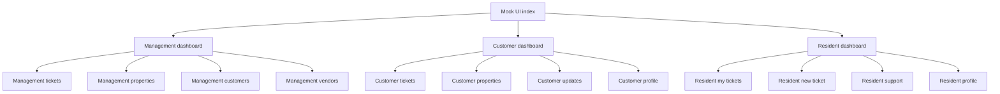

# Mock UI Planning Document

## Objective
Create a first-pass mock UI package using static Razor view markup and CSS for key project pages, with working navigation so pages can be reviewed quickly and then extended into real feature pages without restructuring.

## Scope for This Pass
Based on confirmed direction, include key navigation pages per role from project guidance.

### Management Company Mock Pages
- Dashboard
- Tickets
- Properties
- Customers
- Vendors

### Customer Representative Mock Pages
- Dashboard
- Tickets
- Properties
- Updates
- Profile

### Resident Mock Pages
- Dashboard
- My Tickets
- New Ticket
- Support
- Profile

## Out of Scope for This Pass
- Backend/API integration
- Authentication and authorization logic
- Real data loading
- Form submission behavior beyond static markup
- Admin scaffolding pages

## Mock UI Deliverables
- A Razor view page for each scoped page, with static placeholder content only
- Shared CSS for visual consistency and reusable layout primitives
- Role-based navigation links on every page in each role area
- Entry routing page in the web app to access each role section
- Layout and folder organization in `WebApp` aligned with future feature implementation

## Proposed File Structure
```text
plans/mock-ui/
  plan.md

WebApp/
  Areas/
    Management/
      Controllers/
        DashboardController.cs
      Views/
        Shared/
          _ManagementLayout.cshtml
        Dashboard/
          Index.cshtml
        Tickets/
          Index.cshtml
        Properties/
          Index.cshtml
        Customers/
          Index.cshtml
        Vendors/
          Index.cshtml

    Customer/
      Controllers/
        DashboardController.cs
      Views/
        Shared/
          _CustomerLayout.cshtml
        Dashboard/
          Index.cshtml
        Tickets/
          Index.cshtml
        Properties/
          Index.cshtml
        Updates/
          Index.cshtml
        Profile/
          Index.cshtml

    Resident/
      Controllers/
        DashboardController.cs
      Views/
        Shared/
          _ResidentLayout.cshtml
        Dashboard/
          Index.cshtml
        Tickets/
          MyTickets.cshtml
          NewTicket.cshtml
        Support/
          Index.cshtml
        Profile/
          Index.cshtml

  Controllers/
    MockUiController.cs
  Views/
    MockUi/
      Index.cshtml
  wwwroot/
    css/
      mock-ui.css
```

## Navigation Strategy
1. Add a consistent top header and left sidebar navigation pattern per role section.
2. Keep active-link state visible in sidebar for orientation.
3. Include a role switch link group on each page header to jump across role page sets.
4. Ensure every page is reachable within two clicks from landing page.

## UI Structure Strategy
1. Use a shared base layout pattern:
   - Header
   - Sidebar
   - Main content area with cards
2. Use reusable CSS utility classes for:
   - Grid and cards
   - Buttons and badges
   - Alert and status styles
3. Keep each page content intentionally lightweight with placeholders that represent real future widgets.

## Implementation Plan
1. Create mock UI root structure and shared stylesheet.
2. Build landing page with links to all role sections.
3. Implement management page set with shared layout and role navigation.
4. Implement customer page set with shared layout and role navigation.
5. Implement resident page set with shared layout and role navigation.
6. Add active navigation states and consistent page titles.
7. Perform static QA pass:
   - Verify all links resolve
   - Verify layout consistency across pages
   - Verify responsive behavior at common widths
8. Capture review notes and requested design adjustments in a follow-up markdown note.

## Acceptance Criteria
- Every scoped page exists as a Razor view with static placeholder markup.
- Every page contains working navigation links.
- Shared CSS provides consistent structure and visual hierarchy.
- Role areas are clearly separated and easy to review.
- Pages are routable inside `WebApp` using MVC routing and can be incrementally upgraded with real features.

## Site Map Diagram


## Handoff Notes for Implementation Mode
- Keep page content static in `.cshtml` and style in shared CSS.
- Add MVC routes and controller actions only for navigation access.
- Avoid domain or API integration in this phase.
- Keep naming and structure stable so future feature work can attach behavior page by page.
