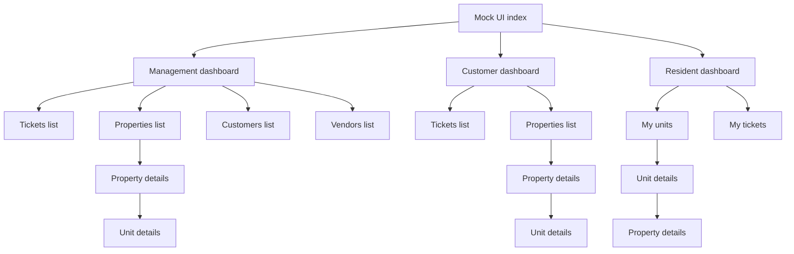

# Mock UI Planning Revision Document

## Objective
Revise the original mock UI plan to keep all existing Management capabilities in place while expanding structure depth and consistency across roles. The revised plan introduces explicit detail-page requirements for properties and units, then derives Customer and Resident page sets from the strengthened Management model.

This revision remains planning-only and does not include implementation changes.

## Revised Scope by Role

### Management Revised Scope
Management remains the most complete operational role and is expanded, not reduced.

#### Management Page Inventory
- Dashboard
- Tickets List
- Ticket Details
- Ticket Work Log and Activity
- Ticket Assignment and Scheduling View
- Properties List
- Property Details
- Property Units List
- Unit Details
- Customers List
- Customer Details
- Vendors List
- Vendor Details

#### Management Capability Notes
- Preserve all original capabilities from the baseline scope: Dashboard, Tickets, Properties, Customers, Vendors.
- Expand operational visibility through details and drill-down pages.
- Ensure ticket execution flow remains visible from triage to closure planning context.
- Ensure every property can be opened into a dedicated details page.
- Ensure every unit can be opened into a dedicated details page.

### Customer Representative Revised Scope
Customer pages are derived from the improved Management structure, adapted for monitoring and collaboration instead of operational control.

#### Customer Page Inventory
- Dashboard
- Tickets List
- Ticket Details
- Properties List
- Property Details
- Units Overview
- Unit Details
- Updates
- Profile

#### Customer Capability Notes
- Focus on portfolio transparency, status tracking, and communication.
- Keep details pages read-focused, with role-appropriate actions such as comment, confirmation, and escalation intent.
- Maintain clear paths from portfolio overview to individual property and unit context.

### Resident Revised Scope
Resident pages are also derived from the improved Management structure, simplified for personal usage.

#### Resident Page Inventory
- Dashboard
- My Tickets
- Ticket Details
- New Ticket
- My Units
- Unit Details
- Property Details
- Support
- Profile

#### Resident Capability Notes
- Dashboard must aggregate resident data across all resident-linked units, including units from different properties.
- Unit Details page must be scoped to one specific unit only.
- Property Details page is accessible from a unit context and must represent that unit's parent property.
- Navigation should make multi-property, multi-unit residency understandable without exposing unrelated records.

## Added Detail Pages Requirements

### Mandatory Detail-Page Rules
1. Every property listed in role-relevant views must have a reachable Property Details page.
2. Every unit listed in role-relevant views must have a reachable Unit Details page.
3. Property and unit detail pages are mandatory in Management, Customer, and Resident role flows where those entities are visible.
4. Unit Details pages must remain unit-scoped; no mixed-unit data on one unit page.

### Resident Multi-Unit Scenario Requirement
- A resident may be linked to multiple units across different properties.
- Resident Dashboard must aggregate high-level cards and activity across all resident-linked units.
- Each Unit Details page must show only that unit's information, tickets, status signals, and context.
- Navigating from the Resident Dashboard to any unit must preserve unit-specific context.

## Navigation Strategy

### Global Navigation Principles
- Keep role-specific side navigation stable across pages.
- Use breadcrumb and card-link drill-down patterns for list-to-details movement.
- Ensure Property Details and Unit Details are first-class destinations, not hidden behind ticket-only paths.
- Keep cross-role entry from mock index, then role-local navigation afterward.

### Sample Navigation Paths

#### Management
- Mock UI Index -> Management Dashboard -> Properties List -> Property Details -> Unit Details
- Mock UI Index -> Management Dashboard -> Tickets List -> Ticket Details -> Related Property Details -> Related Unit Details
- Mock UI Index -> Management Dashboard -> Customers List -> Customer Details -> Linked Property Details -> Unit Details

#### Customer
- Mock UI Index -> Customer Dashboard -> Properties List -> Property Details -> Unit Details
- Mock UI Index -> Customer Dashboard -> Tickets List -> Ticket Details -> Related Unit Details

#### Resident
- Mock UI Index -> Resident Dashboard -> My Units -> Unit Details
- Mock UI Index -> Resident Dashboard -> Aggregated Unit Card -> Unit Details -> Parent Property Details
- Mock UI Index -> Resident My Tickets -> Ticket Details -> Related Unit Details -> Parent Property Details

### Revised Site Map Diagram


## Information Architecture

### Core IA Revision
- Role entry level: Management, Customer, Resident.
- Primary object level: Tickets, Properties, Units, People and Partners where relevant.
- Detail level: Ticket Details, Property Details, Unit Details, and related actor details per role.
- Context transfer rule: list pages hand off object identity and summary context to detail pages.

### Role-Scoped IA View
- Management: broad operational graph across tickets, properties, units, customers, vendors.
- Customer: portfolio graph centered on customer-visible properties, units, and ticket outcomes.
- Resident: personal graph centered on resident-linked units across one or more properties.

## Revised File Structure Proposal

```text
plans/mock-ui/
  plan.md
  revision.md

WebApp/
  Areas/
    Management/
      Controllers/
        DashboardController.cs
        TicketsController.cs
        PropertiesController.cs
        CustomersController.cs
        VendorsController.cs
      Views/
        Shared/
          _ManagementLayout.cshtml
        Dashboard/
          Index.cshtml
        Tickets/
          Index.cshtml
          Details.cshtml
          Activity.cshtml
          Scheduling.cshtml
        Properties/
          Index.cshtml
          Details.cshtml
          Units.cshtml
        Units/
          Details.cshtml
        Customers/
          Index.cshtml
          Details.cshtml
        Vendors/
          Index.cshtml
          Details.cshtml

    Customer/
      Controllers/
        DashboardController.cs
        TicketsController.cs
        PropertiesController.cs
        UpdatesController.cs
        ProfileController.cs
        UnitsController.cs
      Views/
        Shared/
          _CustomerLayout.cshtml
        Dashboard/
          Index.cshtml
        Tickets/
          Index.cshtml
          Details.cshtml
        Properties/
          Index.cshtml
          Details.cshtml
        Units/
          Index.cshtml
          Details.cshtml
        Updates/
          Index.cshtml
        Profile/
          Index.cshtml

    Resident/
      Controllers/
        DashboardController.cs
        TicketsController.cs
        SupportController.cs
        ProfileController.cs
        UnitsController.cs
        PropertiesController.cs
      Views/
        Shared/
          _ResidentLayout.cshtml
        Dashboard/
          Index.cshtml
        Tickets/
          MyTickets.cshtml
          NewTicket.cshtml
          Details.cshtml
        Units/
          Index.cshtml
          Details.cshtml
        Properties/
          Details.cshtml
        Support/
          Index.cshtml
        Profile/
          Index.cshtml

  Controllers/
    MockUiController.cs
  Views/
    MockUi/
      Index.cshtml
  wwwroot/
    css/
      mock-ui.css
```

## Acceptance Criteria
1. Management scope is preserved in full spirit and expanded without removals from baseline capabilities.
2. Customer and Resident revisions are clearly derived from the improved Management structure and adapted to each role.
3. Property Details page requirement is explicit and role-relevant across flows.
4. Unit Details page requirement is explicit and role-relevant across flows.
5. Resident multi-unit, multi-property scenario is explicitly modeled:
   - Dashboard aggregates all resident-linked units.
   - Each Unit Details page shows only that unit's information.
6. Role-by-role page inventory is complete and unambiguous.
7. Navigation strategy includes clear sample paths to Property Details and Unit Details.
8. Revised file structure proposal supports the expanded page inventory.
9. Document remains planning-only with no implementation instructions beyond handoff framing.

## Migration Note from Original Plan
- Baseline plan is retained as the structural foundation.
- Revision deepens page architecture by introducing mandatory detail drill-down for properties and units.
- Management remains the reference model and is expanded.
- Customer and Resident structures now mirror Management patterns where appropriate, then constrain actions by role intent.
- Resident flow is explicitly updated for residents linked to multiple units across different properties.

## Handoff Notes
- Treat this revision as the source planning artifact for upcoming implementation mode work.
- Implement page scaffolding in the same role-first order: Management, then Customer, then Resident.
- Validate navigation reachability to Property Details and Unit Details in each role before visual refinement.
- Preserve unit-scoped detail integrity in Resident flows when implementing mock content.
- Keep this revision and the baseline plan together for traceability during implementation and review.
