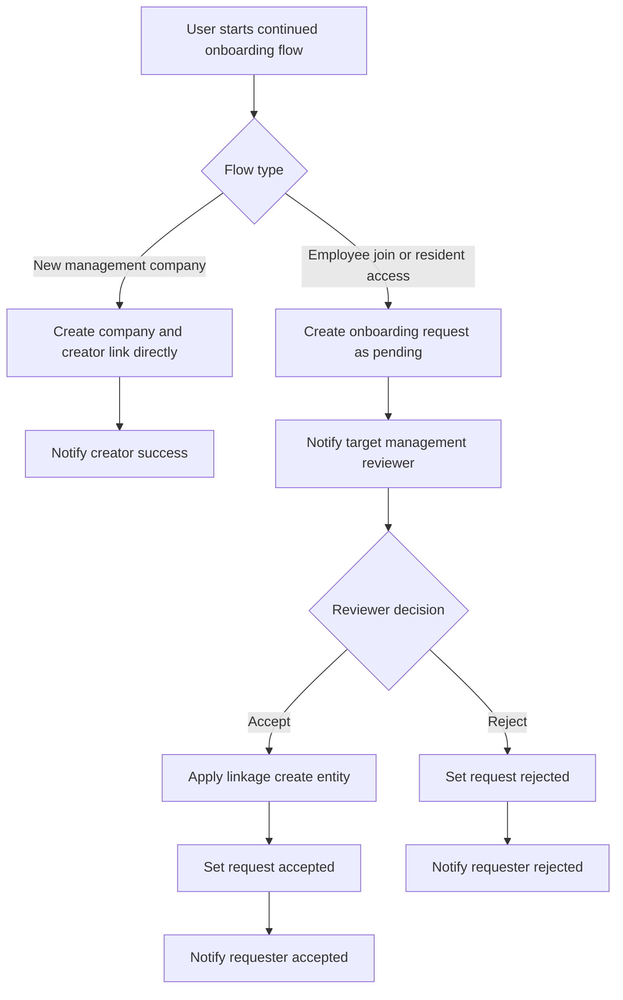

# Continued onboarding implementation plan

## Scope
Implement continued onboarding workflows described in [`plans/onboarding/continued-onboarding.md`](plans/onboarding/continued-onboarding.md) using a simple but extensible model:
- One generic request entity
- One request type lookup entity
- One notification entity

Chosen model:
- [`OnboardingRequest`](App.Domain/Onboarding/OnboardingRequest.cs)
- [`OnboardingRequestType`](App.Domain/Onboarding/OnboardingRequestType.cs)
- [`Notification`](App.Domain/Onboarding/Notification.cs)

This keeps implementation simple for a school project, while allowing new request types later without creating new request tables.

## Workflow coverage

### 1) New Management company flow
1. App user registers via existing onboarding.
2. User chooses new management company flow.
3. User submits company details and creates company directly without SystemAdmin approval.
4. System creates:
   - [`ManagementCompany`](App.Domain/ManagementCompany/ManagementCompany.cs)
   - [`ManagementCompanyUser`](App.Domain/ManagementCompany/ManagementCompanyUser.cs) for creator as active company user
6. Company user can add customer and resident using existing management pages.
7. Resident linkage options:
   - Direct link by management user creating [`ResidentUser`](App.Domain/Resident/ResidentUser.cs) if app user exists
   - Request based link by app user providing id code and customer registry code

### 2) Existing Management company employee flow
1. App user registers.
2. User submits request with company registry code and requested role.
3. Management company reviewer accepts or rejects.
4. On accept create [`ManagementCompanyUser`](App.Domain/ManagementCompany/ManagementCompanyUser.cs).

### 3) Resident flow
1. App user registers.
2. Either:
   - Submit resident access request using customer registry code and id code
   - Be linked directly by management company via [`ResidentUser`](App.Domain/Resident/ResidentUser.cs)
3. On approved request create [`ResidentUser`](App.Domain/Resident/ResidentUser.cs).

### 4) Customer representative flow
1. Reuse resident access flow to establish resident link first.
2. Management company creates [`CustomerRepresentative`](App.Domain/Customer/CustomerRepresentative.cs) for that resident.

## Domain design

### New lookup entity: OnboardingRequestType
Suggested immutable codes:
- `NEW_MCOMPANY`
- `MCOMPANY_EMPLOYEE_JOIN`
- `RESIDENT_ACCESS`

Suggested fields:
- `Id`
- `Code`
- `Label` using [`LangStr`](Base.Domain/LangStr.cs)
- `IsActive`
- `CreatedAt`

### New transactional entity: OnboardingRequest
Suggested fields:
- `Id`
- `OnboardingRequestTypeId`
- `Status` string enum style `PENDING` `ACCEPTED` `REJECTED` `CANCELLED`
- `RequestedByAppUserId`
- `ReviewedByAppUserId` nullable
- `ManagementCompanyId` nullable target tenant
- `RequestedRoleId` nullable for employee join
- `CustomerRegistryCode` nullable
- `ResidentIdCode` nullable
- `RequestedManagementCompanyName` nullable
- `RequestedManagementCompanyRegistryCode` nullable
- `DecisionNotes` nullable
- `CreatedAt`
- `ReviewedAt` nullable

Design rule:
- Keep only minimal payload needed for current three flows.
- Enforce type specific required fields in BLL validation.

### New entity: Notification
Suggested fields:
- `Id`
- `RecipientAppUserId`
- `OnboardingRequestId` nullable
- `TypeCode` string such as `ONBOARDING_REQUEST_CREATED` and `ONBOARDING_REQUEST_DECIDED`
- `Title` plain text
- `Message` plain text
- `IsRead`
- `CreatedAt`
- `ReadAt` nullable

## EF and persistence plan
1. Add domain classes under onboarding namespace folder.
2. Add `DbSet` entries in [`AppDbContext`](App.DAL.EF/AppDbContext.cs).
3. Configure relationships, indexes, and unique constraints in [`AppDbContext.OnModelCreating()`](App.DAL.EF/AppDbContext.cs:51).
4. Add migration for new tables and constraints.
5. Seed request types in [`InitialData`](App.DAL.EF/Seeding/InitialData.cs).

Suggested indexes:
- Request inbox index by `ManagementCompanyId` and `Status` and `CreatedAt`
- Request history index by `RequestedByAppUserId` and `CreatedAt`
- Notification index by `RecipientAppUserId` and `IsRead` and `CreatedAt`

## BLL plan
Extend existing onboarding service in BLL layer:
- [`IOnboardingService`](App.BLL/Onboarding/IOnboardingService.cs)
- [`OnboardingService`](App.BLL/Onboarding/OnboardingService.cs)

Service responsibilities:
1. Create direct management company creation flow.
2. Create requests for approval based flows only.
2. Validate type specific inputs.
3. Resolve company and resident by codes where needed.
4. Build management inbox queries.
5. Approve reject request with simple checks.
6. On approval create linkage records:
   - [`ResidentUser`](App.Domain/Resident/ResidentUser.cs)
   - [`ManagementCompanyUser`](App.Domain/ManagementCompany/ManagementCompanyUser.cs)
   - [`ManagementCompany`](App.Domain/ManagementCompany/ManagementCompany.cs)
7. Create notifications for reviewer and requester.
8. Write simple audit events using existing created at and reviewed fields plus decision notes.

Implementation rule from architecture guide:
- Keep business logic in BLL, controllers remain orchestration only.

## MVC and UI plan

### New pages and actions
In [`OnboardingController`](WebApp/Controllers/OnboardingController.cs) or dedicated continuation controller:
1. Choose continued onboarding flow page.
2. Submit forms for:
   - New company request
   - Existing company employee join request
   - Resident access request
3. My request status page for requester.

In management area new inbox pages:
- Pending onboarding requests list
- Request details
- Approve reject actions

Notification UI:
- Simple notification dropdown or page in shared layout
- Mark as read action

### Simple validation and security approach
Because project scope is school MVP:
- Use server side validation only, no heavy workflow engine.
- Do basic tenant scoping for management inbox by `ManagementCompanyId`.
- Do not expose cross tenant details in messages.
- Use generic error on failed request matching.
- Do not implement system admin approvals for onboarding flows.

## Request processing flow diagram

## Implementation checklist for Code mode
- [ ] Add domain entities for request type request and notification
- [ ] Register new `DbSet` properties in context
- [ ] Configure constraints relations and indexes
- [ ] Create and review EF migration
- [ ] Seed onboarding request type lookup rows
- [ ] Extend existing onboarding service contracts and implementation
- [ ] Add request DTOs or view models for continued onboarding forms
- [ ] Add requester side MVC pages and controller actions
- [ ] Add management inbox MVC pages and approve reject actions
- [ ] Add notification read list and mark read actions
- [ ] Add integration tests for request creation and approval paths
- [ ] Add tests for duplicate prevention on linkage creation

## Acceptance criteria
- User can submit all three request types from UI.
- New management company flow creates company and creator link immediately without approval.
- Management reviewer can approve or reject from inbox.
- Approval creates correct linkage records for each flow.
- Requester receives notifications for created and decided events.
- Duplicate active linkage is prevented by validation and existing unique constraints.
- New request types can be added by seeding lookup and adding validation handler.

## Notes for future extension
- Add optional JSON payload later only if request specific fields grow.
- Add richer audit table later if detailed timeline is needed.
- Add API endpoints after MVC flow is stable.
