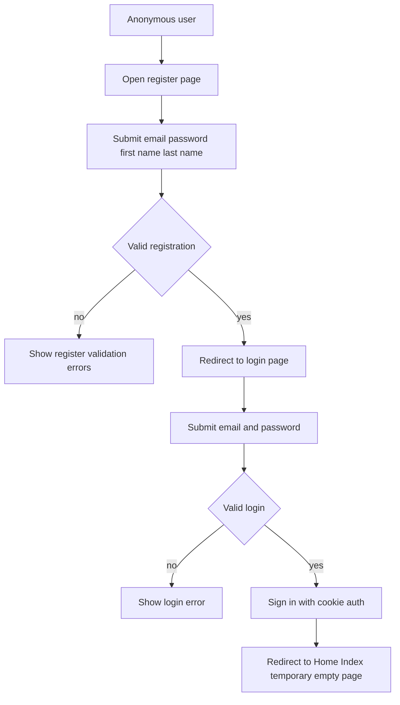

# Onboarding Flow Plan - Custom MVC Login and Registration

## Objective
Implement a complete onboarding flow using custom MVC pages and controllers, not ASP.NET Core default Identity UI.

Requested behavior:
- Registration fields: email, password, first name, last name.
- Login fields: email, password.
- After successful registration: redirect to login page.
- After successful login: redirect to `Home/Index` temporary landing.

## Current Baseline Findings
- Identity is configured with default UI enabled in `WebApp/Program.cs` via `AddDefaultUI`.
- Navigation in `_LoginPartial` links directly to Identity area Razor Pages under `/Identity/Account/*`.
- `AppUser` requires `FirstName` and `LastName`.
- API identity controller exists for JWT use cases; this plan targets MVC cookie login pages for browser onboarding.

## Design Principles for Implementation
1. Keep authentication flow server-side MVC with antiforgery-protected forms.
2. Keep controllers thin and move onboarding business rules to dedicated BLL service layer.
3. Do not depend on Identity default UI pages or their routes.
4. Keep redirects deterministic and aligned with requested flow.
5. Keep future extension path open for role-context redirect logic.

## Planned Architecture

### 1. New BLL onboarding service
Create a dedicated onboarding/auth service in `App.BLL` for MVC registration and login orchestration.

Responsibilities:
- Validate registration business rules.
- Create user with `FirstName`, `LastName`, `Email`, `UserName`.
- Execute password sign-in checks.
- Return structured result objects for controller mapping.

Reason:
- Aligns with repository rule to keep business logic out of MVC controllers.

### 2. New MVC controller for onboarding
Create a custom controller in `WebApp` for browser auth pages.

Planned endpoints:
- GET Register page
- POST Register submit
- GET Login page
- POST Login submit
- POST Logout

Flow behavior:
- Register success -> redirect to Login.
- Login success -> redirect to `Home/Index`.
- Login or register failure -> stay on same page with validation summary.

### 3. New MVC view models
Introduce dedicated view models for form binding and validation attributes.

Planned models:
- Register view model: `Email`, `Password`, `FirstName`, `LastName`.
- Login view model: `Email`, `Password`, optional remember-me flag.

Validation:
- Required fields.
- Email format.
- Password minimum policy aligned with Identity options.
- Max lengths for names based on domain constraints.

### 4. New custom Razor views
Create custom pages for login and registration.

Planned views:
- Register page with four requested fields.
- Login page with two requested fields.
- Shared validation summary and field messages.

UX requirements:
- Clear success and error feedback.
- Prevent duplicate submission by disabling submit button on postback script.
- Keep styling aligned with existing site styles for now.

### 5. Remove default Identity UI usage
Update app to stop using default Identity UI routes.

Planned changes:
- Remove `AddDefaultUI` from Identity service registration.
- Remove or neutralize dependency on Identity area account page links.
- Update navigation partial to point to custom controller routes.
- Keep Identity core services and token providers active.

### 6. Navigation and route updates
Update shared layout auth links.

Behavior after update:
- Anonymous user sees links to custom Register and Login pages.
- Authenticated user sees greeting and custom Logout action.

### 7. Redirect and guard behavior
- Authenticated user visiting Register or Login should be redirected to `Home/Index`.
- Anonymous user posting Logout should be handled safely without exception.
- Preserve optional returnUrl only if local and safe.

### 8. Temporary post-login page handling
Use `Home/Index` as requested temporary destination.

Planned adjustment:
- Replace current welcome content with minimal empty placeholder state to behave as empty page for now.

### 9. Verification and tests
Add tests proportional to scope.

Planned coverage:
- Registration success creates user with first and last name.
- Registration duplicates fail with validation message.
- Login success redirects to `Home/Index`.
- Invalid login remains on login page with generic error.
- Navigation links resolve to custom pages, not Identity area pages.

## End-to-End Flow Diagram

## Implementation Task Breakdown
1. Create onboarding BLL service contracts and result models in `App.BLL`.
2. Implement onboarding BLL service using `UserManager` and `SignInManager`.
3. Create MVC onboarding controller with GET and POST actions.
4. Create register and login view models with validation attributes.
5. Create register and login Razor views with validation display.
6. Update `_LoginPartial` links and logout form to custom routes.
7. Remove `AddDefaultUI` usage and verify no UI dependency remains.
8. Ensure post-register and post-login redirects match requested behavior.
9. Adjust `Home/Index` to temporary empty state placeholder.
10. Add or update tests for registration and login flow behavior.
11. Run verification pass for navigation and auth flow.

## Acceptance Criteria
- Default Identity UI pages are not used for registration or login.
- Custom register page collects email, password, first name, last name.
- Custom login page collects email and password.
- Successful registration redirects to login page.
- Successful login redirects to `Home/Index`.
- Shared navigation points only to custom auth routes.
- `AppUser.FirstName` and `AppUser.LastName` are persisted during registration.
- Validation and error handling are visible and user-friendly.

## Risks and Mitigations
- Risk: removing `AddDefaultUI` may break existing Identity links.
  - Mitigation: update all auth links in shared partials before removing usage.
- Risk: redirect behavior could conflict with future context routing.
  - Mitigation: keep redirect logic isolated in controller for easy extension.
- Risk: exposing detailed login errors can aid enumeration.
  - Mitigation: use generic invalid credentials message on login failure.

## Handoff Notes
- This plan intentionally focuses on MVC browser onboarding.
- API identity JWT endpoints remain unchanged unless explicitly requested later.
- If future requirement introduces role-context landing, replace login success redirect target with context resolver.
