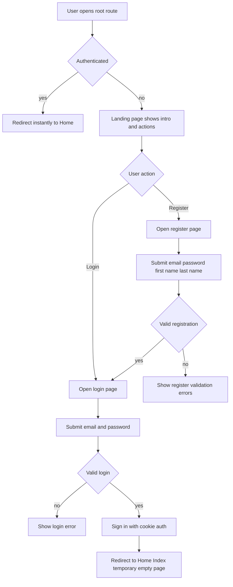

# Onboarding Flow Plan - Custom MVC Login and Registration

## Objective
Implement a complete onboarding flow using custom MVC pages and controllers, not ASP.NET Core default Identity UI.

Requested behavior:
- If someone accesses the site at `/`, show a public landing page with app introduction and clear actions.
- If authenticated user accesses `/`, redirect instantly to `/Home`.
- If anonymous user accesses `/`, keep user on the public landing page.
- Landing page has two primary buttons: Register and Login.
- Register button routes to `/Onboarding/Register`.
- Login button routes to `/Onboarding/Login`.
- Registration fields: email, password, first name, last name.
- Login fields: email, password.
- After successful registration: redirect to login page.
- After successful login: redirect to `Home/Index` temporary landing.
- BLL implementation must remain reusable by future MVC and API controllers.
- BLL must not depend on `WebApp` project types, namespaces, or MVC abstractions.

## Current Baseline Findings
- Identity is configured with default UI enabled in `WebApp/Program.cs` via `AddDefaultUI`.
- Navigation in `_LoginPartial` links directly to Identity area Razor Pages under `/Identity/Account/*`.
- `AppUser` requires `FirstName` and `LastName`.
- API identity controller exists for JWT use cases; this plan targets MVC cookie login pages for browser onboarding.

## Design Principles for Implementation
1. Keep authentication flow server-side MVC with antiforgery-protected forms.
2. Keep controllers thin and move onboarding business rules to dedicated BLL service layer.
3. Do not depend on Identity default UI pages or their routes.
4. Keep redirects deterministic and aligned with requested flow.
5. Keep future extension path open for role-context redirect logic.
6. Deliver easy-to-use, visually polished, professional UI for landing, registration, and login screens.
7. Keep onboarding BLL transport-agnostic so MVC and future API controllers can use the same service contracts.
8. Enforce one-way dependency direction: `WebApp` depends on `App.BLL`, never the reverse.

## Planned Architecture

### 1. Public landing page at root route
Introduce a dedicated public onboarding entry page reachable at `/`.

Responsibilities:
- Present concise introduction to the app value proposition.
- Provide two primary call-to-action buttons for Register and Login.
- Route users directly to `/Onboarding/Register` or `/Onboarding/Login`.

UI and UX intent:
- Professional first impression with clear visual hierarchy.
- Fast scanability and obvious next actions.
- Mobile-friendly layout with accessible button sizing and contrast.

### 2. New BLL onboarding service
Create a dedicated onboarding/auth service in `App.BLL` for MVC registration and login orchestration.

Responsibilities:
- Validate registration business rules.
- Create user with `FirstName`, `LastName`, `Email`, `UserName`.
- Execute password sign-in checks.
- Return structured result objects for controller mapping.

Reusability constraints:
- Service contracts and result models live in `App.BLL` and use framework-neutral shapes.
- No references from `App.BLL` to `WebApp` view models, controllers, Razor types, or HTTP context abstractions.
- MVC and future API controllers map request models to shared BLL contracts independently.

Reason:
- Aligns with repository rule to keep business logic out of MVC controllers.

### 3. New MVC controller for onboarding
Create a custom controller in `WebApp` for browser auth pages.

Planned endpoints:
- GET Landing page for `/` entry
- GET Register page
- POST Register submit
- GET Login page
- POST Login submit
- POST Logout

Flow behavior:
- Anonymous user opens `/` and chooses Register or Login.
- Authenticated user opening `/` is redirected immediately to `/Home`.
- Register success -> redirect to Login.
- Login success -> redirect to `Home/Index`.
- Login or register failure -> stay on same page with validation summary.

### 4. New MVC view models
Introduce dedicated view models for form binding and validation attributes.

Planned models:
- Register view model: `Email`, `Password`, `FirstName`, `LastName`.
- Login view model: `Email`, `Password`, optional remember-me flag.

Validation:
- Required fields.
- Email format.
- Password minimum policy aligned with Identity options.
- Max lengths for names based on domain constraints.

### 5. New custom Razor views
Create custom pages for landing, login, and registration.

Planned views:
- Landing page with app introduction, supporting copy, and prominent Register and Login actions.
- Register page with four requested fields.
- Login page with two requested fields.
- Shared validation summary and field messages.

UX requirements:
- Clear success and error feedback.
- Prevent duplicate submission by disabling submit button on postback script.
- Keep styling professional, modern, and consistent with existing site design language.

### 6. Remove default Identity UI usage
Update app to stop using default Identity UI routes.

Planned changes:
- Remove `AddDefaultUI` from Identity service registration.
- Remove or neutralize dependency on Identity area account page links.
- Update navigation partial to point to custom controller routes.
- Keep Identity core services and token providers active.

### 7. Navigation and route updates
Update shared layout auth links.

Behavior after update:
- Root `/` route resolves conditionally by auth state.
- Anonymous user at `/` sees public landing page.
- Authenticated user at `/` is redirected to `/Home` instantly.
- Anonymous user sees links to custom Register and Login pages.
- Authenticated user sees greeting and custom Logout action.

### 8. Redirect and guard behavior
- Authenticated user visiting Register or Login should be redirected to `Home/Index`.
- Authenticated user visiting `/` should be redirected to `/Home` immediately.
- Anonymous user posting Logout should be handled safely without exception.
- Preserve optional returnUrl only if local and safe.

### 9. Temporary post-login page handling
Use `Home/Index` as requested temporary destination.

Planned adjustment:
- Replace current welcome content with minimal empty placeholder state to behave as empty page for now.

### 10. Verification and tests
Add tests proportional to scope.

Planned coverage:
- Anonymous visit to `/` returns landing page and action links.
- Authenticated visit to `/` redirects immediately to `/Home`.
- Registration success creates user with first and last name.
- Registration duplicates fail with validation message.
- Login success redirects to `Home/Index`.
- Invalid login remains on login page with generic error.
- Navigation links resolve to custom pages, not Identity area pages.

## End-to-End Flow Diagram

## Implementation Task Breakdown
1. Add public landing page as Step 1 for onboarding flow, mapped to `/`, with app introduction and Register or Login actions.
2. Create onboarding BLL service contracts and result models in `App.BLL`.
3. Implement onboarding BLL service using `UserManager` and `SignInManager`.
4. Verify `App.BLL` has no dependency on `WebApp` and onboarding contracts are reusable for future API controllers.
5. Create MVC onboarding controller with GET and POST actions, including landing route handling.
6. Create register and login view models with validation attributes.
7. Create landing, register, and login Razor views with professional, user-friendly UI and clear validation feedback.
8. Update `_LoginPartial` links and logout form to custom routes.
9. Remove `AddDefaultUI` usage and verify no UI dependency remains.
10. Ensure root route behavior matches auth state: authenticated users go instantly to `/Home`, anonymous users stay on landing.
11. Ensure landing-to-auth routing and post-register or post-login redirects match requested behavior.
12. Adjust `Home/Index` to temporary empty state placeholder.
13. Add or update tests for landing, registration, and login flow behavior.
14. Run verification pass for navigation and full onboarding auth flow.

## Acceptance Criteria
- Default Identity UI pages are not used for registration or login.
- Visiting `/` as anonymous user shows a professional onboarding landing page with app introduction.
- Visiting `/` as authenticated user redirects instantly to `/Home`.
- Landing page has Register and Login buttons routing to `/Onboarding/Register` and `/Onboarding/Login`.
- Custom register page collects email, password, first name, last name.
- Custom login page collects email and password.
- Successful registration redirects to login page.
- Successful login redirects to `Home/Index`.
- Shared navigation points only to custom auth routes.
- `AppUser.FirstName` and `AppUser.LastName` are persisted during registration.
- Validation and error handling are visible and user-friendly.
- Onboarding service in `App.BLL` is reusable by future API controllers and has no dependency on `WebApp`.

## Risks and Mitigations
- Risk: removing `AddDefaultUI` may break existing Identity links.
  - Mitigation: update all auth links in shared partials before removing usage.
- Risk: redirect behavior could conflict with future context routing.
  - Mitigation: keep redirect logic isolated in controller for easy extension.
- Risk: exposing detailed login errors can aid enumeration.
  - Mitigation: use generic invalid credentials message on login failure.

## Handoff Notes
- This plan intentionally focuses on MVC browser onboarding.
- API identity JWT endpoints remain unchanged unless explicitly requested later.
- If future requirement introduces role-context landing, replace login success redirect target with context resolver.
