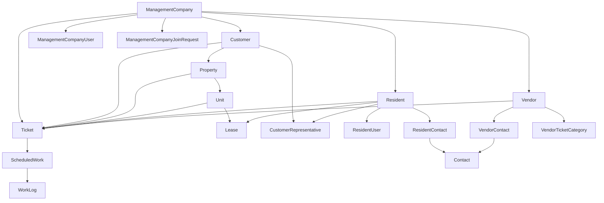

# Profile pages implementation plan

## Goal
Add fully functional profile pages for:
- management company
- customer
- property
- unit
- resident

Each page must be reachable from the respective area navigation `Profile` entry and must support:
- editing the scoped domain entity
- safe hard deletion with explicit service-layer recursive cleanup within tenant scope

## Confirmed constraints and baseline
- Deletion behavior is globally restricted in EF via [`DeleteBehavior.Restrict`](App.DAL.EF/AppDbContext.cs:240), so recursive deletes must be orchestrated explicitly in BLL and not rely on DB cascade.
- Management area currently has no profile nav entry in [`_ManagementLayout.cshtml`](WebApp/Areas/Management/Views/Shared/_ManagementLayout.cshtml).
- Customer area already has profile nav and route in [`_CustomerLayout.cshtml`](WebApp/Areas/Customer/Views/Shared/_CustomerLayout.cshtml:109) and [`CustomerDashboardController.Profile`](WebApp/Areas/Customer/Controllers/CustomerDashboardController.cs:48).
- Property area already has profile nav and route in [`_PropertyLayout.cshtml`](WebApp/Areas/Property/Views/Shared/_PropertyLayout.cshtml:121) and [`PropertyDashboardController.Profile`](WebApp/Areas/Property/Controllers/PropertyDashboardController.cs:42).
- Unit area currently has `Details` nav in [`_UnitLayout.cshtml`](WebApp/Areas/Unit/Views/Shared/_UnitLayout.cshtml:134) and no profile route in [`UnitDashboardController`](WebApp/Areas/Unit/Controllers/UnitDashboardController.cs:15).
- Resident area has no profile nav/route in [`_ResidentLayout.cshtml`](WebApp/Areas/Resident/Views/Shared/_ResidentLayout.cshtml:97) and [`ResidentDashboardController`](WebApp/Areas/Resident/Controllers/ResidentDashboardController.cs:15).

## Architecture decisions
1. Keep controllers thin and place edit and delete business policy in dedicated BLL services, aligned with repository rules in [`AGENTS.md`](AGENTS.md).
2. Use explicit hard-delete orchestration services per aggregate root profile target:
   - management company profile service
   - customer profile service
   - property profile service
   - unit profile service
   - resident profile service
3. Execute delete orchestration in a single transaction per delete command.
4. Enforce tenant and role checks before any read/update/delete action to prevent IDOR.
5. Use strongly typed view models for GET and POST edit flows, with resource-backed labels and validation text.
6. Add explicit delete confirmation UX with anti-forgery and typed confirmation token input.

## Deletion orchestration model
Top-down relationship expectations inferred from current entities and mappings:

### Required delete order principles
- Delete children before parents because of [`DeleteBehavior.Restrict`](App.DAL.EF/AppDbContext.cs:240).
- Alwayd entity identity.
- For shared edges like `Ticket` and `Contact`, delete dependent rows from all referencing tables first.
- For management company deletion, remove all tenant-scoped operational data under company boundary.

## Implementation plan

### 1. Add profile page endpoints and navigation consistency
1. Add `Profile` section route in management dashboard controller layer (new profile action or dedicated profile controller in management area), based on current route style in [`DashboardController`](WebApp/Areas/Management/Controllers/DashboardController.cs:13).
2. Add `Profile` nav entry to management sidebar in [`_ManagementLayout.cshtml`](WebApp/Areas/Management/Views/Shared/_ManagementLayout.cshtml).
3. Replace or complement unit `Details` with `Profile` route and section handling in [`UnitDashboardController`](WebApp/Areas/Unit/Controllers/UnitDashboardController.cs:45) and [`_UnitLayout.cshtml`](WebApp/Areas/Unit/Views/Shared/_UnitLayout.cshtml:134).
4. Add resident profile route and nav in [`ResidentDashboardController`](WebApp/Areas/Resident/Controllers/ResidentDashboardController.cs:34) and [`_ResidentLayout.cshtml`](WebApp/Areas/Resident/Views/Shared/_ResidentLayout.cshtml:97).
5. Keep customer and property profile routes but switch from placeholder section rendering to real profile views and form actions in [`CustomerDashboardController`](WebApp/Areas/Customer/Controllers/CustomerDashboardController.cs:48) and [`PropertyDashboardController`](WebApp/Areas/Property/Controllers/PropertyDashboardController.cs:42).

### 2. Create dedicated BLL profile services
1. Add interfaces and implementations in BLL for each profile aggregate with commands:
   - `GetProfileAsync`
   - `UpdateProfileAsync`
   - `DeleteProfileAsync`
2. Keep services focused per entity to avoid monolithic business service.
3. Reuse existing access services for context authorization:
   - [`IManagementCustomerAccessService`](App.BLL/Management/Customers/IManagementCustomerAccessService.cs)
   - [`IManagementCustomerPropertyService`](App.BLL/Management/Properties/IManagementCustomerPropertyService.cs)
   - [`IManagementUnitDashboardService`](App.BLL/Management/Units/IManagementUnitDashboardService.cs)
   - [`IManagementResidentAccessService`](App.BLL/Management/Residents/IManagementResidentAccessService.cs)
4. Add explicit role checks for dangerous delete operations.

### 3. Implement edit flows for each profile
1. Define typed profile edit view models under each area view model namespace.
2. Add resource-backed `Display` and validation attributes using [`UiText.resx`](App.Resources/Views/UiText.resx) and [`UiText.et.resx`](App.Resources/Views/UiText.et.resx).
3. Implement GET edit model population from BLL profile query.
4. Implement POST edit with:
   - anti-forgery
   - `ModelState` validation
   - tenant and authorization checks
   - optimistic-safe update mapping
5. Ensure localized strings for success and failure messages in controller responses.

### 4. Implement safe hard-delete orchestration
1. For each aggregate type, define deterministic delete sequence methods in BLL.
2. Run delete operation in one transaction.
3. Validate no cross-tenant records are touched.
4. Delete graph by aggregate root:
   - management company: delete all company-scoped records including customers, properties, units, leases, residents, contacts, vendors, tickets, scheduled work, work logs, membership and join-request rows.
   - customer: delete customer subtree including properties, units, leases, linked tickets, representatives and dependent work data.
   - property: delete property subtree including units, leases, property and unit tickets and dependent scheduled work and work logs.
   - unit: delete unit subtree including leases, unit tickets and dependent scheduled work and work logs.
   - resident: delete resident subtree including resident users, resident contacts, leases, representative links, resident tickets and dependent scheduled work and work logs.
5. Add explicit guardrails for potentially shared `Contact` usage to avoid deleting contacts still referenced by remaining rows.
6. Return safe `NotFound` or `Forbid` patterns without leaking cross-tenant existence details.

### 5. Add profile UI pages and delete confirmation UX
1. Create dedicated profile views per area with sections:
   - profile summary
   - edit form
   - danger zone delete card
2. Require typed confirmation input before delete submit.
3. Show localized irreversible warning text.
4. Provide post-delete redirect strategy:
   - management company delete returns to context chooser
   - customer delete returns to management company dashboard
   - property delete returns to customer dashboard
   - unit delete returns to property units page
   - resident delete returns to management residents page or context chooser if self-context removed

### 6. Update routing and page shell section handling
1. Add `CurrentSection` support for `Profile` in all relevant layout view models:
   - [`CustomerLayoutViewModel`](WebApp/ViewModels/Customer/CustomerDashboard/ManagementCustomerDashboardPageViewModel.cs:14)
   - [`PropertyLayoutViewModel`](WebApp/ViewModels/Property/PropertyDashboard/PropertyDashboardPageViewModel.cs:17)
   - [`UnitLayoutViewModel`](WebApp/ViewModels/Unit/UnitLayoutViewModel.cs:3)
   - [`ResidentLayoutViewModel`](WebApp/ViewModels/Resident/ResidentLayoutViewModel.cs:3)
   - management layout model path via [`ManagementLayoutViewModel`](WebApp/ViewModels/Management/Layout/ManagementLayoutViewModel.cs:5)
2. Keep route patterns consistent with existing slug/idcode patterns.

### 7. Persistence and migration review
1. Prefer service-level orchestration first.
2. Add migration only if schema constraints or indexes need adjustment for delete orchestration performance or correctness.
3. If migration is added, ensure alignment with mappings in [`AppDbContext`](App.DAL.EF/AppDbContext.cs).

### 8. Verification and tests
1. Add tests for profile access control and IDOR prevention per area.
2. Add tests for update command success and validation failure.
3. Add tests for delete orchestration correctness and full dependent cleanup per root.
4. Add tests proving cross-tenant rows are untouched.
5. Add regression tests for deletion order to prevent FK restriction failures.

## Execution checklist for implementation mode
- Add management, unit, resident profile nav and routes.
- Implement profile edit view models and localized resources.
- Implement profile BLL services with tenant and role checks.
- Implement recursive hard-delete orchestration with transaction boundaries.
- Wire controllers to new BLL services.
- Add profile views and danger zone delete UX.
- Add and run tests for authorization, orchestration, and regressions.

## Risks and mitigations
- Risk: accidental over-delete due to broad query scope.
  - Mitigation: require tenant predicates in every repository query and add negative tests.
- Risk: FK restriction failures due to wrong delete order.
  - Mitigation: codify and test explicit child-first order per aggregate.
- Risk: broken navigation after profile route additions.
  - Mitigation: integration tests for sidebar links and route templates.
- Risk: localization regressions in new profile forms and messages.
  - Mitigation: resource-backed annotations and message keys in both cultures.

## Definition of done for this feature
- Profile page exists and is reachable from each specified area nav.
- Profile edit updates correct entity with tenant-safe authorization.
- Profile delete performs hard delete with recursive cleanup inside tenant boundary.
- No dependent orphan rows remain.
- Cross-tenant data remains intact.
- Localized UI labels and messages exist for English and Estonian.
- Tests cover authorization, delete graph correctness, and regression paths.
