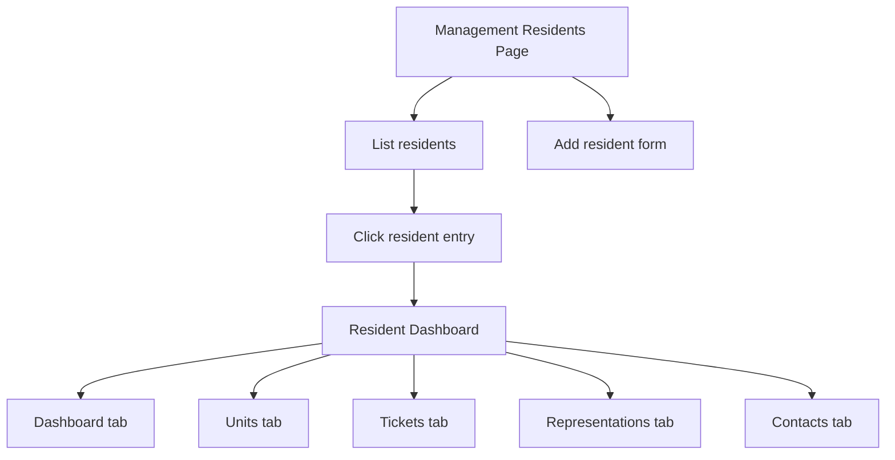

# Residents feature plan for management residents page and new Resident area

## Goal
Implement resident management from [`/m/{companySlug}/residents`](WebApp/Areas/Management/Controllers/CustomersController.cs:14) with:
- list of existing residents for the authorized management company
- add new resident form
- resident name or id code navigation to resident dashboard at `m/{companySlug}/r/{residentIdCode}`
- a new `Resident` area with its own controllers and views
- resident area sidebar links: Dashboard, Units, Tickets, Representations, Contacts

## Confirmed scope
- Route identifier uses [`Resident.IdCode`](App.Domain/Resident/Resident.cs:17) directly in the URL for this increment
- Management page route is `/m/{mcompanyslug}/residents`
- Resident dashboard route is `/m/{mcompanyslug}/r/{residentidcode}`
- Management left navigation gets a new Residents link
- Resident area pages and dashboard only need placeholder implementations for now
- Resident area pages required now: Dashboard, Units, Tickets, Representations, Contacts

## Existing architecture context
- Management collection pages already follow list and add patterns in [`CustomersController`](WebApp/Areas/Management/Controllers/CustomersController.cs:15)
- Management shell navigation lives in [`_ManagementLayout.cshtml`](WebApp/Areas/Management/Views/Shared/_ManagementLayout.cshtml)
- Context specific workspaces already exist for customer, property, and unit areas in [`_CustomerLayout.cshtml`](WebApp/Areas/Customer/Views/Shared/_CustomerLayout.cshtml), [`_PropertyLayout.cshtml`](WebApp/Areas/Property/Views/Shared/_PropertyLayout.cshtml), and [`_UnitLayout.cshtml`](WebApp/Areas/Unit/Views/Shared/_UnitLayout.cshtml)
- Placeholder section routing pattern already exists in [`CustomerDashboardController`](WebApp/Areas/Customer/Controllers/CustomerDashboardController.cs:13), [`PropertyDashboardController`](WebApp/Areas/Property/Controllers/PropertyDashboardController.cs:13), and [`UnitDashboardController`](WebApp/Areas/Unit/Controllers/UnitDashboardController.cs:13)
- Resident domain already exists in [`Resident`](App.Domain/Resident/Resident.cs:6) with `FirstName`, `LastName`, `IdCode`, `PreferredLanguage`, `IsActive`, and `ManagementCompanyId`
- Current EF model in [`AppDbContext`](App.DAL.EF/AppDbContext.cs:12) already has resident foreign key configuration and resident indexes, but it does not currently show a unique management company plus resident id code constraint
- Tenant boundary for this feature is the management company, so every resident query and write must be scoped by authorized company context before materialization

## Implementation plan

### 1. Add dedicated resident management BLL services and models
Create resident focused contracts in the dedicated BLL layer instead of placing resident business logic in controllers.

Planned contracts:
- `App.BLL/Management/Residents/IManagementResidentAccessService.cs`
  - authorize management company resident page access
  - resolve resident dashboard context by `Resident.IdCode` inside authorized company scope
- `App.BLL/Management/Residents/IManagementResidentService.cs`
  - list residents for authorized management company
  - create resident for authorized management company

Planned models file:
- `App.BLL/Management/Residents/ManagementResidentModels.cs`
  - `ManagementResidentsAuthorizedContext`
  - `ManagementResidentListResult`
  - `ManagementResidentListItem`
  - `ManagementResidentCreateRequest`
  - `ManagementResidentCreateResult`
  - `ManagementResidentDashboardAccessResult`
  - `ManagementResidentDashboardContext`

Planned implementation files:
- `App.BLL/Management/Residents/ManagementResidentAccessService.cs`
- `App.BLL/Management/Residents/ManagementResidentService.cs`

Dependency injection updates:
- register resident services in [`WebApp/Program.cs`](WebApp/Program.cs)
- keep resident authorization and resident CRUD responsibilities separate

### 2. Implement resident access and CRUD rules in the BLL layer
Resident logic should enforce management company scope and prevent IDOR on both collection and resident workspace routes.

Resident page access rules:
- resolve current actor from auth context
- resolve management company membership using existing management access patterns
- return not found when company slug does not exist
- return forbid when actor is outside authorized management scope

Resident list rules:
- query residents with `Resident.ManagementCompanyId == authorized company id`
- never load resident by id code without management company filter
- order list predictably, for example by last name then first name

Resident create rules:
- create only inside authorized management company
- require `Resident.IdCode` as mandatory domain input because it is the resident workspace route identifier in this increment
- validate `Resident.IdCode` uniqueness within management company scope in service logic before insert
- normalize obvious input issues such as trimmed whitespace before saving
- keep preferred language optional unless business rules require a default
- set `CreatedAt` and any initial active state centrally in service logic

Resident dashboard access rules:
- resolve by `Resident.IdCode` plus management company scope
- return not found instead of leaking cross tenant existence
- build enough context for resident area header and sidebar navigation

### 3. Add resident domain and database constraints
Because resident routing now depends on [`Resident.IdCode`](App.Domain/Resident/Resident.cs:17), the domain model and persistence model must enforce that contract consistently.

Domain changes:
- make `Resident.IdCode` required in [`Resident`](App.Domain/Resident/Resident.cs:6)
- align data annotations and nullability so `IdCode` is mandatory instead of optional
- keep max length rules compatible with current field definition unless a business rule change is required

Database and EF changes:
- update [`AppDbContext`](App.DAL.EF/AppDbContext.cs:12) fluent configuration if needed so resident id code is required
- check whether a unique constraint or unique index already exists for `ManagementCompanyId + IdCode`
- current configuration in [`ConfigureIndexesAndUniqueConstraints`](App.DAL.EF/AppDbContext.cs:528) does not show such a resident uniqueness rule, so plan to add one unless implementation mode confirms otherwise in the live model snapshot or database
- add an EF migration that makes resident id code non nullable and enforces uniqueness within management company scope
- no historical resident rows currently exist, so the migration can apply the required and unique constraints directly without a legacy data remediation step

### 3. Add management residents page controller and view models
Create a dedicated management controller rather than extending unrelated controllers.

Planned controller:
- `WebApp/Areas/Management/Controllers/ResidentsController.cs`

Route base:
- `m/{companySlug}/residents`

Actions:
- `GET index` for list and add form display
- `POST add` for add resident submission

Behavior:
- follow the same authorize then build page view model shape used in [`CustomersController`](WebApp/Areas/Management/Controllers/CustomersController.cs:15)
- keep controller transport focused and delegate business validation to resident services
- on success redirect back to index with `TempData` confirmation
- on validation failure rebuild page with list and preserved add form input

Planned view models:
- `WebApp/ViewModels/ManagementResidents/ManagementResidentsPageViewModel.cs`
- `WebApp/ViewModels/ManagementResidents/ManagementResidentListItemViewModel.cs`
- `WebApp/ViewModels/ManagementResidents/AddManagementResidentViewModel.cs`

Suggested list data:
- resident full name
- id code
- preferred language
- active status
- quick link to resident dashboard

Suggested add form data:
- `FirstName`
- `LastName`
- `IdCode`
- `PreferredLanguage`
- optional `IsActive` defaulting to active if that matches current business expectations

### 4. Add management residents view and management navigation link
Create a new management page and surface it from the shared left navigation.

Planned files:
- `WebApp/Areas/Management/Views/Residents/Index.cshtml`
- update [`_ManagementLayout.cshtml`](WebApp/Areas/Management/Views/Shared/_ManagementLayout.cshtml)

Navigation change:
- add a Residents link beside other management level sections
- active state should match `ResidentsController`
- use resource backed text, not hardcoded labels

Page composition:
- residents list card
- add resident form card
- anti forgery token in add form
- validation summary and field level validation messages
- success feedback via `TempData`
- resident dashboard links should use `companySlug` and `residentIdCode`

### 5. Create new Resident area with placeholder dashboard and subpages
Mirror the pattern used by the unit workspace, but scope the route directly under management company without customer or property segments.

Planned area structure:
- `WebApp/Areas/Resident/Controllers/ResidentDashboardController.cs`
- `WebApp/Areas/Resident/Views/Shared/_ResidentLayout.cshtml`
- `WebApp/Areas/Resident/Views/_ViewStart.cshtml`
- `WebApp/Areas/Resident/Views/_ViewImports.cshtml`
- `WebApp/Areas/Resident/Views/ResidentDashboard/Index.cshtml`

Controller route base:
- `m/{companySlug}/r/{residentIdCode}`

Actions:
- `GET` dashboard root
- `GET units`
- `GET tickets`
- `GET representations`
- `GET contacts`

Behavior for initial increment:
- every action resolves access through resident access service
- all actions render the same placeholder page shell with section specific heading
- no unit, ticket, representation, or contact workflows are implemented yet

### 6. Add resident layout and resident dashboard view models
Create resident specific layout context so the sidebar and header can be driven consistently across placeholder pages.

Planned view models:
- `WebApp/ViewModels/Resident/ResidentDashboardPageViewModel.cs`
- `WebApp/ViewModels/Resident/ResidentLayoutViewModel.cs`

Layout behavior in resident layout:
- same management shell style as existing workspace layouts
- top header should show management company name and resident display name
- resident display label should prefer full name and may include id code as supporting text
- sidebar links exactly:
  - Dashboard
  - Units
  - Tickets
  - Representations
  - Contacts
- active link highlighting based on current section
- links should preserve `companySlug` and `residentIdCode`
- footer should keep shared actions like new context, language selector, and privacy link

### 7. Define resident display and routing conventions
Make naming and linking consistent before implementation begins.

Resident display conventions:
- resident full name should be composed from `FirstName` and `LastName`
- id code should be shown in list and route context because it is the dashboard identifier in this increment
- if id code is missing in old data, the implementation should decide whether such residents are hidden from navigation, blocked from creation only, or require a remediation path before dashboard support

Resident routing conventions:
- use `Resident.IdCode` as the long term resident route identifier, not just a temporary increment choice
- require `IdCode` on resident creation and persist it as mandatory data
- treat id code comparisons consistently, preferably trimmed and case stable if business rules allow

### 8. Add localization coverage for new static UI text
All user visible labels, headings, and messages for the new management residents page and resident area should use resources.

Expected resource updates in both languages:
- Residents management page title
- Add resident form labels
- Resident dashboard and resident area section labels
- Success and validation fallback messages added by controllers or services
- Placeholder text for resident area pages

Planned files:
- `App.Resources/Views/UiText.resx`
- `App.Resources/Views/UiText.et.resx`

### 10. Verification checklist for implementation mode
Required checks after coding:
- `Resident.IdCode` is mandatory in the domain model and no longer nullable in [`Resident`](App.Domain/Resident/Resident.cs:6)
- persistence enforces resident id code requiredness after migration
- database has uniqueness enforcement for `ManagementCompanyId + IdCode` unless implementation mode proves an equivalent constraint already exists
- `/m/{companySlug}/residents` renders residents list and add form
- management sidebar shows working Residents link
- valid resident creation adds the resident under the authorized company and redirects back with success message
- duplicate resident id code in the same company is rejected with a clear validation error
- clicking a resident entry opens `/m/{companySlug}/r/{residentIdCode}`
- resident area sidebar contains exactly Dashboard, Units, Tickets, Representations, Contacts
- each resident subpage route renders a placeholder without runtime errors
- resident lookup never succeeds across another management company boundary
- localization works in English and Estonian for new labels and messages

## Proposed file touch map for implementation mode

### Domain and persistence
- `App.Domain/Resident/Resident.cs`
- `App.DAL.EF/AppDbContext.cs`
- `App.DAL.EF/Migrations/<new_migration_for_resident_idcode_required_and_unique>.cs`
- `App.DAL.EF/Migrations/<new_migration_for_resident_idcode_required_and_unique>.Designer.cs`
- `App.DAL.EF/Migrations/AppDbContextModelSnapshot.cs`

### BLL
- `App.BLL/Management/Residents/IManagementResidentAccessService.cs`
- `App.BLL/Management/Residents/IManagementResidentService.cs`
- `App.BLL/Management/Residents/ManagementResidentModels.cs`
- `App.BLL/Management/Residents/ManagementResidentAccessService.cs`
- `App.BLL/Management/Residents/ManagementResidentService.cs`
- `WebApp/Program.cs`

### WebApp controllers
- `WebApp/Areas/Management/Controllers/ResidentsController.cs`
- `WebApp/Areas/Resident/Controllers/ResidentDashboardController.cs`

### WebApp ViewModels
- `WebApp/ViewModels/ManagementResidents/ManagementResidentsPageViewModel.cs`
- `WebApp/ViewModels/Resident/ResidentDashboardPageViewModel.cs`
- `WebApp/ViewModels/Resident/ResidentLayoutViewModel.cs`

### WebApp views and area setup
- `WebApp/Areas/Management/Views/Residents/Index.cshtml`
- `WebApp/Areas/Management/Views/Shared/_ManagementLayout.cshtml`
- `WebApp/Areas/Resident/Views/Shared/_ResidentLayout.cshtml`
- `WebApp/Areas/Resident/Views/_ViewStart.cshtml`
- `WebApp/Areas/Resident/Views/_ViewImports.cshtml`
- `WebApp/Areas/Resident/Views/ResidentDashboard/Index.cshtml`

### Localization
- `App.Resources/Views/UiText.resx`
- `App.Resources/Views/UiText.et.resx`

## Navigation flow diagram

## Notes for implementation mode
- Keep resident business logic in the dedicated BLL layer, not inline in web controllers
- Scope all resident reads and writes by authorized management company before materialization
- Use [`Resident.IdCode`](App.Domain/Resident/Resident.cs:17) directly in routing only for this increment
- Do not implement actual units, tickets, representations, or contacts resident workflows yet
- If historical resident rows can have null or duplicate id codes, handle that explicitly in service validation and dashboard resolution rules before enabling navigation for those records
