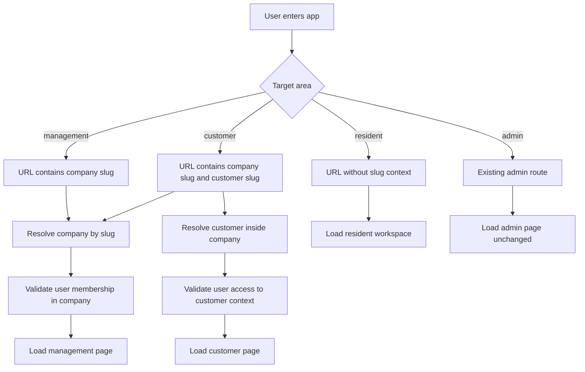

# Slug-Based Routing Rewrite Plan

## Objective
Rewrite application routing so operational context is expressed in the URL by system-generated slugs instead of relying on implicit context cookies or ID-only context selection.

Requested target behavior:
- Management context URLs use `/m/{companySlug}/...`.
- Customer context URLs use `/m/{companySlug}/c/{customerSlug}/...`.
- Resident pages do not require slug-based context because one user has a single resident experience aggregating all residencies.
- Admin area routing remains unchanged.
- Onboarding routing remains mostly unchanged, except newly created management companies must redirect into the correct slugged management context.
- Slugs are system-generated and must be persisted for management companies and customers.
- This likely requires a full routing rewrite across the non-admin web experience.

## Current Baseline Findings
- Conventional area routing in [`WebApp/Program.cs`](WebApp/Program.cs) currently uses [`app.MapControllerRoute()`](WebApp/Program.cs:194) with `/{area}/{controller}/{action}/{id?}` style patterns.
- Context selection is currently cookie-driven in [`OnboardingController.SetContext()`](WebApp/Controllers/OnboardingController.cs:180) using cookies such as `ctx.type`, `ctx.management.company`, and `ctx.customer.id`.
- Automatic post-login redirect logic in [`OnboardingController.ResolveContextRedirectAsync()`](WebApp/Controllers/OnboardingController.cs:319) resolves context from cookies and membership checks, then redirects to area dashboards without URL context.
- [`ManagementCompany`](App.Domain/ManagementCompany/ManagementCompany.cs) and [`Customer`](App.Domain/Customer/Customer.cs) currently do not contain slug fields.
- The current design makes context ambiguous when a user belongs to multiple management companies or customer contexts, because the visible URL does not identify the active tenant scope.

## Architectural Direction
Move from cookie-selected implicit context toward route-selected explicit context.

Core principle:
- URL is the primary source of active operational context for management and customer experiences.

Implications:
- Route values become first-class inputs for tenant resolution.
- Context guard logic must validate route slug access before controller action logic executes.
- Link generation across layouts, controllers, redirects, and views must always include required slug values.
- Cookie state may remain only as an optional convenience for last-used context discovery, but must no longer be the authority for management or customer tenant selection.

## Target URL Model

### Management context
Examples:
- `/m/{companySlug}`
- `/m/{companySlug}/properties`
- `/m/{companySlug}/customers`
- `/m/{companySlug}/tickets/{id}`

Rule:
- Every management-area page outside admin must include `{companySlug}`.

### Customer context
Examples:
- `/m/{companySlug}/c/{customerSlug}`
- `/m/{companySlug}/c/{customerSlug}/properties`
- `/m/{companySlug}/c/{customerSlug}/tickets`
- `/m/{companySlug}/c/{customerSlug}/profile`

Rule:
- Every customer-context page must include both `{companySlug}` and `{customerSlug}`.
- Customer slug resolution must be validated within the selected management company boundary to prevent cross-tenant lookup by slug alone.

### Resident context
Examples can remain conventional, such as:
- `/resident`
- `/resident/tickets`

Rule:
- Resident experience does not require slug routing because the user has one resident workspace aggregating their residencies.

### Admin context
Rule:
- Admin URLs and admin scaffolding remain unchanged.
- No slug rewrite is required for [`WebApp/Areas/Admin`](WebApp/Areas/Admin).

## Domain and Persistence Changes

### 1. Add slug fields
Add persisted slug properties to:
- [`ManagementCompany`](App.Domain/ManagementCompany/ManagementCompany.cs)
- [`Customer`](App.Domain/Customer/Customer.cs)

Planned characteristics:
- Required.
- Lowercase normalized storage.
- Immutable after creation unless an explicit regeneration workflow is later introduced.
- Unique according to the right scope rules.

### 2. Uniqueness rules
Recommended constraints:
- `ManagementCompany.Slug` unique globally.
- `Customer.Slug` unique per `ManagementCompanyId`.

Reasoning:
- Management URLs use company slug as global entry key.
- Customer URLs are nested under company slug, so customer slug only needs to be unique within the parent company.
- This avoids unnecessary global customer slug collisions while preserving unambiguous routing.

### 3. EF Core updates
Plan for [`App.DAL.EF/AppDbContext.cs`](App.DAL.EF/AppDbContext.cs):
- Add model configuration for slug fields.
- Add indexes and uniqueness constraints.
- Ensure max lengths and normalization expectations are enforced consistently.

### 4. Migration work
Plan for a migration in [`App.DAL.EF/Migrations`](App.DAL.EF/Migrations):
- Add new slug columns.
- Backfill slugs for existing records.
- Add unique indexes only after backfill data is safe.

## Slug Generation Strategy
Slugs are system-generated, so creation must be deterministic and collision-safe.

Recommended algorithm:
1. Start from a normalized source string.
2. Transliterate to ASCII when needed.
3. Lowercase.
4. Replace whitespace and separators with `-`.
5. Remove unsupported characters.
6. Collapse duplicate separators.
7. Trim edge separators.
8. If collision exists, append a deterministic suffix.

Recommended source values:
- Management company slug: based primarily on company name.
- Customer slug: based primarily on customer name within the management company scope.

Collision handling examples:
- `acme-property`
- `acme-property-2`
- `acme-property-3`

Implementation placement:
- Slug generation belongs in dedicated BLL or domain-support logic, not inline in MVC controllers.
- Controllers should request create or resolve operations, not build slugs themselves.

## Routing Rewrite Scope
This change likely requires a full rewrite of non-admin routing because existing conventional area routes do not carry slug context.

### 1. Replace generic area assumptions
Current route pattern in [`WebApp/Program.cs`](WebApp/Program.cs:194) is too generic for context-aware URLs.

Planned routing direction:
- Add explicit route mappings for management slug routes.
- Add explicit route mappings for customer nested slug routes.
- Preserve separate resident route mapping.
- Preserve admin route mapping as-is.

### 2. Prefer route templates that make context mandatory
Likely direction:
- Use explicit attribute routes or dedicated mapped area routes so controllers cannot be reached without required slug parameters.

Example conceptual mapping:
- Management controllers: `/m/{companySlug}/{controller=Dashboard}/{action=Index}/{id?}`
- Customer controllers: `/m/{companySlug}/c/{customerSlug}/{controller=Dashboard}/{action=Index}/{id?}`

### 3. Controller surface review
Every non-admin controller must be classified into one of these buckets:
- Management-context controller.
- Customer-context controller.
- Resident controller.
- Global onboarding or public controller.
- Admin controller unaffected by slug rewrite.

This classification is required before implementation to avoid partial routing drift.

## Context Resolution and Authorization Model

### 1. Route-driven context resolution
Introduce a context resolution layer that:
- Reads `companySlug` and optional `customerSlug` from route values.
- Resolves the corresponding entities from the database.
- Verifies current user membership and role authorization inside that resolved context.
- Makes resolved context available to downstream controllers and views.

### 2. IDOR and tenant isolation requirements
For every slugged request:
- Resolve management company by `companySlug`.
- Apply current-user membership filter before confirming access.
- When `customerSlug` is present, resolve customer within the already resolved management company.
- Never resolve customer by slug alone without company constraint.
- Return not found or forbidden without leaking cross-tenant existence details.

This keeps routing aligned with the repository tenant-isolation rules in [`AGENTS.md`](AGENTS.md).

### 3. Middleware or action filter changes
Current context enforcement depends on onboarding-oriented cookie logic in [`WebApp/Middleware/OnboardingContextGuardMiddleware.cs`](WebApp/Middleware/OnboardingContextGuardMiddleware.cs).

Planned change:
- Refactor guard behavior so route slugs, not cookies, drive context validation for management and customer pages.
- Preserve resident flow separately.
- Preserve onboarding guard responsibilities that are unrelated to tenant slug routing.

## Onboarding Changes
Onboarding routing mostly stays the same, but post-create management company redirect must change.

### Required change
After successful creation in [`OnboardingController.NewManagementCompany()`](WebApp/Controllers/OnboardingController.cs:268), redirect must target the newly created company slug context instead of generic management dashboard.

Target outcome:
- Current behavior redirects to management dashboard without context.
- New behavior redirects to `/m/{companySlug}`.

### Additional onboarding impact
Review these flows for compatibility:
- Post-login redirect selection in [`OnboardingController.ResolveContextRedirectAsync()`](WebApp/Controllers/OnboardingController.cs:319).
- Context chooser flow in [`OnboardingController.SetContext()`](WebApp/Controllers/OnboardingController.cs:180).

Recommended redesign:
- Replace management and customer context switching links with slug-based redirects.
- Keep only lightweight last-used-context memory if still desired.
- Do not depend on cookie-only context to enter management or customer pages.

## Link Generation Rewrite
A full routing rewrite also requires a systematic link-generation rewrite.

Affected surfaces:
- Shared layouts and navigation menus.
- Redirects in controllers.
- Buttons and action links in Razor views.
- Any generated URLs in onboarding flows.
- Any future API or UI helpers that assume `id`-only route values.

Rule:
- Management links must always carry `companySlug`.
- Customer links must always carry both `companySlug` and `customerSlug`.

Recommended implementation support:
- Introduce route helper methods or a context-aware URL builder to reduce repeated manual route dictionaries.
- Avoid scattering literal route patterns across many views.

## Data Backfill and Rollout Considerations

### Existing records
Because management companies and customers already exist, the migration plan must include backfill.

Backfill steps:
1. Add nullable slug columns first if needed.
2. Generate slugs for all existing rows.
3. Resolve collisions.
4. Validate uniqueness.
5. Make columns required.
6. Add unique indexes.

### Safe rollout approach
Recommended sequence:
1. Persist and populate slug data.
2. Add resolution services and tests.
3. Introduce new route mappings.
4. Update redirects and navigation.
5. Remove dependency on cookie-selected management and customer context.
6. Clean up obsolete route paths after verification.

## Testing and Verification Plan
Minimum validation areas:
- Management company creation generates slug and redirects to `/m/{companySlug}`.
- Existing management user can access only allowed `/m/{companySlug}` routes.
- Existing customer representative can access only allowed `/m/{companySlug}/c/{customerSlug}` routes.
- Customer slug cannot be resolved across the wrong management company.
- Resident routes remain functional without slug requirements.
- Admin routes remain unchanged.
- Link generation in layouts and views always includes required slug values.
- Old generic management or customer routes no longer allow ambiguous context access.

Recommended test categories:
- Unit tests for slug generation and normalization.
- Integration tests for route resolution and authorization filters.
- Regression tests for onboarding redirects.
- Security tests for tenant-bound slug lookup behavior.

## Implementation Task Breakdown
1. Inventory all non-admin controllers and views that participate in management, customer, resident, and onboarding routing.
2. Define final route map for management, customer, resident, onboarding, and admin surfaces.
3. Add slug fields to [`ManagementCompany`](App.Domain/ManagementCompany/ManagementCompany.cs) and [`Customer`](App.Domain/Customer/Customer.cs).
4. Add EF model configuration, indexes, and migration support in [`App.DAL.EF/AppDbContext.cs`](App.DAL.EF/AppDbContext.cs) and [`App.DAL.EF/Migrations`](App.DAL.EF/Migrations).
5. Implement centralized slug generation and collision handling in the BLL or dedicated support layer.
6. Backfill slug data for existing management companies and customers.
7. Introduce route-driven context resolution and authorization validation for management and customer requests.
8. Refactor [`WebApp/Program.cs`](WebApp/Program.cs) route registration to support `/m/{companySlug}/...` and `/m/{companySlug}/c/{customerSlug}/...`.
9. Refactor management and customer controllers to require slug route values instead of implicit cookie context.
10. Rewrite shared navigation, Razor links, and controller redirects to always emit slug-aware URLs.
11. Update onboarding create-company redirect and login or context-selection flows to land in slug-based routes.
12. Preserve resident routing without slug requirements and verify it still resolves correctly.
13. Verify admin routing remains unchanged.
14. Add tests for slug generation, route authorization, onboarding redirects, and cross-tenant isolation.
15. Remove or downgrade obsolete cookie-based management and customer context selection once slug routing is fully authoritative.

## Acceptance Criteria
- Management pages are reachable only via `/m/{companySlug}/...` style URLs.
- Customer-context pages are reachable only via `/m/{companySlug}/c/{customerSlug}/...` style URLs.
- Management company and customer slugs are persisted in the database.
- Slugs are generated by the system, not entered manually by users.
- Management slug lookup is unique and stable.
- Customer slug lookup is unique within a management company and validated within tenant scope.
- Onboarding redirect after creating a management company lands in the new slugged management context.
- Resident pages continue to work without slug routing.
- Admin area behavior and URLs are unchanged.
- Context ambiguity for users with multiple management or customer memberships is eliminated from operational URLs.
- Authorization and tenant isolation are enforced using route context before controller business logic proceeds.

## Risks and Mitigations
- Risk: partial route migration leaves a mix of slugged and non-slugged links.
  - Mitigation: inventory all controllers and views first, then update link generation systematically.
- Risk: customer slug lookup could introduce cross-tenant leakage if resolved globally.
  - Mitigation: always resolve customer inside the already resolved management company scope.
- Risk: migration may fail on duplicate generated slugs.
  - Mitigation: implement deterministic collision handling before adding unique constraints.
- Risk: cookie-based context logic may conflict with slug-based routing during transition.
  - Mitigation: clearly demote cookies to optional last-used hints and make route values authoritative.
- Risk: conventional routes may still expose old paths.
  - Mitigation: explicitly replace or disable ambiguous non-slug routes for management and customer areas.

## Context Flow Diagram

## Handoff Notes
- This plan assumes the target public URL shapes are `/m/{companySlug}/...` and `/m/{companySlug}/c/{customerSlug}/...`.
- The plan intentionally treats this as a routing rewrite, not a small patch, because the current architecture in [`WebApp/Program.cs`](WebApp/Program.cs) and [`OnboardingController`](WebApp/Controllers/OnboardingController.cs) is built around generic area routes and cookie-selected context.
- Before implementation, another mode should inspect all affected controllers under [`WebApp/Areas/Management`](WebApp/Areas/Management), customer-area equivalents, resident controllers, layouts, and middleware to convert the plan into a concrete change list.