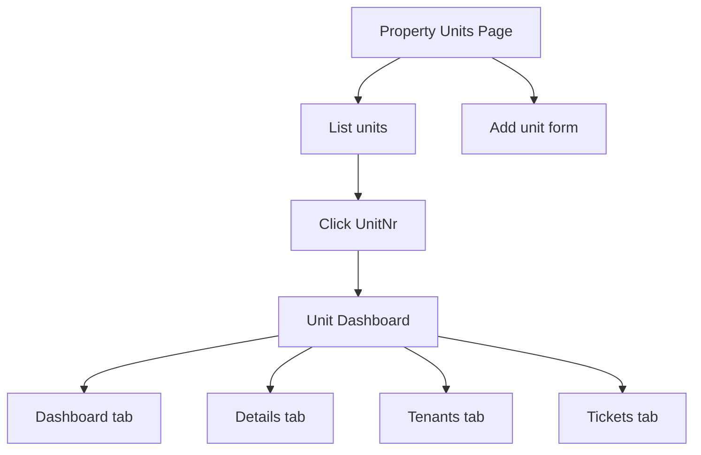

# Units feature plan for property units page and new Unit area

## Goal
Implement units management from the property units page at `m/{companySlug}/c/{customerSlug}/p/{propertySlug}/units` with:
- list of existing units for the property
- add new unit form
- unit name click navigation to unit dashboard at `m/{companySlug}/c/{customerSlug}/p/{propertySlug}/u/{unitSlug}`
- a new `Unit` area with its own controllers and views
- `Unit` area layout matching current management style with sidebar links: Dashboard, Details, Tenants, Tickets

## Confirmed MVP details
- Units list columns: `UnitNr`, `FloorNr`, `SizeM2`
- Add form fields: required `UnitNr`, optional `FloorNr`, optional `SizeM2`, optional `Notes`
- Unit dashboard and subpages only need placeholders for now

## Existing architecture context
- Property dashboard section routing already exists in `WebApp/Areas/Property/Controllers/PropertyDashboardController.cs`
- Property area uses shared shell layout in `WebApp/Areas/Property/Views/Shared/_PropertyLayout.cshtml`
- Tenant and access checks are centralized in BLL access flows used by property controllers
- Slug creation utility exists in `App.BLL/Routing/SlugGenerator.cs`
- Unit domain already includes `Slug`, `UnitNr`, `FloorNr`, `SizeM2`, `Notes`, `PropertyId` in `App.Domain/Property/Unit.cs`

## Implementation plan

### 1. Add dedicated Units BLL services and models
Create separate units focused contracts and models so unit behavior is not mixed into broad customer or property services.

Planned contracts:
- `App.BLL/Management/Units/IManagementPropertyUnitService.cs`
  - list units inside authorized property context
  - create unit inside authorized property context
- `App.BLL/Management/Units/IManagementUnitDashboardService.cs`
  - resolve unit dashboard context by unit slug under authorized property context

Planned models file:
- `App.BLL/Management/Units/ManagementPropertyUnitModels.cs`
  - `ManagementPropertyUnitListResult`
  - `ManagementPropertyUnitListItem`
  - `ManagementPropertyUnitCreateRequest`
  - `ManagementPropertyUnitCreateResult`
  - `ManagementUnitDashboardAccessResult`
  - `ManagementUnitDashboardContext`

Planned implementation file:
- `App.BLL/Management/Units/ManagementPropertyUnitService.cs`

Dependency injection updates:
- register the new unit service interfaces in `WebApp/Program.cs`
- keep existing customer and property access services unchanged for their current responsibilities

### 2. Implement BLL unit operations in dedicated unit service
Implement unit operations in `App.BLL/Management/Units/ManagementPropertyUnitService.cs` with strict tenant and ownership checks inherited from resolved property context.

Implementation details:
- List query filters by `PropertyId == context.PropertyId`
- Create validates required `UnitNr` and optional numeric ranges
- Generate unique unit slug with `SlugGenerator` using `UnitNr`
- Ensure uniqueness within property scope using existing unit slugs for that property
- Persist `Notes` as `LangStr` from current culture input
- Unit dashboard resolver filters by both `PropertyId` and `Unit.Slug`
- Return not found if slug missing or outside current property scope

Security and IDOR constraints:
- Never resolve unit by ID or slug without property scoped filter
- Never accept client supplied property or customer IDs in create request
- Always derive company and customer and property from prior authorized context

### 3. Add ViewModels for property units page
Create dedicated page model in `WebApp/ViewModels/Property/PropertyUnits/`:
- `PropertyUnitsPageViewModel`
- `PropertyUnitListItemViewModel`
- `AddUnitViewModel`

Validation annotations for add form:
- `UnitNr` required
- `FloorNr` optional integer
- `SizeM2` optional decimal with valid range
- `Notes` optional text

Localization:
- use `App.Resources.Views.UiText` keys where available
- add resource keys in both `App.Resources/Views/UiText.resx` and `App.Resources/Views/UiText.et.resx` for new static labels and messages

### 4. Replace Property Units section placeholder with real page behavior
Update `WebApp/Areas/Property/Controllers/PropertyDashboardController.cs`:
- Keep existing route `GET units`
- For Units section, build specialized view model using `IManagementPropertyUnitService`
- Add `POST units/add` action for add form submit
- On successful add, redirect back to Units section with success message in `TempData`
- On validation or business error, return Units view with ModelState errors and preserved form input

Routing for unit links from units list:
- each unit name should link to Unit area route using `unitSlug`

### 5. Create new Unit area with its own layout and placeholder pages
Add new area structure:
- `WebApp/Areas/Unit/Controllers/UnitDashboardController.cs`
- `WebApp/Areas/Unit/Views/Shared/_UnitLayout.cshtml`
- `WebApp/Areas/Unit/Views/_ViewStart.cshtml`
- `WebApp/Areas/Unit/Views/_ViewImports.cshtml`
- `WebApp/Areas/Unit/Views/UnitDashboard/Index.cshtml`

Controller route base:
- `m/{companySlug}/c/{customerSlug}/p/{propertySlug}/u/{unitSlug}`

Actions:
- `GET` dashboard root
- `GET details`
- `GET tenants`
- `GET tickets`

Behavior for initial increment:
- all actions resolve access via `IManagementUnitDashboardService`
- all actions render same placeholder content style with current section label
- no functional tenant or ticket workflows yet

### 6. Add Unit layout model and sidebar navigation
Add view model for unit layout context in `WebApp/ViewModels/Unit/`:
- `UnitDashboardPageViewModel`
- `UnitLayoutViewModel`

Layout behavior in `_UnitLayout.cshtml`:
- same management shell style and context chooser behavior as property layout
- top left header stack must show in order:
  - management company name
  - customer name
  - property name
  - unit name
- sidebar links exactly:
  - Dashboard
  - Details
  - Tenants
  - Tickets
- active link highlighting based on current section
- breadcrumb style header links back to company, customer, property, unit dashboard
- bottom left sidebar must keep existing shared actions:
  - New context button
  - language selector
  - privacy link

### 7. Update property units view UX
Add dedicated Units view under property area:
- `WebApp/Areas/Property/Views/PropertyDashboard/Units.cshtml` or equivalent section specific view

Page composition:
- units list card with columns `UnitNr`, `FloorNr`, `SizeM2`
- `UnitNr` rendered as link to unit dashboard route
- add unit card with form fields `UnitNr`, `FloorNr`, `SizeM2`, `Notes`
- anti forgery token in form
- validation summary and field level validation messages
- success feedback via `TempData`

### 8. Wire resources for new UI text
Add missing keys to both language resource files for:
- Unit area section labels and titles
- Units page form labels
- Validation and success or failure messages where controller adds user visible text
- Placeholder messages for Unit area pages

### 9. Verification checklist for implementation mode
Required checks after coding:
- Route `m/test/c/klient/p/kinnistu1/units` shows units list and add form
- Add valid unit creates row and returns to list with success message
- Added unit appears in list immediately after redirect
- Clicking `UnitNr` opens `m/{companySlug}/c/{customerSlug}/p/{propertySlug}/u/{unitSlug}`
- Unit area sidebar contains only Dashboard, Details, Tenants, Tickets
- Each unit subpage route renders placeholder without errors
- Unauthorized or cross tenant requests return `Forbid` or `NotFound` without leakage
- Localization works in English and Estonian for newly added static labels and messages

## Proposed file touch map for implementation mode

### BLL
- `App.BLL/Management/Units/IManagementPropertyUnitService.cs`
- `App.BLL/Management/Units/IManagementUnitDashboardService.cs`
- `App.BLL/Management/Units/ManagementPropertyUnitModels.cs`
- `App.BLL/Management/Units/ManagementPropertyUnitService.cs`
- `WebApp/Program.cs`

### WebApp controllers
- `WebApp/Areas/Property/Controllers/PropertyDashboardController.cs`
- `WebApp/Areas/Unit/Controllers/UnitDashboardController.cs`

### WebApp ViewModels
- `WebApp/ViewModels/Property/PropertyUnits/PropertyUnitsPageViewModel.cs`
- `WebApp/ViewModels/Unit/UnitDashboardPageViewModel.cs`

### WebApp views and area setup
- `WebApp/Areas/Property/Views/PropertyDashboard/Units.cshtml`
- `WebApp/Areas/Unit/Views/Shared/_UnitLayout.cshtml`
- `WebApp/Areas/Unit/Views/_ViewStart.cshtml`
- `WebApp/Areas/Unit/Views/_ViewImports.cshtml`
- `WebApp/Areas/Unit/Views/UnitDashboard/Index.cshtml`

### Localization
- `App.Resources/Views/UiText.resx`
- `App.Resources/Views/UiText.et.resx`

## Navigation flow diagram

## Notes for implementation mode
- Use dedicated unit service interfaces instead of extending generic customer or property service responsibilities
- Keep controllers thin and transport focused
- Keep unit slug uniqueness scoped to property, not global
- Do not implement tenant and ticket business logic inside Unit area placeholders yet
