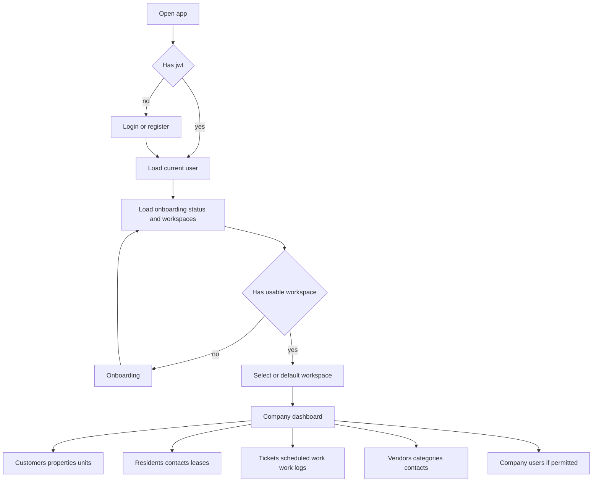

# AGENTS.md - Frontend Vue SPA Implementation Guide

## 1. Mission

Build a standalone Vue 3 SPA for the existing backend API defined in `plans/v2/front/backend-swagger.json`.

This document is self-contained for the frontend agent. Treat `backend-swagger.json` as the API source of truth and keep the SPA aligned with the current non-Admin MVC Public and Portal experience. The SPA must mirror implemented Public and Portal business capabilities, but it must be API-backed and client-routed.

Do not build `WebApp/Areas/Admin`, SystemAdmin platform administration, REST API controllers, server-rendered behavior, or MVC-only workflows.

## 2. Mandatory Tech Stack

Use only:
- Vue 3
- TypeScript
- Vite
- Vue Router
- Pinia
- ESLint
- Prettier
- Native `fetch` wrapped by a typed API client

Do not add HTTP client libraries or other runtime libraries unless the frontend project explicitly approves the dependency.

## 3. Source Of Truth

Primary API contract:
- `plans/v2/front/backend-swagger.json`

Razor reference pack:
- `WebApp/Areas/Public/Views`
- `WebApp/Areas/Portal/Views`
- `WebApp/Views/Shared`

Use the Razor files as product and layout references. Copy page hierarchy, visual patterns, table/form composition, empty states, confirmation flows, app chrome, breadcrumbs, workspace switching, and contextual navigation where they still match Swagger-backed capabilities.

When translating Razor to Vue:
- Replace Razor tag helpers with Vue components and router links.
- Replace MVC forms with Vue form state and API calls.
- Replace TempData with Pinia or route-scoped notification state.
- Replace ViewModels with TypeScript types derived from Swagger DTOs.
- Replace server routing with Vue Router.
- Replace cookie context switching with `/api/v1/workspaces` and `/api/v1/workspaces/select`.

Do not depend on `.cshtml` at runtime.

## 4. Product Boundaries

The SPA supports authenticated management company operations, customer/property/unit/resident workflows, ticket lifecycle management, scheduled work, work logs, vendors, contacts, leases, onboarding, and workspace selection.

Explicit exclusions:
- `WebApp/Areas/Admin`
- SystemAdmin platform administration
- MVC-only/server-rendered behavior
- Cookie-only context switching
- Server-side TempData flows
- Any route or navigation item without matching Swagger support
- Tests, while the repository override says not to write tests

## 5. API Client

Create a typed native `fetch` client.

Requirements:
- Read API base URL from `VITE_API_BASE_URL`.
- Default to same-origin only when `VITE_API_BASE_URL` is absent.
- Attach `Authorization: Bearer <jwt>` for protected requests.
- Send and accept JSON.
- Parse successful empty responses, especially `204`.
- Parse both `App.DTO.v1.RestApiErrorResponse`-style errors and ASP.NET `ProblemDetails`.
- Normalize errors into one frontend error type with `status`, `title/message`, `errorCode`, `traceId`, `fieldErrors`, and raw payload.

Use Swagger DTO names as TypeScript type names where practical. Preserve namespace meaning in file organization even if generated names are shortened, for example `App.DTO.v1.Portal.Tickets.TicketDetailsDto` may become `TicketDetailsDto` under a `portal/tickets` API module.

## 6. Authentication

Use these endpoints:
- `POST /api/v1/auth/register`
- `POST /api/v1/auth/login`
- `POST /api/v1/auth/refresh`
- `POST /api/v1/auth/logout`
- `GET /api/v1/auth/me`

Token handling:
- Store auth state in Pinia.
- Keep access token available for bearer injection.
- Keep refresh token available for refresh.
- On a protected request returning `401`, run exactly one refresh request for concurrent failures and replay queued requests after refresh succeeds.
- If refresh fails, clear auth state, clear selected workspace state, and redirect to login.
- Logout must call `/api/v1/auth/logout`, then clear local auth and workspace state even if the API call fails.
- Route guards must protect every authenticated route.

## 7. Startup And Workspace Flow

Supported workspace endpoints:
- `GET /api/v1/workspaces`
- `POST /api/v1/workspaces/select`
- `GET /api/v1/workspaces/default-redirect`

Supported onboarding endpoints:
- `GET /api/v1/onboarding/status`
- `POST /api/v1/onboarding/management-companies`
- `GET /api/v1/onboarding/management-company-roles`
- `POST /api/v1/onboarding/management-company-join-requests`

Startup flow:
1. User registers or logs in.
2. Persist `jwt` and `refreshToken` from `JWTResponse`.
3. Load `/api/v1/auth/me`.
4. Load `/api/v1/onboarding/status` and `/api/v1/workspaces`.
5. If no usable workspace exists, route to onboarding.
6. If a default workspace exists, use `/api/v1/workspaces/default-redirect` or the `WorkspaceCatalogDto.defaultContext` path data to enter the workspace.
7. When the user selects a workspace, call `/api/v1/workspaces/select`, update Pinia state, then route to the returned destination.

## 8. Route Tree

Use company-slug-centered routes for authenticated Portal pages:

- `/auth/login`
- `/auth/register`
- `/onboarding`
- `/onboarding/new-management-company`
- `/onboarding/join-management-company`
- `/workspaces`
- `/companies/:companySlug`
- `/companies/:companySlug/profile`
- `/companies/:companySlug/users`
- `/companies/:companySlug/users/:membershipId`
- `/companies/:companySlug/users/transfer-ownership`
- `/companies/:companySlug/customers`
- `/companies/:companySlug/customers/:customerSlug`
- `/companies/:companySlug/customers/:customerSlug/profile`
- `/companies/:companySlug/customers/:customerSlug/properties`
- `/companies/:companySlug/customers/:customerSlug/tickets`
- `/companies/:companySlug/customers/:customerSlug/properties/:propertySlug`
- `/companies/:companySlug/customers/:customerSlug/properties/:propertySlug/profile`
- `/companies/:companySlug/customers/:customerSlug/properties/:propertySlug/units`
- `/companies/:companySlug/customers/:customerSlug/properties/:propertySlug/tickets`
- `/companies/:companySlug/customers/:customerSlug/properties/:propertySlug/units/:unitSlug`
- `/companies/:companySlug/customers/:customerSlug/properties/:propertySlug/units/:unitSlug/profile`
- `/companies/:companySlug/customers/:customerSlug/properties/:propertySlug/units/:unitSlug/leases`
- `/companies/:companySlug/customers/:customerSlug/properties/:propertySlug/units/:unitSlug/tickets`
- `/companies/:companySlug/residents`
- `/companies/:companySlug/residents/:residentIdCode`
- `/companies/:companySlug/residents/:residentIdCode/profile`
- `/companies/:companySlug/residents/:residentIdCode/contacts`
- `/companies/:companySlug/residents/:residentIdCode/leases`
- `/companies/:companySlug/residents/:residentIdCode/tickets`
- `/companies/:companySlug/tickets`
- `/companies/:companySlug/tickets/new`
- `/companies/:companySlug/tickets/:ticketId`
- `/companies/:companySlug/tickets/:ticketId/edit`
- `/companies/:companySlug/tickets/:ticketId/scheduled-work`
- `/companies/:companySlug/tickets/:ticketId/scheduled-work/:scheduledWorkId`
- `/companies/:companySlug/tickets/:ticketId/scheduled-work/:scheduledWorkId/work-logs`
- `/companies/:companySlug/vendors`
- `/companies/:companySlug/vendors/new`
- `/companies/:companySlug/vendors/:vendorId`
- `/companies/:companySlug/vendors/:vendorId/edit`
- `/companies/:companySlug/vendors/:vendorId/categories`
- `/companies/:companySlug/vendors/:vendorId/contacts`

Frontend URLs do not need to match backend URLs, but API calls must use the Swagger paths under `/api/v1/portal/companies/{companySlug}/...`.

## 9. Capability Map

Implement every non-admin Swagger-backed area listed below. Render navigation from API-backed capabilities and permission flags only. No dead links.

### Auth
- Register, login, refresh, logout, current user.

### Onboarding
- Onboarding status.
- Create management company.
- Load management company role options.
- Submit management company join request.

### Workspaces
- Workspace catalog.
- Workspace selection.
- Default redirect.
- Navigation state based on workspace option permissions, especially `canManageCompanyUsers`.

### Management Companies
- Company dashboard: `GET /api/v1/portal/companies/{companySlug}/dashboard`
- Company profile get/update/delete through `/api/v1/portal/companies/{companySlug}` and `/profile` as defined by Swagger.

### Company Users
- List, add, edit, update, and remove company users.
- Load role options.
- Approve and reject access requests.
- Load ownership transfer candidates.
- Transfer ownership.
- Show user-management navigation only when the workspace permissions allow it.

### Customers
- List and create customers.
- Customer dashboard.
- Customer profile get/update/delete.
- Customer properties.
- Customer tickets.

### Properties
- Property dashboard.
- Property profile get/update/delete.
- Property units.
- Property tickets.
- Global property type lookup from `GET /api/v1/portal/lookups/property-types`.

### Units
- Unit dashboard.
- Unit profile get/update/delete.
- Unit leases.
- Unit tickets.
- Resident search for assigning leases.

### Residents
- List and create residents.
- Resident dashboard.
- Resident profile get/update/delete.
- Resident contacts.
- Resident leases.
- Resident tickets.
- Property search and property-unit selection for lease assignment.

### Resident Contacts
- List contacts.
- Create and attach contact.
- Edit and delete contact assignments.
- Confirm, unconfirm, and set primary contact.

### Leases
- Unit-scoped lease list/create/update/delete.
- Resident-scoped lease list/create/update/delete.
- Lease role options from scoped lease endpoints and `GET /api/v1/portal/lookups/lease-roles`.

### Tickets
- Management ticket list/detail/create/update/delete.
- Context ticket lists for customer, property, unit, and resident routes.
- Ticket form bootstrap endpoints.
- Selector options for customers, properties, units, residents, and vendors.
- Ticket options from `/api/v1/portal/companies/{companySlug}/lookups/ticket-options` and `/tickets/options`.
- Transition availability.
- Advance status.
- Preserve canonical lifecycle display: `Created -> Assigned -> Scheduled -> In Progress -> Completed -> Closed`.

### Scheduled Work
- List scheduled work for a ticket.
- Detail, create, update, and delete scheduled work.
- Form bootstrap endpoints.
- Start, complete, and cancel actions.
- Require vendor and schedule details where API validation requires them.

### Work Logs
- List work logs under scheduled work.
- Create, edit, and delete work logs.
- Use form and delete-model endpoints where Swagger provides them.
- Respect `canViewCosts`; hide material, labor, and total cost fields when false.

### Vendors
- List, create, detail, update, and delete vendors.
- Vendor category list, assign, update, and delete.
- Vendor contacts list, create, attach, edit assignment, delete assignment, confirm, unconfirm, and set primary.
- Vendor registry-code confirmation is required for destructive vendor delete flows.

### Lookups
- Company ticket options.
- Lease roles.
- Property types.
- Any additional selector options exposed under tickets, leases, vendors, and scoped form endpoints.

## 10. UI Rules

Build a responsive, professional operational UI consistent with the current MVC Portal/Public experience.

Mandatory UI behavior:
- App chrome with top bar, left navigation, workspace switcher, profile shortcut, and logout.
- Context-aware breadcrumbs from route params and loaded DTO display names.
- Navigation links only for supported API capabilities.
- No Admin/SystemAdmin links.
- No dead links.
- Every page load has loading, success, empty, forbidden, and failure states as applicable.
- Every form has field-level validation, summary errors, and disabled submit while pending.
- Long-running or destructive actions must prevent duplicate submissions.
- Successful create/update/delete/action flows must show immediate confirmation.
- Destructive actions require explicit confirmation UI.

Confirmation requirements:
- Use `App.DTO.v1.Shared.DeleteConfirmationDto` where the API expects `deleteConfirmation`.
- Use the vendor delete DTO and require the registry-code confirmation for vendor deletion.
- Make irreversible or high-impact actions explicit, including deleting profiles, deleting contacts, removing users, deleting scheduled work, deleting work logs, advancing ticket status, canceling scheduled work, and transferring ownership.

## 11. State Architecture

Create Pinia stores or composables for:
- `authStore`: jwt, refreshToken, user, roles, auth status.
- `workspaceStore`: workspace catalog, selected workspace, default redirect, permissions.
- `notificationStore`: success, warning, and error notifications.
- Feature modules for customers, properties, units, residents, tickets, scheduled work, work logs, vendors, contacts, leases, company users, onboarding, and lookups.

Keep business authorization decisions server-side. The frontend may hide unavailable actions based on DTO permission flags, but must handle `401`, `403`, and `404` responses cleanly.

## 12. English-Only UI Text

Frontend-owned static UI text is English only.

Requirements:
- Static frontend labels, buttons, headings, validation summaries, empty states, notifications, and local-only messages must be written in English.
- Do not create bilingual label files.
- Do not add a language framework, language selector, text store, or dynamic text-loading system.
- Do not add request parameters for frontend-selected language or UI language.
- Render API-provided domain and lookup labels exactly as returned by the backend.
- Do not reimplement `LangStr` fallback logic in the frontend.

## 13. Error Handling

Support both error shapes:
- `App.DTO.v1.RestApiErrorResponse` style: `status`, `error`, `errorCode`, `errors`, `traceId`.
- ASP.NET `ProblemDetails`: `type`, `title`, `status`, `detail`, `instance`, plus possible validation extensions.

Display:
- Field errors near controls.
- Page-level errors in an alert region.
- `401` as signed-out or expired-session state.
- `403` as access-denied state.
- `404` as not-found state without implying cross-tenant existence.
- Trace ID in expandable technical details when available.

## 14. Security And Tenancy

Tenant boundary is management company. The frontend must never treat a client-provided slug, ID, permission flag, or route param as authorization authority.

Requirements:
- All portal API calls must include the current `companySlug` from the selected workspace or route.
- Do not cache tenant-scoped data across company switches unless keyed by company slug.
- Clear tenant-scoped stores when switching workspace or logging out.
- Preserve route guards for authenticated and workspace-required pages.
- Hide actions when permission flags say unavailable, but rely on API authorization as final authority.
- Do not expose SystemAdmin links or platform administration routes.

## 15. Suggested File Organization

Use a structure close to:

```text
src/
  api/
    client.ts
    errors.ts
    auth.ts
    workspaces.ts
    onboarding.ts
    portal/
      companyUsers.ts
      customers.ts
      properties.ts
      units.ts
      residents.ts
      residentContacts.ts
      leases.ts
      tickets.ts
      scheduledWork.ts
      workLogs.ts
      vendors.ts
      vendorContacts.ts
      lookups.ts
  components/
  layouts/
  router/
  stores/
  views/
  types/
```

## 16. Mermaid Workflow



## 17. Definition Of Done

- Vue app uses only the mandatory stack unless extra dependencies were explicitly approved.
- `VITE_API_BASE_URL` is supported.
- Typed native `fetch` client is implemented.
- JWT, refresh, logout cleanup, route guards, and single-flight refresh are operational.
- Workspace catalog, select, and default redirect are operational.
- Onboarding supports create company and join request flows.
- The route tree is company-slug-centered under `/companies/:companySlug`.
- All non-admin Swagger-backed areas are implemented: Auth, CompanyUsers, Customers, Dashboards, Leases, Lookups, ManagementCompanies, Onboarding, Properties, ResidentContacts, Residents, ScheduledWork, Tickets, Units, VendorContacts, Vendors, WorkLogs, and Workspaces.
- Navigation is rendered from API-backed capabilities and permission flags only.
- Destructive actions use confirmation UI matching backend DTOs.
- Error handling supports both RestApiErrorResponse-style payloads and ProblemDetails.
- Frontend static UI text is English-only, with no localization infrastructure.
- No Admin/SystemAdmin frontend is present.
- No tests are written while the repository testing override remains active.
- Code is formatted and linted.
